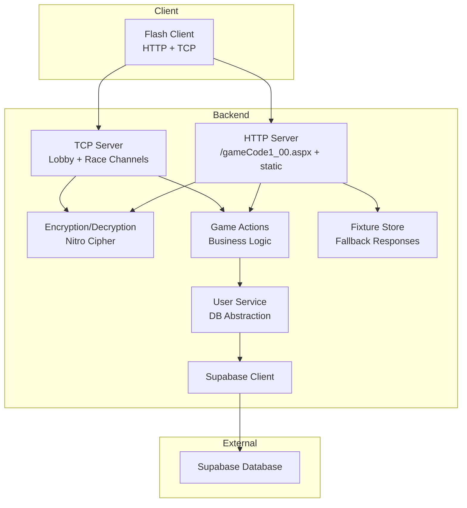
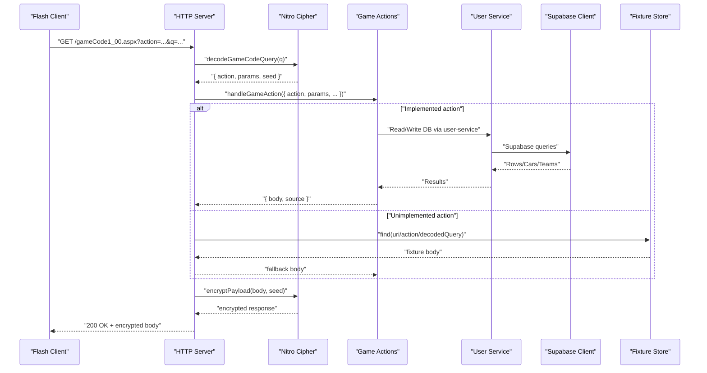
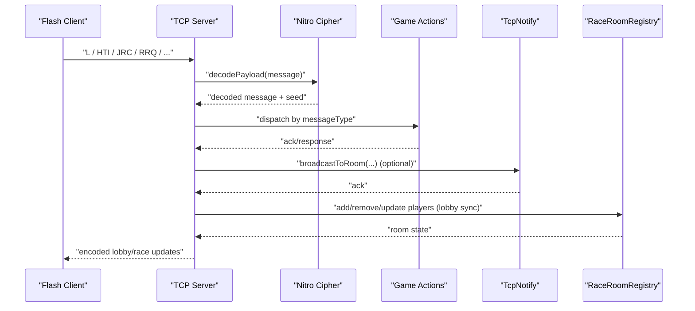
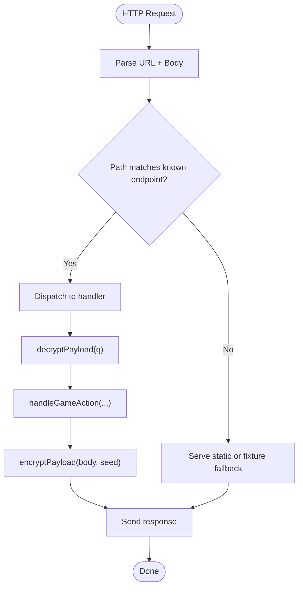
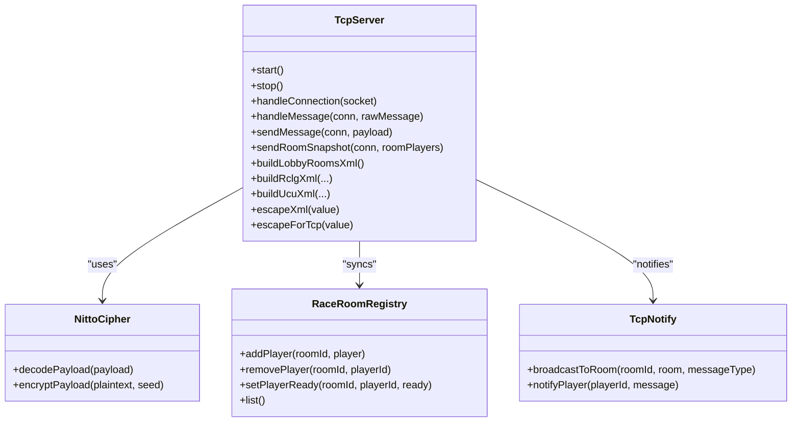
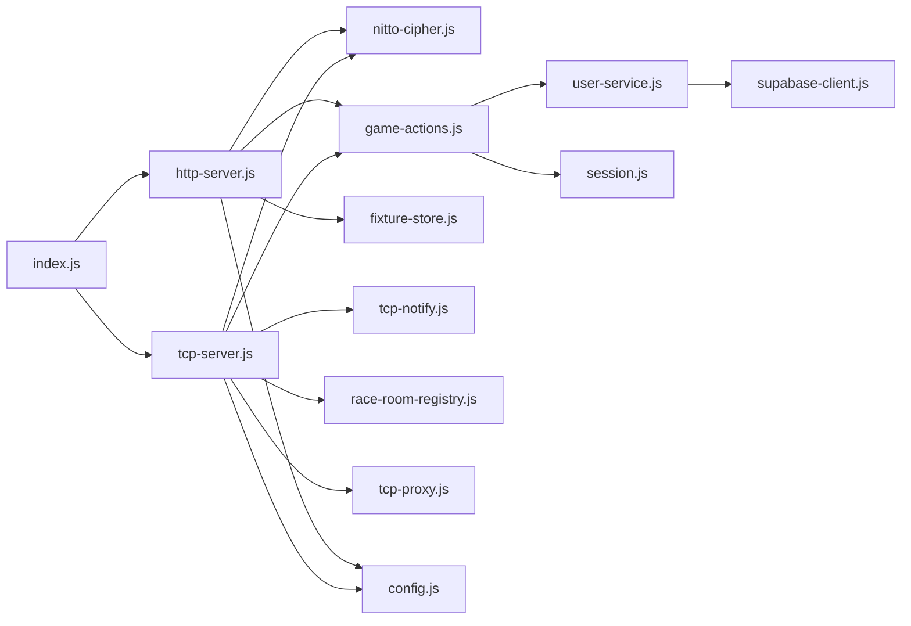

# Architecture Overview

<cite>
**Referenced Files in This Document**
- [index.js](file://backend/src/index.js)
- [http-server.js](file://backend/src/http-server.js)
- [tcp-server.js](file://backend/src/tcp-server.js)
- [supabase-client.js](file://backend/src/supabase-client.js)
- [nitto-cipher.js](file://backend/src/nitto-cipher.js)
- [game-actions.js](file://backend/src/game-actions.js)
- [user-service.js](file://backend/src/user-service.js)
- [tcp-notify.js](file://backend/src/tcp-notify.js)
- [tcp-proxy.js](file://backend/src/tcp-proxy.js)
- [race-room-registry.js](file://backend/src/race-room-registry.js)
- [config.js](file://backend/src/config.js)
- [fixture-store.js](file://backend/src/fixture-store.js)
- [session.js](file://backend/src/session.js)
- [README.md](file://backend/README.md)
- [package.json](file://backend/package.json)
</cite>

## Table of Contents
1. [Introduction](#introduction)
2. [Project Structure](#project-structure)
3. [Core Components](#core-components)
4. [Architecture Overview](#architecture-overview)
5. [Detailed Component Analysis](#detailed-component-analysis)
6. [Dependency Analysis](#dependency-analysis)
7. [Performance Considerations](#performance-considerations)
8. [Troubleshooting Guide](#troubleshooting-guide)
9. [Conclusion](#conclusion)
10. [Appendices](#appendices)

## Introduction
This document describes the Nitto Legends Community Backend system’s architecture and how it preserves the original Flash client behavior while migrating data to modern infrastructure. The backend exposes two primary entry points:
- An HTTP server handling legacy gameCode1_00.aspx requests and related static assets.
- A TCP server handling real-time lobby and race communications.

Both channels pass through a custom encryption/decryption layer to maintain protocol compatibility, then delegate business logic to service modules backed by Supabase. Non-implemented actions fall back to fixture responses to keep gameplay functional during incremental migration.

## Project Structure
The backend is organized around a small set of cohesive modules:
- Entry point initializes services and servers.
- HTTP server handles web requests, decryption, routing, and response encryption.
- TCP server manages persistent connections, lobby rooms, and race channels.
- Supabase client encapsulates database access.
- Game actions module implements business logic for supported actions.
- User service module abstracts database operations for players, cars, teams, and sessions.
- Cipher module implements the legacy encryption scheme.
- Fixture store provides fallback responses for unimplemented actions.
- Supporting modules manage rooms, notifications, proxies, and configuration.

**Diagram sources**
- [index.js:14-64](file://backend/src/index.js#L14-L64)
- [http-server.js:253-520](file://backend/src/http-server.js#L253-L520)
- [tcp-server.js:12-1177](file://backend/src/tcp-server.js#L12-L1177)
- [nitto-cipher.js:100-139](file://backend/src/nitto-cipher.js#L100-L139)
- [game-actions.js:1-2386](file://backend/src/game-actions.js#L1-L2386)
- [user-service.js:1-661](file://backend/src/user-service.js#L1-L661)
- [supabase-client.js:1-27](file://backend/src/supabase-client.js#L1-L27)
- [fixture-store.js:26-85](file://backend/src/fixture-store.js#L26-L85)

**Section sources**
- [README.md:1-76](file://backend/README.md#L1-L76)
- [package.json:1-15](file://backend/package.json#L1-L15)

## Core Components
- HTTP Server: Parses legacy queries, decrypts payloads, resolves actions, and encrypts responses. It serves static assets and uploads, and supports compatibility endpoints.
- TCP Server: Manages persistent connections, lobby rooms, race challenges, and race channels. It performs message decoding and encodes lobby/race updates.
- Nitto Cipher: Implements the legacy encryption/decryption scheme used by the Flash client.
- Game Actions: Orchestrates business logic for supported actions, interacting with user service and database.
- User Service: Provides CRUD operations against Supabase tables for players, cars, teams, and sessions.
- Supabase Client: Creates a client instance when credentials are present; otherwise runs in fixture-only mode.
- Fixture Store: Loads and selects fallback responses for unimplemented actions.
- Session Management: Validates and maintains session lifetimes.
- Notification and Proxy: Provides hooks for broadcasting and forwarding TCP frames.
- Race Room Registry: Tracks room membership and readiness for lobby synchronization.

**Section sources**
- [http-server.js:253-520](file://backend/src/http-server.js#L253-L520)
- [tcp-server.js:12-1177](file://backend/src/tcp-server.js#L12-L1177)
- [nitto-cipher.js:100-139](file://backend/src/nitto-cipher.js#L100-L139)
- [game-actions.js:1-2386](file://backend/src/game-actions.js#L1-L2386)
- [user-service.js:1-661](file://backend/src/user-service.js#L1-L661)
- [supabase-client.js:1-27](file://backend/src/supabase-client.js#L1-L27)
- [fixture-store.js:26-85](file://backend/src/fixture-store.js#L26-L85)
- [session.js:11-87](file://backend/src/session.js#L11-L87)
- [tcp-notify.js:1-58](file://backend/src/tcp-notify.js#L1-L58)
- [tcp-proxy.js:1-11](file://backend/src/tcp-proxy.js#L1-L11)
- [race-room-registry.js:1-137](file://backend/src/race-room-registry.js#L1-L137)

## Architecture Overview
The backend preserves the original game behavior by:
- Maintaining the legacy request format and encryption scheme.
- Routing supported actions to real database operations.
- Falling back to fixture responses for unsupported actions.
- Separating concerns with service-layer logic and a clean database abstraction.

**Diagram sources**
- [http-server.js:425-514](file://backend/src/http-server.js#L425-L514)
- [nitto-cipher.js:125-139](file://backend/src/nitto-cipher.js#L125-L139)
- [game-actions.js:1-2386](file://backend/src/game-actions.js#L1-L2386)
- [user-service.js:1-661](file://backend/src/user-service.js#L1-L661)
- [fixture-store.js:75-84](file://backend/src/fixture-store.js#L75-L84)

**Diagram sources**
- [tcp-server.js:148-498](file://backend/src/tcp-server.js#L148-L498)
- [nitto-cipher.js:107-123](file://backend/src/nitto-cipher.js#L107-L123)
- [tcp-notify.js:12-40](file://backend/src/tcp-notify.js#L12-L40)
- [race-room-registry.js:40-75](file://backend/src/race-room-registry.js#L40-L75)

## Detailed Component Analysis

### HTTP Server
Responsibilities:
- Serve static assets and compatibility endpoints.
- Decrypt incoming gameCode1_00.aspx queries.
- Route to game actions handler.
- Encrypt responses and set metadata headers.
- Support uploads and tournament key generation.
- Fallback to fixture store for unknown actions.

Key behaviors:
- Decryption and routing occur before invoking game actions.
- Responses are encrypted using the same seed from the request.
- Upload handling persists assets to disk and returns XML-like acknowledgments.
- Tournament key generation returns a JPEG image derived from a deterministic code.

**Diagram sources**
- [http-server.js:253-520](file://backend/src/http-server.js#L253-L520)
- [nitto-cipher.js:125-139](file://backend/src/nitto-cipher.js#L125-L139)
- [game-actions.js:1-2386](file://backend/src/game-actions.js#L1-L2386)
- [fixture-store.js:75-84](file://backend/src/fixture-store.js#L75-L84)

**Section sources**
- [http-server.js:10-424](file://backend/src/http-server.js#L10-L424)
- [http-server.js:425-514](file://backend/src/http-server.js#L425-L514)

### TCP Server
Responsibilities:
- Accept and manage persistent TCP connections.
- Decode/encode messages using the legacy cipher.
- Manage lobby rooms and race challenges.
- Support dual-channel races (lobby vs race).
- Maintain room membership and readiness.
- Apply engine wear after race results.

Key behaviors:
- Recognizes bootstrap and heartbeat messages.
- Supports room join, refresh, and chat.
- Handles race requests, readiness, and results.
- Sends periodic heartbeats and room snapshots.

**Diagram sources**
- [tcp-server.js:12-1177](file://backend/src/tcp-server.js#L12-L1177)
- [nitto-cipher.js:107-123](file://backend/src/nitto-cipher.js#L107-L123)
- [race-room-registry.js:1-137](file://backend/src/race-room-registry.js#L1-L137)
- [tcp-notify.js:1-58](file://backend/src/tcp-notify.js#L1-L58)

**Section sources**
- [tcp-server.js:77-146](file://backend/src/tcp-server.js#L77-L146)
- [tcp-server.js:148-498](file://backend/src/tcp-server.js#L148-L498)

### Nitto Cipher
Responsibilities:
- Build dynamic keys from a seed.
- Encode/decode payloads using a wheel-based cipher.
- Extract and verify seed suffixes.

Integration:
- Used by HTTP server to decrypt/encrypt gameCode1_00.aspx payloads.
- Used by TCP server to decode/encode lobby/race messages.

**Section sources**
- [nitto-cipher.js:100-139](file://backend/src/nitto-cipher.js#L100-L139)

### Game Actions
Responsibilities:
- Resolve caller session and validate permissions.
- Implement supported actions (login, create account, garage, purchases, etc.).
- Compose XML responses for the legacy client.
- Coordinate with user service and database.

Patterns:
- Service Layer Pattern: Business logic is centralized here, delegating data access to user-service.
- Protocol Adapter Pattern: Converts database-backed data into legacy XML structures.

**Section sources**
- [game-actions.js:166-204](file://backend/src/game-actions.js#L166-L204)
- [game-actions.js:227-272](file://backend/src/game-actions.js#L227-L272)
- [game-actions.js:274-338](file://backend/src/game-actions.js#L274-L338)

### User Service
Responsibilities:
- Provide typed database operations for players, cars, teams, sessions.
- Normalize legacy data to ensure compatibility.
- Insert/update records with backward-compatible fallbacks.

**Section sources**
- [user-service.js:184-195](file://backend/src/user-service.js#L184-L195)
- [user-service.js:211-255](file://backend/src/user-service.js#L211-L255)
- [user-service.js:399-429](file://backend/src/user-service.js#L399-L429)

### Supabase Client
Responsibilities:
- Initialize a Supabase client when credentials are present.
- Return null and log warnings when credentials are missing.
- Disable live database access until environment is configured.

**Section sources**
- [supabase-client.js:1-27](file://backend/src/supabase-client.js#L1-L27)

### Fixture Store
Responsibilities:
- Load decoded HTTP responses from fixture files.
- Select the most specific matching fixture for a given URI/action/query.
- Provide fallback responses for unimplemented actions.

**Section sources**
- [fixture-store.js:26-85](file://backend/src/fixture-store.js#L26-L85)

### Session Management
Responsibilities:
- Associate sessions with players.
- Validate sessions and update timestamps.
- Purge expired sessions periodically.

**Section sources**
- [session.js:11-87](file://backend/src/session.js#L11-L87)

### Notification and Proxy
Responsibilities:
- Broadcast room updates to players.
- Forward TCP frames (placeholder).
- Escape XML for safe transmission.

**Section sources**
- [tcp-notify.js:12-40](file://backend/src/tcp-notify.js#L12-L40)
- [tcp-proxy.js:6-9](file://backend/src/tcp-proxy.js#L6-L9)

### Race Room Registry
Responsibilities:
- Enforce single-room membership.
- Track readiness and room capacity.
- Provide room lists and player presence.

**Section sources**
- [race-room-registry.js:40-75](file://backend/src/race-room-registry.js#L40-L75)

## Dependency Analysis
High-level dependencies:
- index orchestrates initialization of services and servers.
- HTTP/TCP servers depend on cipher, game actions, and services.
- Game actions depend on user service and session management.
- User service depends on Supabase client.
- Fixture store is used by HTTP server for fallbacks.
- TCP server integrates with notify and room registry.

**Diagram sources**
- [index.js:14-64](file://backend/src/index.js#L14-L64)
- [http-server.js:253-520](file://backend/src/http-server.js#L253-L520)
- [tcp-server.js:12-1177](file://backend/src/tcp-server.js#L12-L1177)
- [nitto-cipher.js:100-139](file://backend/src/nitto-cipher.js#L100-L139)
- [game-actions.js:1-2386](file://backend/src/game-actions.js#L1-L2386)
- [user-service.js:1-661](file://backend/src/user-service.js#L1-L661)
- [supabase-client.js:1-27](file://backend/src/supabase-client.js#L1-L27)
- [fixture-store.js:26-85](file://backend/src/fixture-store.js#L26-L85)
- [tcp-notify.js:1-58](file://backend/src/tcp-notify.js#L1-L58)
- [race-room-registry.js:1-137](file://backend/src/race-room-registry.js#L1-L137)
- [tcp-proxy.js:1-11](file://backend/src/tcp-proxy.js#L1-L11)
- [config.js:42-52](file://backend/src/config.js#L42-L52)
- [session.js:11-87](file://backend/src/session.js#L11-L87)

**Section sources**
- [index.js:14-64](file://backend/src/index.js#L14-L64)

## Performance Considerations
- HTTP request handling is synchronous per request; ensure middleware and handlers remain lightweight.
- TCP server maintains in-memory room state and connections; monitor memory growth under load.
- Encryption/decryption adds CPU overhead; consider batching or caching where appropriate.
- Database queries should be indexed on frequent filters (e.g., player_id, session_key).
- Fixture loading occurs once and is cached; avoid excessive reloads.
- Implement rate limiting and input sanitization for uploads and chat.

## Troubleshooting Guide
Common issues and diagnostics:
- Missing Supabase credentials: The backend logs warnings and operates in fixture-only mode. Verify environment variables and install the Supabase client package.
- Session validation failures: Ensure sessions are created during login and not reused across players.
- Upload failures: Check file path sanitization and directory permissions for cache locations.
- Legacy cipher errors: Confirm seed suffix validity and payload length.
- TCP connection drops: Inspect socket error logs and ensure cross-domain policy responses are sent first.

**Section sources**
- [supabase-client.js:3-18](file://backend/src/supabase-client.js#L3-L18)
- [session.js:56-87](file://backend/src/session.js#L56-L87)
- [http-server.js:314-354](file://backend/src/http-server.js#L314-L354)
- [nitto-cipher.js:107-123](file://backend/src/nitto-cipher.js#L107-L123)
- [tcp-server.js:124-134](file://backend/src/tcp-server.js#L124-L134)

## Conclusion
The Nitto Legends Community Backend preserves the original Flash client protocol while modernizing data persistence and operational controls. Through the Protocol Adapter Pattern (cipher), Service Layer Pattern (actions and user-service), and Observer Pattern (TCP notify), the system cleanly separates legacy compatibility from modern data operations. The fixture fallback mechanism ensures continuity during incremental feature porting, while Supabase provides scalable persistence.

## Appendices

### Technology Stack Decisions
- Node.js for runtime and native networking.
- Supabase for managed Postgres and auth.
- Plain JavaScript modules for portability and simplicity.
- Environment-driven configuration with .env support.

**Section sources**
- [package.json:11-13](file://backend/package.json#L11-L13)
- [config.js:42-52](file://backend/src/config.js#L42-L52)

### Integration Patterns
- HTTP: Legacy query decoding → action dispatch → DB/service → encryption → response.
- TCP: Message decoding → lobby/race orchestration → DB/service → message encoding → broadcast.
- Fixture fallback: URI/action/query-based selection for unimplemented actions.

**Section sources**
- [http-server.js:425-514](file://backend/src/http-server.js#L425-L514)
- [tcp-server.js:148-498](file://backend/src/tcp-server.js#L148-L498)
- [fixture-store.js:75-84](file://backend/src/fixture-store.js#L75-L84)

### System Boundaries and Deployment Topology
- Internal boundaries:
  - HTTP/TCP servers are independent but share services and configuration.
  - Supabase is accessed only through the backend to protect service role keys.
- Deployment:
  - Run the backend with Node.js; configure ports and credentials via environment.
  - Place fixture files under backend/fixtures for fallback responses.
  - Ensure cache directories exist for uploads and avatars.

**Section sources**
- [README.md:12-20](file://backend/README.md#L12-L20)
- [index.js:86-94](file://backend/src/index.js#L86-L94)
- [config.js:42-52](file://backend/src/config.js#L42-L52)