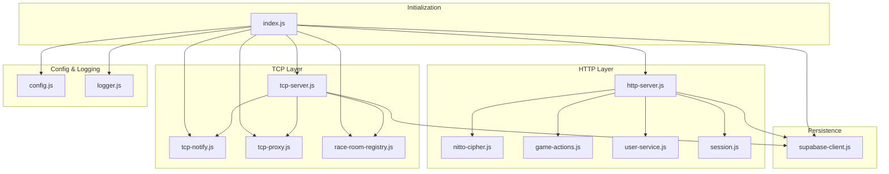
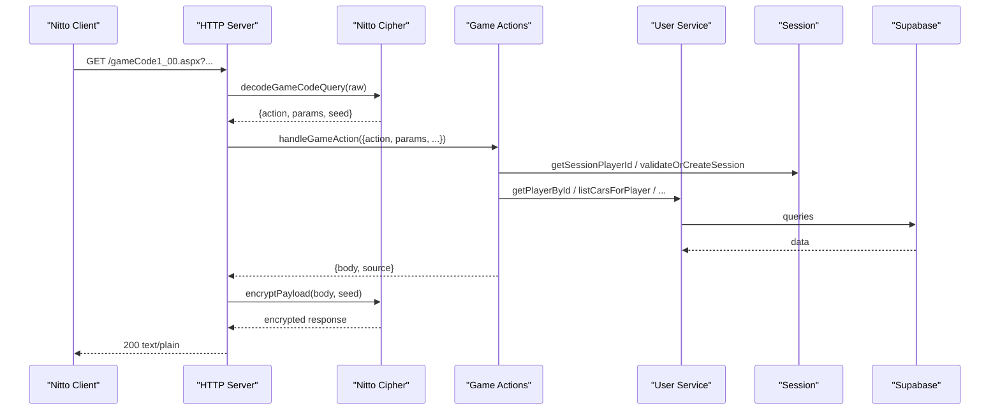
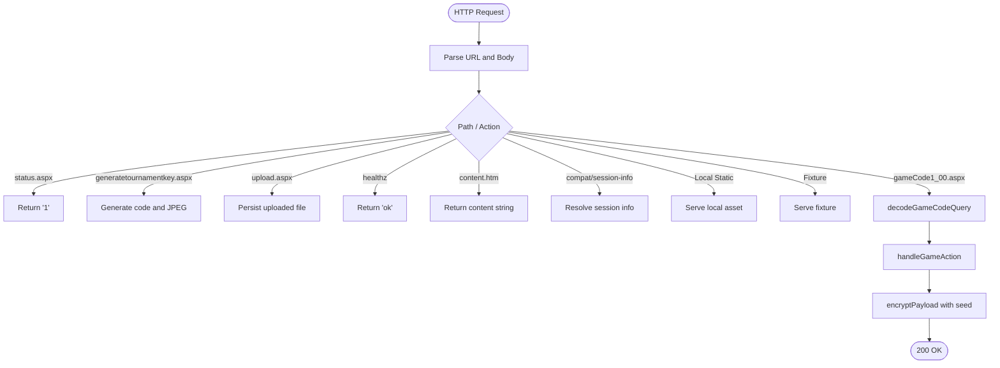
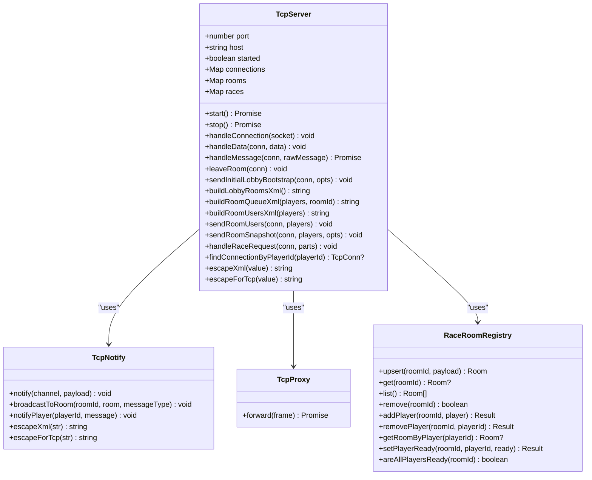
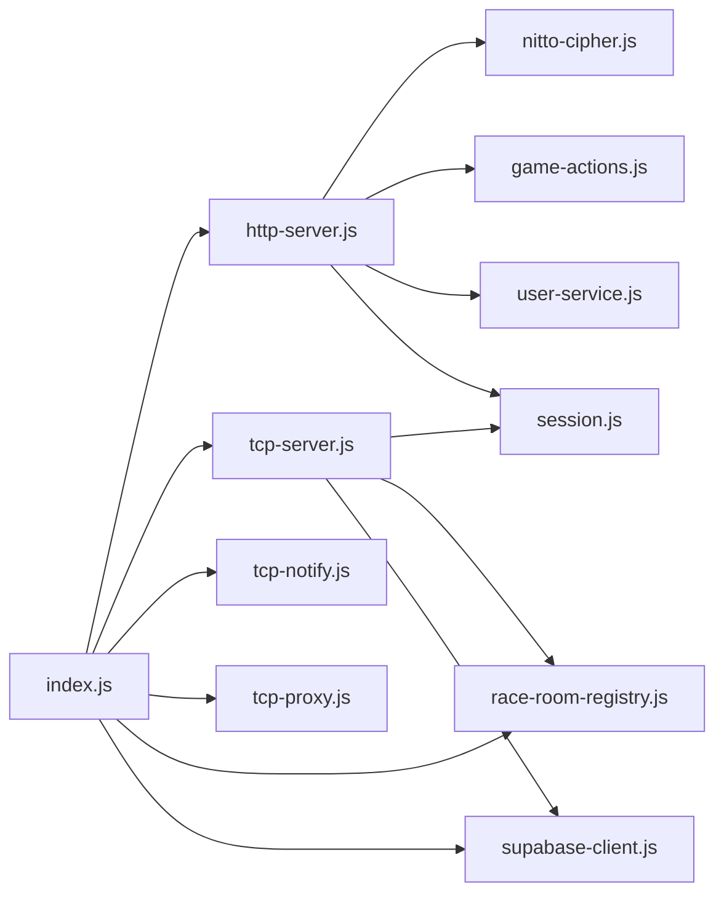

# Core Services

<cite>
**Referenced Files in This Document**
- [index.js](file://backend/src/index.js)
- [http-server.js](file://backend/src/http-server.js)
- [nitto-cipher.js](file://backend/src/nitto-cipher.js)
- [game-actions.js](file://backend/src/game-actions.js)
- [user-service.js](file://backend/src/user-service.js)
- [session.js](file://backend/src/session.js)
- [tcp-server.js](file://backend/src/tcp-server.js)
- [tcp-notify.js](file://backend/src/tcp-notify.js)
- [tcp-proxy.js](file://backend/src/tcp-proxy.js)
- [race-room-registry.js](file://backend/src/race-room-registry.js)
- [supabase-client.js](file://backend/src/supabase-client.js)
- [config.js](file://backend/src/config.js)
- [logger.js](file://backend/src/logger.js)
- [package.json](file://backend/package.json)
</cite>

## Table of Contents
1. [Introduction](#introduction)
2. [Project Structure](#project-structure)
3. [Core Components](#core-components)
4. [Architecture Overview](#architecture-overview)
5. [Detailed Component Analysis](#detailed-component-analysis)
6. [Dependency Analysis](#dependency-analysis)
7. [Performance Considerations](#performance-considerations)
8. [Troubleshooting Guide](#troubleshooting-guide)
9. [Conclusion](#conclusion)

## Introduction
This document describes the core backend services powering the Nitto Legends Community Server. It focuses on:
- The HTTP server handling legacy gameCode1_00.aspx actions and static assets
- The TCP server managing real-time multiplayer communication
- Session management for authentication and validation
- The user service for player and car data operations
- The service layer architecture, modular design, dependency injection, lifecycle management, error handling, and inter-service communication protocols
- Performance, scalability, and monitoring considerations

## Project Structure
The backend is organized around a small set of cohesive modules:
- Initialization and orchestration: index.js wires services and starts servers
- HTTP server: handles HTTP requests, legacy game actions, and static assets
- TCP server: manages persistent TCP connections, rooms, races, and real-time events
- Session management: validates and maintains player sessions
- User service: encapsulates player, car, and team data operations
- Encryption: legacy Nitto cipher for request/response payloads
- Registry and notification: in-memory room registry and TCP notifications
- Supabase client: optional database integration
- Configuration and logging: environment-driven config and simple logger

**Diagram sources**
- [index.js:1-95](file://backend/src/index.js#L1-L95)
- [http-server.js:253-521](file://backend/src/http-server.js#L253-L521)
- [nitto-cipher.js:100-139](file://backend/src/nitto-cipher.js#L100-L139)
- [game-actions.js:1-800](file://backend/src/game-actions.js#L1-L800)
- [user-service.js:184-661](file://backend/src/user-service.js#L184-L661)
- [session.js:11-87](file://backend/src/session.js#L11-L87)
- [tcp-server.js:12-1177](file://backend/src/tcp-server.js#L12-L1177)
- [tcp-notify.js:1-58](file://backend/src/tcp-notify.js#L1-L58)
- [tcp-proxy.js:1-11](file://backend/src/tcp-proxy.js#L1-L11)
- [race-room-registry.js:1-137](file://backend/src/race-room-registry.js#L1-L137)
- [supabase-client.js:1-27](file://backend/src/supabase-client.js#L1-L27)
- [config.js:42-53](file://backend/src/config.js#L42-L53)
- [logger.js:1-24](file://backend/src/logger.js#L1-L24)

**Section sources**
- [index.js:1-95](file://backend/src/index.js#L1-L95)
- [config.js:42-53](file://backend/src/config.js#L42-L53)
- [logger.js:1-24](file://backend/src/logger.js#L1-L24)

## Core Components
- HTTP server: Implements a legacy-compatible HTTP endpoint for Nitto clients, serving static assets and handling gameCode1_00.aspx actions. It decrypts requests, resolves sessions, delegates to game actions, and re-encrypts responses.
- TCP server: Provides persistent TCP sockets for real-time gameplay, including lobby, room management, race matchmaking, and in-race synchronization.
- Session management: Validates session keys, creates login sessions, and periodically purges expired sessions.
- User service: Encapsulates player, car, and team data operations with normalization and compatibility helpers.
- Encryption: Legacy Nitto cipher for payload encryption/decryption and seed handling.
- Registry and notification: In-memory race room registry synchronized with TCP server and a notification bridge for broadcasting updates.
- Supabase client: Optional database integration for persistent storage and retrieval of game data.

**Section sources**
- [http-server.js:253-521](file://backend/src/http-server.js#L253-L521)
- [tcp-server.js:12-1177](file://backend/src/tcp-server.js#L12-L1177)
- [session.js:11-87](file://backend/src/session.js#L11-L87)
- [user-service.js:184-661](file://backend/src/user-service.js#L184-L661)
- [nitto-cipher.js:100-139](file://backend/src/nitto-cipher.js#L100-L139)
- [tcp-notify.js:1-58](file://backend/src/tcp-notify.js#L1-L58)
- [race-room-registry.js:1-137](file://backend/src/race-room-registry.js#L1-L137)
- [supabase-client.js:1-27](file://backend/src/supabase-client.js#L1-L27)

## Architecture Overview
The system initializes services, constructs the TCP server and notify bridge, wires them together, and exposes an HTTP server. Both HTTP and TCP layers rely on shared services for session validation and user data. Supabase is optional and gracefully handled.

**Diagram sources**
- [http-server.js:426-518](file://backend/src/http-server.js#L426-L518)
- [nitto-cipher.js:125-139](file://backend/src/nitto-cipher.js#L125-L139)
- [game-actions.js:166-204](file://backend/src/game-actions.js#L166-L204)
- [user-service.js:184-397](file://backend/src/user-service.js#L184-L397)
- [session.js:11-87](file://backend/src/session.js#L11-L87)

## Detailed Component Analysis

### HTTP Server
Responsibilities:
- Serve legacy static assets and generated content
- Decrypt incoming gameCode1_00.aspx requests
- Resolve session and player identity
- Delegate to game actions and re-encrypt responses
- Support upload and compatibility endpoints

Key behaviors:
- Request pipeline logs and routes to appropriate handlers
- Supports plain-text createaccount fallback for web forms
- Encrypts responses using the request’s seed
- Periodically cleans stale pending uploads

**Diagram sources**
- [http-server.js:105-521](file://backend/src/http-server.js#L105-L521)
- [nitto-cipher.js:125-139](file://backend/src/nitto-cipher.js#L125-L139)
- [game-actions.js:166-204](file://backend/src/game-actions.js#L166-L204)

**Section sources**
- [http-server.js:105-521](file://backend/src/http-server.js#L105-L521)
- [nitto-cipher.js:125-139](file://backend/src/nitto-cipher.js#L125-L139)

### TCP Server
Responsibilities:
- Accept TCP connections and manage per-connection state
- Handle bootstrap, login, heartbeat, room management, and race lifecycle
- Forward in-race position updates between opponents
- Manage race channels and apply engine wear on race completion
- Maintain room and race registries

Lifecycle and concurrency:
- Starts a TCP server bound to host/port
- Per-connection buffers and message parsing
- Asynchronous message handling with robust error logging

**Diagram sources**
- [tcp-server.js:12-1177](file://backend/src/tcp-server.js#L12-L1177)
- [tcp-notify.js:1-58](file://backend/src/tcp-notify.js#L1-58)
- [tcp-proxy.js:1-11](file://backend/src/tcp-proxy.js#L1-L11)
- [race-room-registry.js:1-137](file://backend/src/race-room-registry.js#L1-L137)

**Section sources**
- [tcp-server.js:12-1177](file://backend/src/tcp-server.js#L12-L1177)
- [tcp-notify.js:1-58](file://backend/src/tcp-notify.js#L1-L58)
- [tcp-proxy.js:1-11](file://backend/src/tcp-proxy.js#L1-L11)
- [race-room-registry.js:1-137](file://backend/src/race-room-registry.js#L1-L137)

### Session Management
Responsibilities:
- Retrieve player ID from session key
- Create login sessions
- Validate or create sessions on demand
- Purge expired sessions

Integration:
- Used by HTTP server to resolve session info and by TCP server for login and race channel association

**Section sources**
- [session.js:11-87](file://backend/src/session.js#L11-L87)
- [http-server.js:221-251](file://backend/src/http-server.js#L221-L251)
- [tcp-server.js:179-206](file://backend/src/tcp-server.js#L179-L206)

### User Service
Responsibilities:
- Player CRUD and lookup
- Car CRUD, normalization, and legacy compatibility
- Team and member listing
- Money and default car updates
- Test drive state management

Patterns:
- Normalization helpers for legacy data
- Compatibility inserts for missing columns
- Ordered lists and selection semantics

**Section sources**
- [user-service.js:184-661](file://backend/src/user-service.js#L184-L661)

### Encryption (Nitto Cipher)
Responsibilities:
- Encrypt HTTP responses using a seed-derived key
- Decode/encode TCP payloads consistently
- Seed suffix handling for both HTTP and TCP

**Section sources**
- [nitto-cipher.js:100-139](file://backend/src/nitto-cipher.js#L100-L139)

### Supabase Client
Responsibilities:
- Initialize Supabase client from environment
- Graceful degradation when credentials are missing

**Section sources**
- [supabase-client.js:1-27](file://backend/src/supabase-client.js#L1-L27)
- [config.js:42-53](file://backend/src/config.js#L42-L53)

## Dependency Analysis
High-level dependencies:
- index.js depends on all major services and orchestrates startup
- http-server.js depends on cipher, game-actions, user-service, session, and optionally Supabase
- tcp-server.js depends on cipher, session, race-room-registry, and optionally Supabase
- tcp-notify and tcp-proxy are thin bridges used by tcp-server
- user-service and session depend on Supabase when present

**Diagram sources**
- [index.js:1-95](file://backend/src/index.js#L1-L95)
- [http-server.js:253-521](file://backend/src/http-server.js#L253-L521)
- [tcp-server.js:12-1177](file://backend/src/tcp-server.js#L12-L1177)

**Section sources**
- [index.js:1-95](file://backend/src/index.js#L1-L95)
- [http-server.js:253-521](file://backend/src/http-server.js#L253-L521)
- [tcp-server.js:12-1177](file://backend/src/tcp-server.js#L12-L1177)

## Performance Considerations
- HTTP server
  - Uses streaming request body parsing and binary responses for assets
  - Avoids synchronous filesystem operations in hot paths
  - Pending upload cleanup prevents disk growth
- TCP server
  - Efficient message batching and delimiter handling
  - Minimal allocations for XML building
  - Race completion tracking avoids redundant engine wear
- Session and user operations
  - Queries use targeted selects and in-lists
  - Legacy compatibility patches minimize repeated writes
- Supabase
  - Optional; when disabled, HTTP/TCP operate in fixture-only mode
  - Use connection pooling and minimal round-trips in batch operations

[No sources needed since this section provides general guidance]

## Troubleshooting Guide
Common issues and diagnostics:
- Missing Supabase credentials
  - Symptom: Backend runs in fixture-only mode with warnings
  - Resolution: Configure environment variables and install @supabase/supabase-js
- HTTP decryption failures
  - Symptom: 400 responses for gameCode1_00.aspx
  - Resolution: Verify cipher seed and payload encoding
- Session errors
  - Symptom: Login failures or session-not-found
  - Resolution: Confirm session key validity and TTL
- TCP connection drops
  - Symptom: Clients unable to join rooms or races
  - Resolution: Check server logs for socket errors and ensure notify/registry wiring
- Upload failures
  - Symptom: 200 responses but missing files
  - Resolution: Verify filesystem permissions and pending upload cleanup intervals

Operational checks:
- Health endpoints: /healthz for HTTP, TCP policy responses for socket readiness
- Logs: HTTP and TCP servers log request/response metadata and errors

**Section sources**
- [supabase-client.js:1-27](file://backend/src/supabase-client.js#L1-L27)
- [http-server.js:426-518](file://backend/src/http-server.js#L426-L518)
- [session.js:11-87](file://backend/src/session.js#L11-L87)
- [tcp-server.js:77-117](file://backend/src/tcp-server.js#L77-L117)

## Conclusion
The Nitto Legends Community Server backend combines a legacy-compatible HTTP layer with a robust TCP server, unified by shared services for session and user data. The modular design enables clear separation of concerns, optional database integration, and straightforward lifecycle management. By leveraging dependency injection via constructor parameters and centralized initialization, the system remains maintainable and extensible while preserving compatibility with classic Nitto clients.