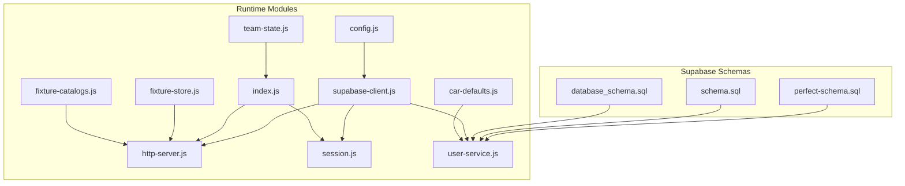
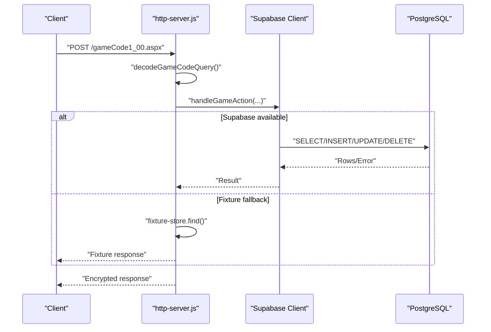
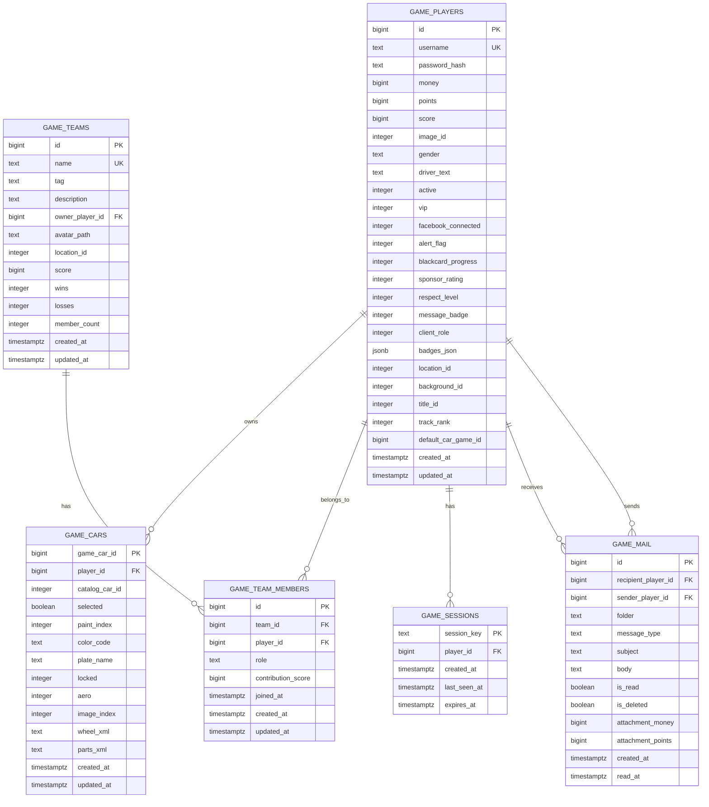
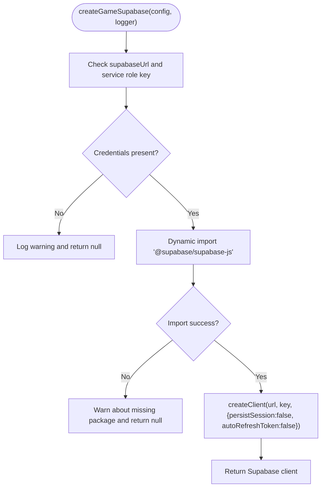
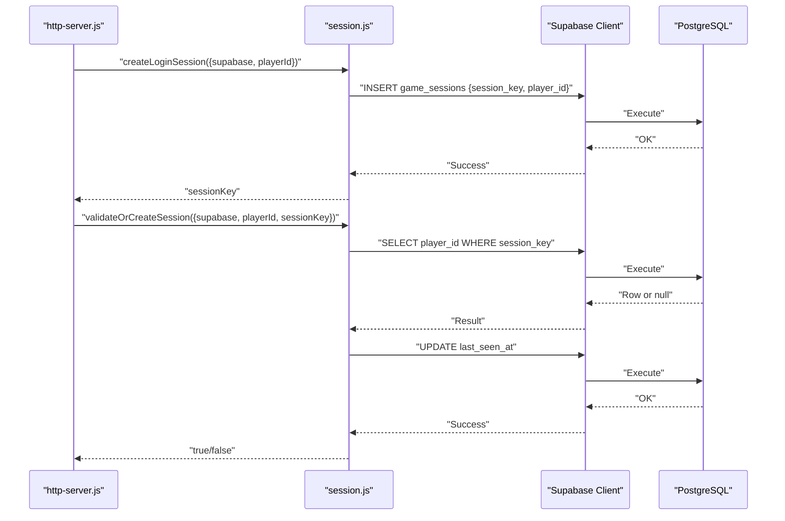
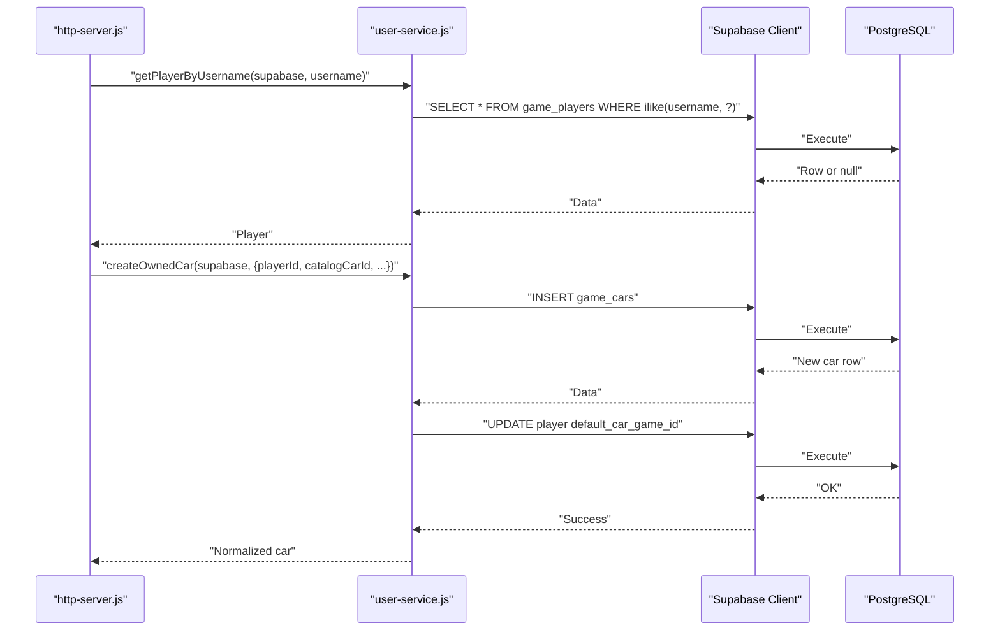
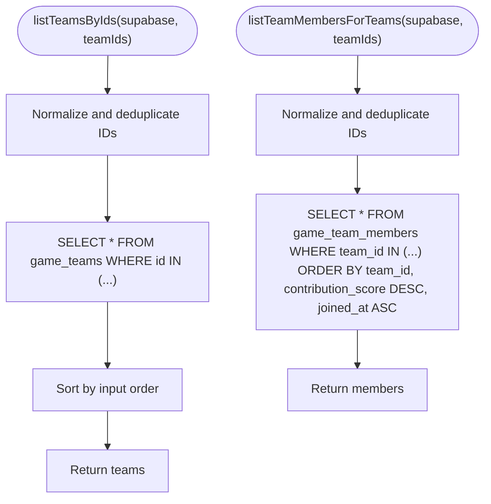
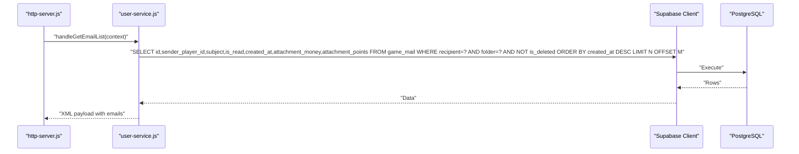
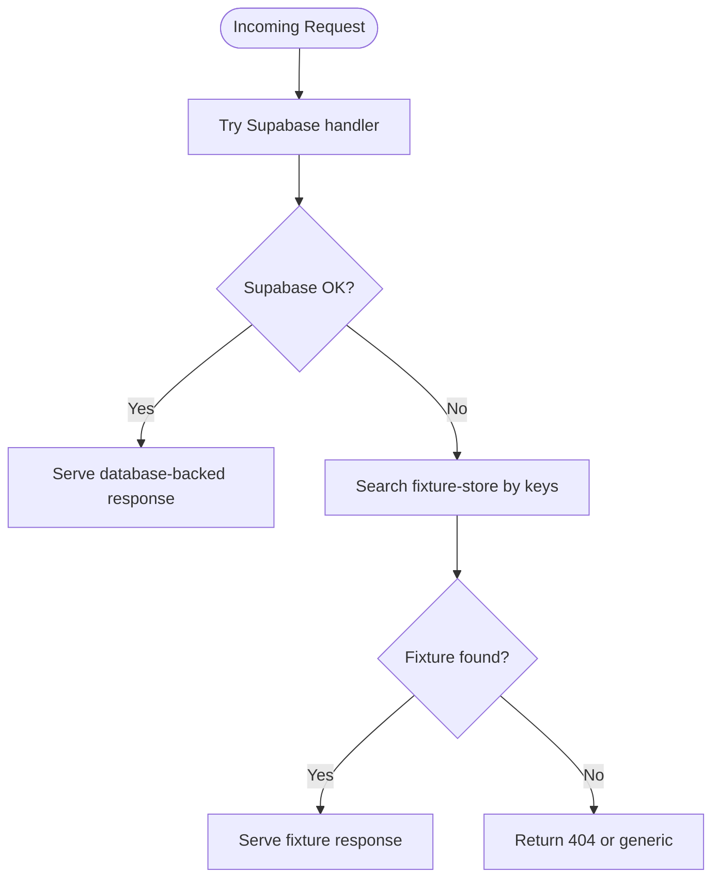
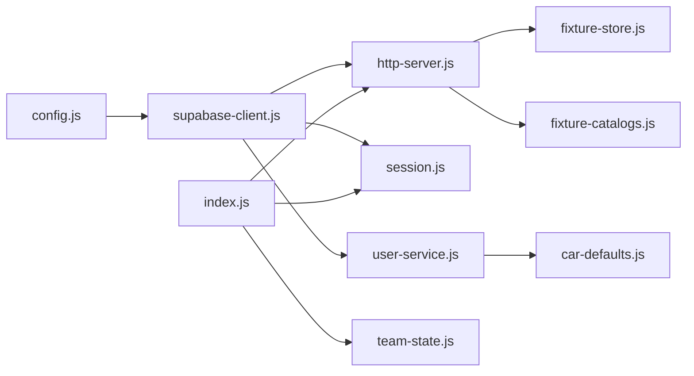

# Database Integration

<cite>
**Referenced Files in This Document**
- [perfect-schema.sql](file://backend/supabase/perfect-schema.sql)
- [schema.sql](file://backend/supabase/schema.sql)
- [database_schema.sql](file://backend/src/database_schema.sql)
- [supabase-client.js](file://backend/src/supabase-client.js)
- [config.js](file://backend/src/config.js)
- [user-service.js](file://backend/src/user-service.js)
- [session.js](file://backend/src/session.js)
- [http-server.js](file://backend/src/http-server.js)
- [index.js](file://backend/src/index.js)
- [fixture-store.js](file://backend/src/fixture-store.js)
- [fixture-catalogs.js](file://backend/src/fixture-catalogs.js)
- [car-defaults.js](file://backend/src/car-defaults.js)
- [team-state.js](file://backend/src/team-state.js)
</cite>

## Table of Contents
1. [Introduction](#introduction)
2. [Project Structure](#project-structure)
3. [Core Components](#core-components)
4. [Architecture Overview](#architecture-overview)
5. [Detailed Component Analysis](#detailed-component-analysis)
6. [Dependency Analysis](#dependency-analysis)
7. [Performance Considerations](#performance-considerations)
8. [Troubleshooting Guide](#troubleshooting-guide)
9. [Conclusion](#conclusion)
10. [Appendices](#appendices)

## Introduction
This document describes the database integration layer built on Supabase and PostgreSQL for the Nitto Legends community server. It covers the database design for player management, session tracking, car ownership, team structures, and messaging. It also documents the Supabase client implementation, connection management, query patterns, data models, entity relationships, and migration strategies. Guidance is included for transitioning from fixture-based responses to database-backed data, along with best practices for validation, security, performance, and extending the schema while maintaining backward compatibility.

## Project Structure
The database integration spans two primary schema definitions and a set of runtime modules:
- Supabase schema scripts define tables, indexes, triggers, and policies.
- Runtime modules implement Supabase client initialization, session management, and data access patterns.
- Fixture-based fallbacks support development and testing without live database connectivity.

**Diagram sources**
- [perfect-schema.sql:1-534](file://backend/supabase/perfect-schema.sql#L1-L534)
- [schema.sql:1-325](file://backend/supabase/schema.sql#L1-L325)
- [database_schema.sql:1-306](file://backend/src/database_schema.sql#L1-L306)
- [config.js:42-52](file://backend/src/config.js#L42-L52)
- [supabase-client.js:1-27](file://backend/src/supabase-client.js#L1-L27)
- [http-server.js:253-521](file://backend/src/http-server.js#L253-L521)
- [session.js:1-87](file://backend/src/session.js#L1-L87)
- [user-service.js:1-661](file://backend/src/user-service.js#L1-L661)
- [index.js:1-95](file://backend/src/index.js#L1-L95)
- [fixture-store.js:1-86](file://backend/src/fixture-store.js#L1-L86)
- [fixture-catalogs.js:1-31](file://backend/src/fixture-catalogs.js#L1-L31)
- [car-defaults.js:1-32](file://backend/src/car-defaults.js#L1-L32)
- [team-state.js:1-40](file://backend/src/team-state.js#L1-L40)

**Section sources**
- [perfect-schema.sql:1-534](file://backend/supabase/perfect-schema.sql#L1-L534)
- [schema.sql:1-325](file://backend/supabase/schema.sql#L1-L325)
- [database_schema.sql:1-306](file://backend/src/database_schema.sql#L1-L306)
- [config.js:42-52](file://backend/src/config.js#L42-L52)
- [supabase-client.js:1-27](file://backend/src/supabase-client.js#L1-L27)
- [http-server.js:253-521](file://backend/src/http-server.js#L253-L521)
- [session.js:1-87](file://backend/src/session.js#L1-L87)
- [user-service.js:1-661](file://backend/src/user-service.js#L1-L661)
- [index.js:1-95](file://backend/src/index.js#L1-L95)
- [fixture-store.js:1-86](file://backend/src/fixture-store.js#L1-L86)
- [fixture-catalogs.js:1-31](file://backend/src/fixture-catalogs.js#L1-L31)
- [car-defaults.js:1-32](file://backend/src/car-defaults.js#L1-L32)
- [team-state.js:1-40](file://backend/src/team-state.js#L1-L40)

## Core Components
- Supabase client initialization with service role credentials and disabled client-side session persistence.
- Session management for login, validation, and periodic cleanup.
- Player and car CRUD operations with backward-compatible handling for schema evolution.
- Team and membership queries with ordered retrieval and constraints.
- Fixture-based fallback for development and testing scenarios.

**Section sources**
- [supabase-client.js:1-27](file://backend/src/supabase-client.js#L1-L27)
- [session.js:1-87](file://backend/src/session.js#L1-L87)
- [user-service.js:184-661](file://backend/src/user-service.js#L184-L661)
- [http-server.js:221-251](file://backend/src/http-server.js#L221-L251)
- [fixture-store.js:26-86](file://backend/src/fixture-store.js#L26-L86)

## Architecture Overview
The runtime integrates HTTP requests with Supabase-backed data access. Requests are decrypted, routed, and handled either via database queries or fixture fallbacks. Sessions are validated against the database, and player/car/team data are retrieved and normalized.

**Diagram sources**
- [http-server.js:426-521](file://backend/src/http-server.js#L426-L521)
- [fixture-store.js:75-86](file://backend/src/fixture-store.js#L75-L86)
- [supabase-client.js:1-27](file://backend/src/supabase-client.js#L1-L27)

**Section sources**
- [http-server.js:426-521](file://backend/src/http-server.js#L426-L521)
- [fixture-store.js:26-86](file://backend/src/fixture-store.js#L26-L86)
- [supabase-client.js:1-27](file://backend/src/supabase-client.js#L1-L27)

## Detailed Component Analysis

### Database Design and Entity Model
The database model centers on five core tables with supporting indexes, triggers, and policies. The design emphasizes referential integrity, performance indexing, and optional Row Level Security (RLS) for service roles.

**Diagram sources**
- [perfect-schema.sql:16-196](file://backend/supabase/perfect-schema.sql#L16-L196)
- [schema.sql:1-98](file://backend/supabase/schema.sql#L1-L98)

**Section sources**
- [perfect-schema.sql:16-196](file://backend/supabase/perfect-schema.sql#L16-L196)
- [schema.sql:1-98](file://backend/supabase/schema.sql#L1-L98)

### Supabase Client Implementation and Connection Management
- Initializes the Supabase client using environment-provided URL and service role key.
- Disables client-side session persistence and token refresh for backend-only operation.
- Gracefully falls back to fixture-only mode when credentials are missing.

**Diagram sources**
- [supabase-client.js:1-27](file://backend/src/supabase-client.js#L1-L27)
- [config.js:47-48](file://backend/src/config.js#L47-L48)

**Section sources**
- [supabase-client.js:1-27](file://backend/src/supabase-client.js#L1-L27)
- [config.js:42-52](file://backend/src/config.js#L42-L52)

### Session Tracking and Validation
- Creates login sessions with UUID session keys and associates them with player IDs.
- Validates sessions by ensuring the session key matches the expected player.
- Periodically purges expired sessions based on last_seen_at thresholds.

**Diagram sources**
- [session.js:23-86](file://backend/src/session.js#L23-L86)
- [http-server.js:221-251](file://backend/src/http-server.js#L221-L251)

**Section sources**
- [session.js:1-87](file://backend/src/session.js#L1-L87)
- [http-server.js:221-251](file://backend/src/http-server.js#L221-L251)

### Player and Car Data Access Patterns
- Retrieves players by ID or username with case-insensitive matching for usernames.
- Creates players with normalization and backward-compatible handling for newer columns.
- Manages cars with selection constraints, XML normalization, and test-drive state handling.
- Ensures only one selected car per player via unique partial indexes and updates.

**Diagram sources**
- [user-service.js:197-367](file://backend/src/user-service.js#L197-L367)
- [http-server.js:236-244](file://backend/src/http-server.js#L236-L244)

**Section sources**
- [user-service.js:184-367](file://backend/src/user-service.js#L184-L367)
- [http-server.js:236-244](file://backend/src/http-server.js#L236-L244)

### Team Structures and Membership Queries
- Lists teams by IDs with deterministic ordering.
- Retrieves team members ordered by contribution score and joined_at.
- Maintains team member count via triggers.

**Diagram sources**
- [user-service.js:588-638](file://backend/src/user-service.js#L588-L638)

**Section sources**
- [user-service.js:588-638](file://backend/src/user-service.js#L588-L638)

### Messaging System (game_mail)
- Supports inbox, sent, and trash folders with read/unread flags and optional monetary/point attachments.
- Retrieves paginated email lists with computed read/attachment flags.

**Diagram sources**
- [user-service.js:956-1011](file://backend/src/user-service.js#L956-L1011)
- [perfect-schema.sql:171-196](file://backend/supabase/perfect-schema.sql#L171-L196)

**Section sources**
- [user-service.js:956-1011](file://backend/src/user-service.js#L956-L1011)
- [perfect-schema.sql:171-196](file://backend/supabase/perfect-schema.sql#L171-L196)

### Transition from Fixture-Based Responses to Database-Backed Data
- FixtureStore loads decoded HTTP responses keyed by URI, action, and decoded query to serve as fallbacks.
- HTTP server prioritizes Supabase-backed responses; if unavailable, serves fixture responses.
- This enables iterative migration: keep fixtures for static assets while moving dynamic logic to the database.

**Diagram sources**
- [http-server.js:410-424](file://backend/src/http-server.js#L410-L424)
- [fixture-store.js:75-86](file://backend/src/fixture-store.js#L75-L86)

**Section sources**
- [http-server.js:410-424](file://backend/src/http-server.js#L410-L424)
- [fixture-store.js:26-86](file://backend/src/fixture-store.js#L26-L86)

### Guidelines for Extending the Schema and Adding New Entities
- Add tables with appropriate foreign keys and constraints; prefer partial unique indexes for business rules (e.g., one selected car per player).
- Define indexes for frequent filters and joins; consider composite indexes for multi-column predicates.
- Use triggers/functions to maintain timestamps and derived aggregates (e.g., team member counts).
- Keep backward compatibility by handling missing columns gracefully in queries and inserts.
- Use RLS policies for service roles to bypass restrictions when needed.

**Section sources**
- [perfect-schema.sql:119-122](file://backend/supabase/perfect-schema.sql#L119-L122)
- [perfect-schema.sql:394-417](file://backend/supabase/perfect-schema.sql#L394-L417)
- [user-service.js:244-254](file://backend/src/user-service.js#L244-L254)
- [user-service.js:343-357](file://backend/src/user-service.js#L343-L357)

## Dependency Analysis
The runtime depends on configuration for Supabase credentials, initializes the client, and wires it into HTTP handlers and periodic tasks.

**Diagram sources**
- [config.js:42-52](file://backend/src/config.js#L42-L52)
- [supabase-client.js:1-27](file://backend/src/supabase-client.js#L1-L27)
- [http-server.js:253-521](file://backend/src/http-server.js#L253-L521)
- [session.js:1-87](file://backend/src/session.js#L1-L87)
- [user-service.js:1-661](file://backend/src/user-service.js#L1-L661)
- [index.js:1-95](file://backend/src/index.js#L1-L95)
- [fixture-store.js:1-86](file://backend/src/fixture-store.js#L1-L86)
- [fixture-catalogs.js:1-31](file://backend/src/fixture-catalogs.js#L1-L31)
- [car-defaults.js:1-32](file://backend/src/car-defaults.js#L1-L32)
- [team-state.js:1-40](file://backend/src/team-state.js#L1-L40)

**Section sources**
- [config.js:42-52](file://backend/src/config.js#L42-L52)
- [supabase-client.js:1-27](file://backend/src/supabase-client.js#L1-L27)
- [http-server.js:253-521](file://backend/src/http-server.js#L253-L521)
- [session.js:1-87](file://backend/src/session.js#L1-L87)
- [user-service.js:1-661](file://backend/src/user-service.js#L1-L661)
- [index.js:1-95](file://backend/src/index.js#L1-L95)
- [fixture-store.js:1-86](file://backend/src/fixture-store.js#L1-L86)
- [fixture-catalogs.js:1-31](file://backend/src/fixture-catalogs.js#L1-L31)
- [car-defaults.js:1-32](file://backend/src/car-defaults.js#L1-L32)
- [team-state.js:1-40](file://backend/src/team-state.js#L1-L40)

## Performance Considerations
- Indexes: Unique partial indexes enforce business rules efficiently; composite indexes optimize multi-column filters.
- Triggers: Automatic updated_at maintenance avoids application-level boilerplate.
- Cleanup: Periodic session purging prevents index bloat and maintains query performance.
- Backward compatibility: Graceful handling of missing columns reduces query failures during migrations.

[No sources needed since this section provides general guidance]

## Troubleshooting Guide
- Missing credentials: The client returns null and logs a warning; the server falls back to fixtures.
- Package not installed: Dynamic import fails; logs a warning and returns null.
- Session validation failures: Occur when session belongs to another player or does not exist; ensure login creates the session and subsequent requests pass the correct session key.
- Column compatibility errors: Queries handle missing columns by retrying without them; ensure migrations are applied.

**Section sources**
- [supabase-client.js:2-18](file://backend/src/supabase-client.js#L2-L18)
- [session.js:61-73](file://backend/src/session.js#L61-L73)
- [user-service.js:244-254](file://backend/src/user-service.js#L244-L254)
- [user-service.js:343-357](file://backend/src/user-service.js#L343-L357)

## Conclusion
The database integration leverages Supabase and PostgreSQL to provide robust, scalable persistence for player, session, car, team, and messaging data. The design balances performance with maintainability through indexes, triggers, and policies, while offering a smooth migration path from fixtures to live data. Backward compatibility and graceful fallbacks ensure reliability during transitions and deployments.

[No sources needed since this section summarizes without analyzing specific files]

## Appendices

### Migration Strategies
- Incremental schema additions: Add columns with defaults and apply indexes/functions post-deploy.
- Data normalization: Use repair routines to normalize legacy XML and IDs.
- RLS policies: Enable RLS and grant service role full access for backend operations.

**Section sources**
- [perfect-schema.sql:263-290](file://backend/supabase/perfect-schema.sql#L263-L290)
- [user-service.js:154-182](file://backend/src/user-service.js#L154-L182)

### Data Validation and Security
- Input sanitization: Username trimming, numeric normalization, and XML normalization.
- Session integrity: UUID-based session keys and strict validation.
- Access control: Service role bypass for backend; consider additional RLS for frontend roles.

**Section sources**
- [user-service.js:228-231](file://backend/src/user-service.js#L228-L231)
- [session.js:28-38](file://backend/src/session.js#L28-L38)
- [perfect-schema.sql:431-466](file://backend/supabase/perfect-schema.sql#L431-L466)