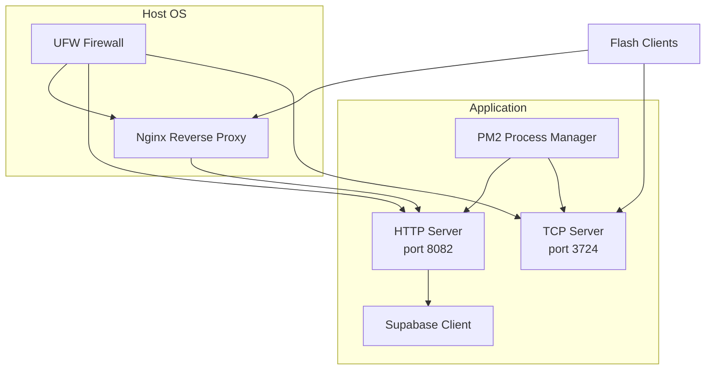
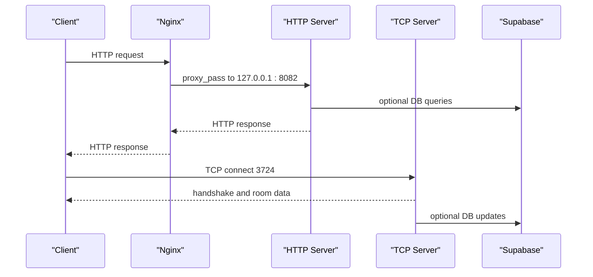
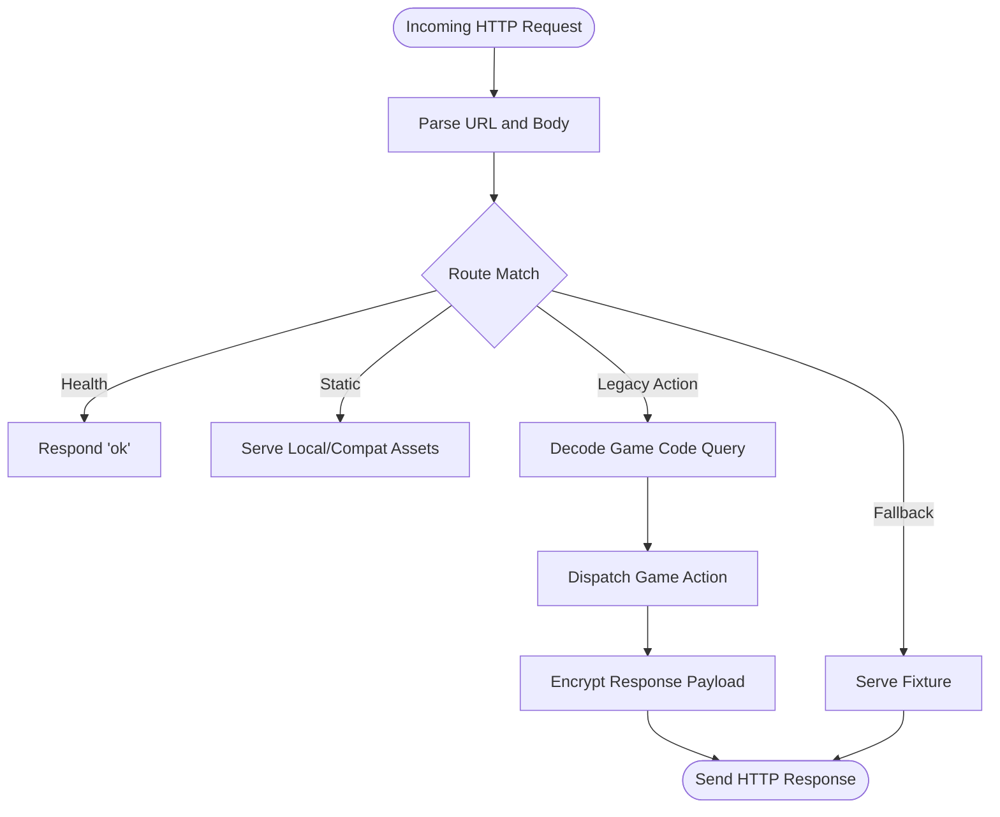
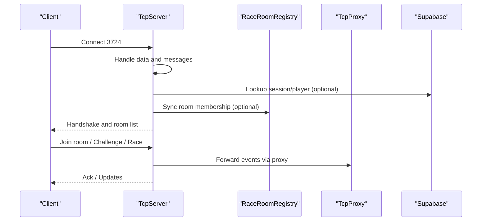
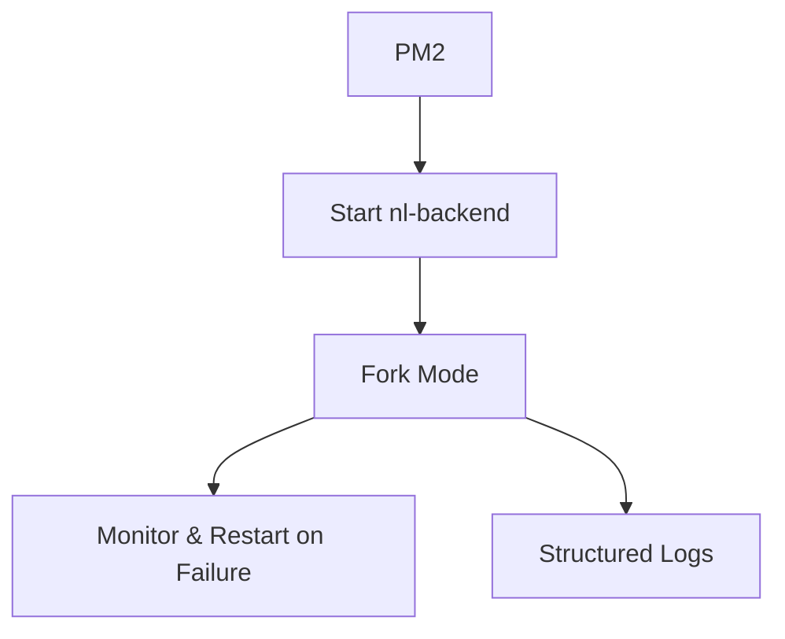
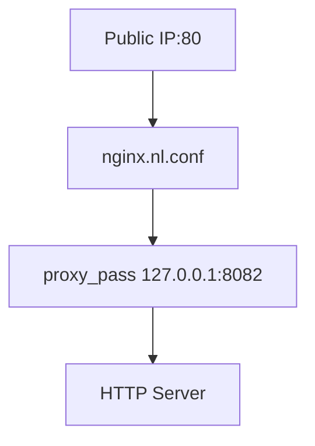
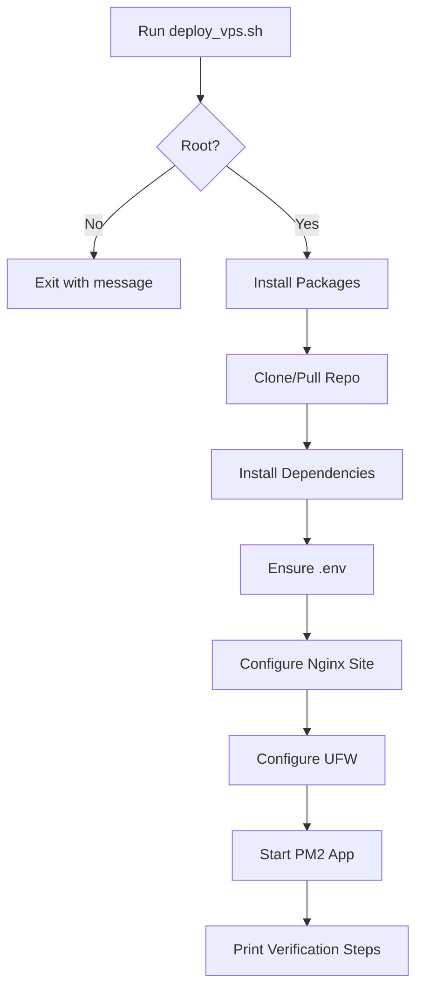
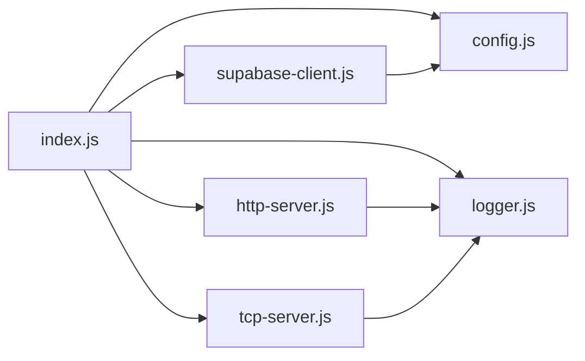
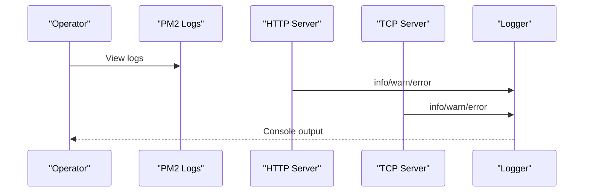

# Deployment & Operations

<cite>
**Referenced Files in This Document**
- [deploy_vps.sh](file://backend/deploy_vps.sh)
- [ecosystem.config.cjs](file://backend/ecosystem.config.cjs)
- [nginx.nl.conf](file://backend/nginx.nl.conf)
- [package.json](file://backend/package.json)
- [config.js](file://backend/src/config.js)
- [logger.js](file://backend/src/logger.js)
- [index.js](file://backend/src/index.js)
- [http-server.js](file://backend/src/http-server.js)
- [tcp-server.js](file://backend/src/tcp-server.js)
- [supabase-client.js](file://backend/src/supabase-client.js)
- [session.js](file://backend/src/session.js)
- [tcp-notify.js](file://backend/src/tcp-notify.js)
- [README.md](file://backend/README.md)
</cite>

## Table of Contents
1. [Introduction](#introduction)
2. [Project Structure](#project-structure)
3. [Core Components](#core-components)
4. [Architecture Overview](#architecture-overview)
5. [Detailed Component Analysis](#detailed-component-analysis)
6. [Dependency Analysis](#dependency-analysis)
7. [Performance Considerations](#performance-considerations)
8. [Monitoring and Logging](#monitoring-and-logging)
9. [Scaling and High Availability](#scaling-and-high-availability)
10. [Backup and Disaster Recovery](#backup-and-disaster-recovery)
11. [Environment Management](#environment-management)
12. [Security Hardening and Compliance](#security-hardening-and-compliance)
13. [Troubleshooting Guide](#troubleshooting-guide)
14. [Conclusion](#conclusion)

## Introduction
This document provides comprehensive deployment and operations guidance for the Nitto Legends Community Backend. It covers production deployment strategies, reverse proxy and process management, environment configuration, automated deployment scripts, monitoring and logging, performance metrics, scaling and high availability, backups and disaster recovery, maintenance schedules, troubleshooting, environment management, and security hardening recommendations tailored to the backend’s architecture and operational needs.

## Project Structure
The backend is organized around a Node.js runtime with a single HTTP server and a dedicated TCP server for legacy game protocol compatibility. Deployment automation is provided by a VPS script that installs prerequisites, clones the repository, configures Nginx, sets firewall rules, and starts the application via PM2. Environment variables are loaded from a .env file and exposed to the runtime.

**Diagram sources**
- [deploy_vps.sh:65-72](file://backend/deploy_vps.sh#L65-L72)
- [nginx.nl.conf:1-18](file://backend/nginx.nl.conf#L1-L18)
- [ecosystem.config.cjs:1-20](file://backend/ecosystem.config.cjs#L1-L20)
- [index.js:66-94](file://backend/src/index.js#L66-L94)

**Section sources**
- [README.md:12-20](file://backend/README.md#L12-L20)
- [deploy_vps.sh:106-115](file://backend/deploy_vps.sh#L106-L115)
- [package.json:6-10](file://backend/package.json#L6-L10)

## Core Components
- HTTP server: Handles legacy game requests, static assets, and compatibility routes. Implements health checks and structured logging.
- TCP server: Provides the legacy TCP protocol for lobby and race communication, including room management, race lifecycle, and notifications.
- Supabase client: Optional database integration for live data; falls back to fixtures when disabled.
- Logger: Centralized logging with ISO timestamps and leveled output.
- Config loader: Loads environment variables from .env and exposes runtime configuration.
- Session manager: Manages session validation and periodic cleanup.

**Section sources**
- [http-server.js:253-521](file://backend/src/http-server.js#L253-L521)
- [tcp-server.js:12-1177](file://backend/src/tcp-server.js#L12-L1177)
- [supabase-client.js:1-27](file://backend/src/supabase-client.js#L1-L27)
- [logger.js:1-24](file://backend/src/logger.js#L1-L24)
- [config.js:10-53](file://backend/src/config.js#L10-L53)
- [session.js:45-54](file://backend/src/session.js#L45-L54)

## Architecture Overview
The backend runs two primary services:
- HTTP service on loopback (127.0.0.1:8082) behind Nginx on the public interface.
- TCP service on 0.0.0.0:3724 for legacy Flash clients.

PM2 manages both services under a single app definition, with autorestart enabled and environment-specific settings.

**Diagram sources**
- [nginx.nl.conf:8-16](file://backend/nginx.nl.conf#L8-L16)
- [index.js:51-64](file://backend/src/index.js#L51-L64)
- [index.js:66](file://backend/src/index.js#L66)
- [supabase-client.js:20-26](file://backend/src/supabase-client.js#L20-L26)

## Detailed Component Analysis

### HTTP Server
- Exposes health endpoint and compatibility routes.
- Decrypts/encrypts legacy payloads and serves fixtures when live data is unavailable.
- Logs request metadata and errors.

**Diagram sources**
- [http-server.js:254-521](file://backend/src/http-server.js#L254-L521)

**Section sources**
- [http-server.js:367-370](file://backend/src/http-server.js#L367-L370)
- [http-server.js:391-424](file://backend/src/http-server.js#L391-L424)
- [http-server.js:472-514](file://backend/src/http-server.js#L472-L514)

### TCP Server
- Manages connections, rooms, races, and lobby state.
- Handles protocol messages for login, heartbeat, room join, race requests, and race sync.
- Emits logs for connection lifecycle and message handling.

**Diagram sources**
- [tcp-server.js:41-57](file://backend/src/tcp-server.js#L41-L57)
- [tcp-server.js:148-498](file://backend/src/tcp-server.js#L148-L498)
- [index.js:23-49](file://backend/src/index.js#L23-L49)

**Section sources**
- [tcp-server.js:12-1177](file://backend/src/tcp-server.js#L12-L1177)
- [tcp-notify.js:1-58](file://backend/src/tcp-notify.js#L1-L58)

### Process Management with PM2
- Single app definition with fork mode and autorestart.
- Environment set to production and working directory configured.

**Diagram sources**
- [ecosystem.config.cjs:1-20](file://backend/ecosystem.config.cjs#L1-L20)

**Section sources**
- [ecosystem.config.cjs:14-17](file://backend/ecosystem.config.cjs#L14-L17)
- [index.js:86-94](file://backend/src/index.js#L86-L94)

### Reverse Proxy with Nginx
- Listens on 80 and proxies to 127.0.0.1:8082.
- Sets headers for client IP and protocol.
- Includes a reasonable client body limit.

**Diagram sources**
- [nginx.nl.conf:1-18](file://backend/nginx.nl.conf#L1-L18)

**Section sources**
- [nginx.nl.conf:8-16](file://backend/nginx.nl.conf#L8-L16)
- [deploy_vps.sh:65-72](file://backend/deploy_vps.sh#L65-L72)

### Automated Deployment Script
- Installs base packages, Node.js, Nginx, UFW, and PM2.
- Clones or updates the repository, installs dependencies, and ensures .env exists.
- Configures Nginx site, firewall, and starts PM2.

**Diagram sources**
- [deploy_vps.sh:12-17](file://backend/deploy_vps.sh#L12-L17)
- [deploy_vps.sh:19-31](file://backend/deploy_vps.sh#L19-L31)
- [deploy_vps.sh:33-45](file://backend/deploy_vps.sh#L33-L45)
- [deploy_vps.sh:47-63](file://backend/deploy_vps.sh#L47-L63)
- [deploy_vps.sh:65-72](file://backend/deploy_vps.sh#L65-L72)
- [deploy_vps.sh:74-79](file://backend/deploy_vps.sh#L74-L79)
- [deploy_vps.sh:81-85](file://backend/deploy_vps.sh#L81-L85)
- [deploy_vps.sh:87-104](file://backend/deploy_vps.sh#L87-L104)

**Section sources**
- [deploy_vps.sh:106-115](file://backend/deploy_vps.sh#L106-L115)

## Dependency Analysis
- Runtime dependencies include Supabase client for optional database access.
- Application startup composes HTTP server, TCP server, and services, then starts both listeners.
- Environment variables drive host/port configuration and Supabase credentials.

**Diagram sources**
- [index.js:1-12](file://backend/src/index.js#L1-L12)
- [config.js:42-52](file://backend/src/config.js#L42-L52)
- [supabase-client.js:1-27](file://backend/src/supabase-client.js#L1-L27)

**Section sources**
- [package.json:11-13](file://backend/package.json#L11-L13)
- [index.js:14-64](file://backend/src/index.js#L14-L64)

## Performance Considerations
- HTTP server:
  - Uses streaming request bodies and binary responses for assets.
  - Implements periodic cleanup of stale uploads and in-memory caches.
- TCP server:
  - Maintains room and race state in memory; avoid excessive concurrent races.
  - Applies engine wear after race completion to simulate realistic gameplay.
- Supabase:
  - Optional; when disabled, the backend runs in fixture-only mode with reduced latency.
- Recommendations:
  - Enable PM2 cluster mode for CPU-bound tasks if scaling horizontally.
  - Use Nginx gzip/static caching for repeated assets.
  - Monitor TCP connection counts and room sizes to size capacity appropriately.

[No sources needed since this section provides general guidance]

## Monitoring and Logging
- Structured logging:
  - Timestamped, leveled log entries for HTTP and TCP operations.
  - Logs include request metadata, decoded actions, and error stacks.
- Health checks:
  - HTTP health endpoint returns a simple OK response.
- Operational visibility:
  - PM2 logs provide process-level insights.
  - Nginx access/error logs record traffic and proxy behavior.

**Diagram sources**
- [logger.js:13-23](file://backend/src/logger.js#L13-L23)
- [http-server.js:260-264](file://backend/src/http-server.js#L260-L264)
- [http-server.js:515-518](file://backend/src/http-server.js#L515-L518)
- [tcp-server.js:95-116](file://backend/src/tcp-server.js#L95-L116)

**Section sources**
- [http-server.js:367-370](file://backend/src/http-server.js#L367-L370)
- [logger.js:1-24](file://backend/src/logger.js#L1-L24)
- [deploy_vps.sh:97-97](file://backend/deploy_vps.sh#L97-L97)

## Scaling and High Availability
- Current configuration:
  - PM2 runs a single fork instance; no built-in clustering.
  - HTTP and TCP servers bind to localhost/public IPs respectively.
- Recommended approaches:
  - Horizontal scaling:
    - Run multiple PM2 instances behind a load balancer.
    - Use sticky sessions or shared state for TCP if needed.
  - Vertical scaling:
    - Increase Node.js heap and tune garbage collection for higher concurrency.
  - High availability:
    - Multiple application nodes with shared database and synchronized cache.
    - Health checks and automatic failover via external orchestrator or cloud LB.

[No sources needed since this section provides general guidance]

## Backup and Disaster Recovery
- Data protection:
  - Supabase-managed database backups; retain recent snapshots.
  - Local cache directories for uploaded assets; back up periodically.
- Recovery steps:
  - Restore database from latest backup.
  - Re-deploy application using the automated script.
  - Validate HTTP health endpoint and TCP connectivity.

[No sources needed since this section provides general guidance]

## Environment Management
- Environments:
  - Development: Use dev script and local .env for quick iteration.
  - Staging: Mirror production configuration with limited scale.
  - Production: Use PM2 with production environment and hardened firewall.
- Configuration:
  - HTTP_HOST, PORT, TCP_HOST, TCP_PORT, SUPABASE_URL, SUPABASE_SERVICE_ROLE_KEY.
  - Ensure .env is present and secure on production hosts.

**Section sources**
- [config.js:42-48](file://backend/src/config.js#L42-L48)
- [package.json:7-8](file://backend/package.json#L7-L8)
- [deploy_vps.sh:47-63](file://backend/deploy_vps.sh#L47-L63)

## Security Hardening and Compliance
- Network:
  - Restrict inbound ports to SSH, Nginx, and TCP 3724.
  - Enable UFW and review status regularly.
- Secrets:
  - Protect Supabase service role key and application secrets.
  - Do not commit .env to version control.
- Access:
  - Limit SSH access to trusted IPs.
  - Use non-root accounts for daily operations.
- Compliance:
  - Ensure data retention and deletion policies align with applicable regulations.
  - Audit logs for unauthorized access attempts.

**Section sources**
- [deploy_vps.sh:74-79](file://backend/deploy_vps.sh#L74-L79)
- [supabase-client.js:2-7](file://backend/src/supabase-client.js#L2-L7)

## Troubleshooting Guide
- Post-deployment verification:
  - Confirm HTTP health endpoint responds.
  - Validate TCP listener is bound to public IP and port.
  - Check Nginx configuration and reload status.
  - Inspect PM2 status and recent logs.
- Common issues:
  - Missing .env: Script will prompt to create and configure it.
  - Supabase not configured: Backend runs in fixture-only mode; enable credentials to restore live data.
  - Port conflicts: Adjust HTTP/TCP ports in .env and restart services.
  - Firewall blocked: Review UFW rules and allow required ports.
- Logs:
  - Use PM2 logs to inspect application-level errors.
  - Check Nginx access/error logs for proxy issues.

**Section sources**
- [deploy_vps.sh:87-104](file://backend/deploy_vps.sh#L87-L104)
- [supabase-client.js:2-7](file://backend/src/supabase-client.js#L2-L7)
- [session.js:45-54](file://backend/src/session.js#L45-L54)

## Conclusion
The Nitto Legends Community Backend is designed for straightforward deployment with Nginx and PM2, clear environment-driven configuration, and robust logging. By following the provided deployment script, maintaining strict environment separation, and implementing the recommended monitoring, scaling, backup, and security practices, operators can reliably run the backend in development, staging, and production environments.