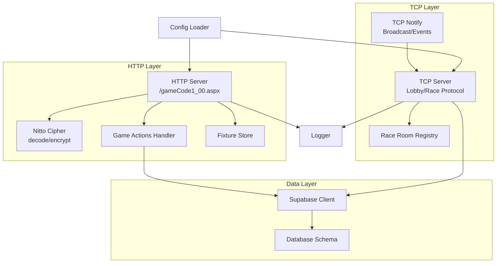
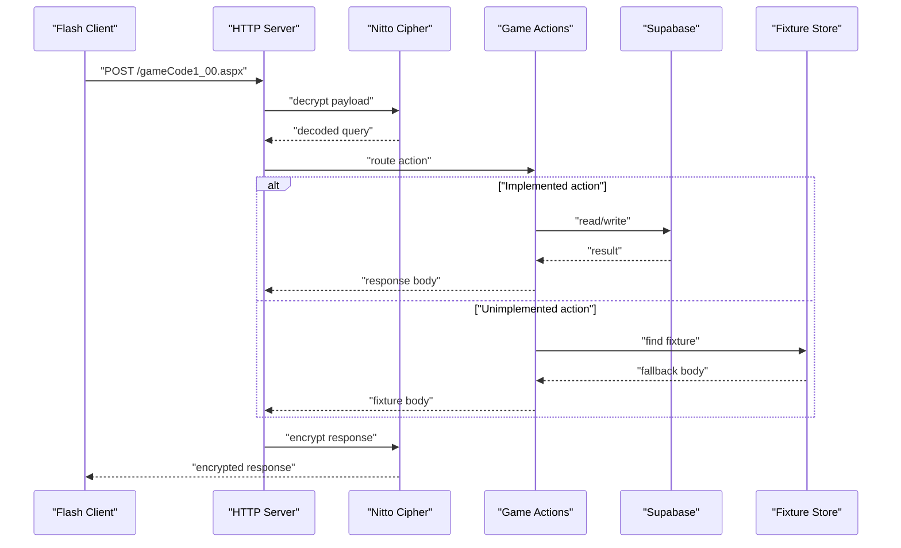
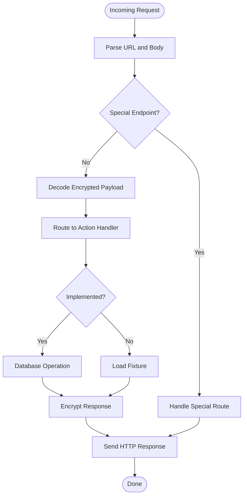
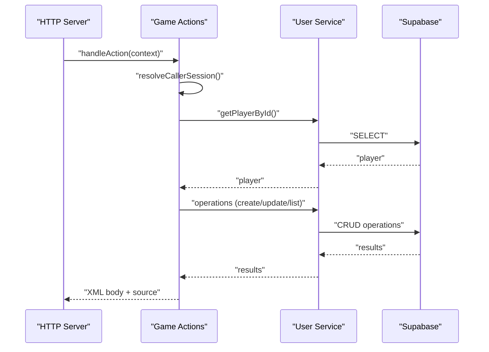
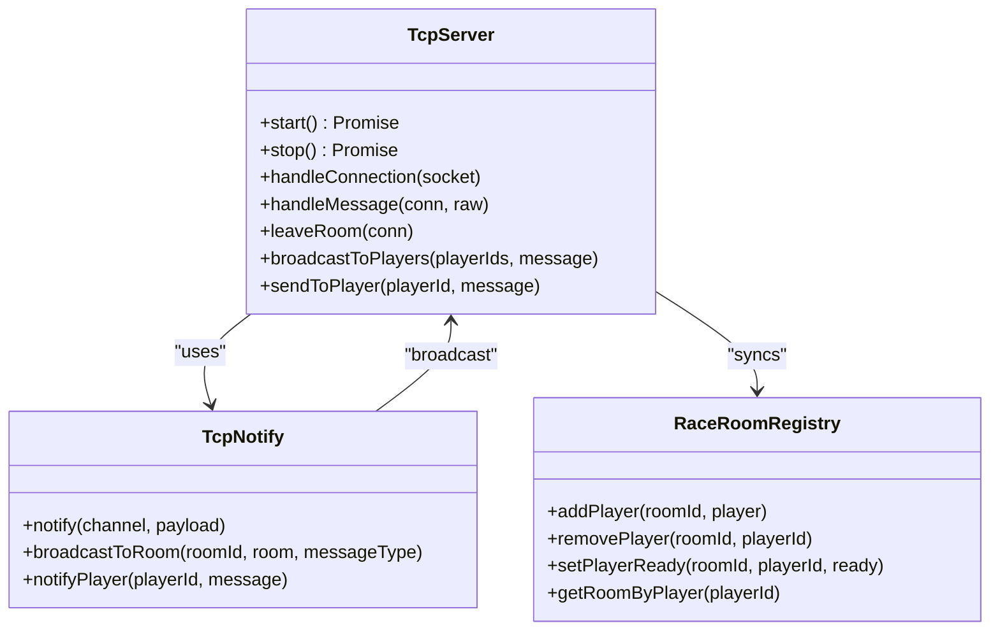
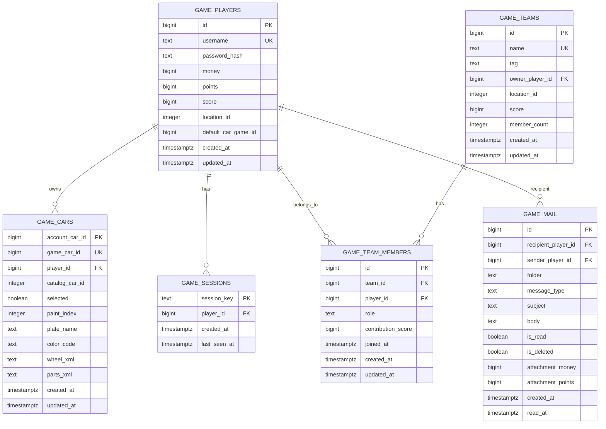
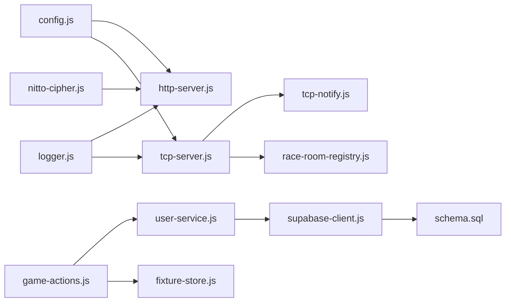

# Development Guidelines

<cite>
**Referenced Files in This Document**
- [README.md](file://backend/README.md)
- [package.json](file://backend/package.json)
- [index.js](file://backend/src/index.js)
- [logger.js](file://backend/src/logger.js)
- [config.js](file://backend/src/config.js)
- [http-server.js](file://backend/src/http-server.js)
- [game-actions.js](file://backend/src/game-actions.js)
- [user-service.js](file://backend/src/user-service.js)
- [supabase-client.js](file://backend/src/supabase-client.js)
- [schema.sql](file://backend/supabase/schema.sql)
- [nitto-cipher.js](file://backend/src/nitto-cipher.js)
- [fixture-store.js](file://backend/src/fixture-store.js)
- [tcp-server.js](file://backend/src/tcp-server.js)
- [tcp-notify.js](file://backend/src/tcp-notify.js)
- [race-room-registry.js](file://backend/src/race-room-registry.js)
</cite>

## Table of Contents
1. [Introduction](#introduction)
2. [Project Structure](#project-structure)
3. [Core Components](#core-components)
4. [Architecture Overview](#architecture-overview)
5. [Detailed Component Analysis](#detailed-component-analysis)
6. [Dependency Analysis](#dependency-analysis)
7. [Performance Considerations](#performance-considerations)
8. [Troubleshooting Guide](#troubleshooting-guide)
9. [Contribution Workflow](#contribution-workflow)
10. [Testing Strategies](#testing-strategies)
11. [Version Control and Release Procedures](#version-control-and-release-procedures)
12. [Documentation and Maintenance](#documentation-and-maintenance)
13. [Conclusion](#conclusion)

## Introduction
This document provides comprehensive development guidelines for contributing to the Nitto Legends Community Backend project. It explains the code organization principles, coding standards, architectural patterns, and development workflow. It also covers the fixture-based development approach, logging standards, debugging techniques for legacy protocol issues, extension guidelines, testing strategies, code review processes, and maintenance practices.

## Project Structure
The backend is organized around a modular Node.js architecture with clear separation of concerns:
- HTTP server and routing for legacy gameCode1_00.aspx requests
- TCP server for real-time lobby and racing communication
- Supabase integration for persistent storage
- Fixture-based fallback system for unimplemented actions
- Centralized logging and configuration management

**Diagram sources**
- [index.js:1-95](file://backend/src/index.js#L1-L95)
- [http-server.js:253-521](file://backend/src/http-server.js#L253-L521)
- [nitto-cipher.js:125-139](file://backend/src/nitto-cipher.js#L125-L139)
- [game-actions.js:1-800](file://backend/src/game-actions.js#L1-L800)
- [fixture-store.js:26-86](file://backend/src/fixture-store.js#L26-L86)
- [tcp-server.js:12-1177](file://backend/src/tcp-server.js#L12-L1177)
- [tcp-notify.js:1-58](file://backend/src/tcp-notify.js#L1-L58)
- [race-room-registry.js:1-137](file://backend/src/race-room-registry.js#L1-L137)
- [supabase-client.js:1-27](file://backend/src/supabase-client.js#L1-L27)
- [schema.sql:1-325](file://backend/supabase/schema.sql#L1-L325)
- [config.js:42-53](file://backend/src/config.js#L42-L53)
- [logger.js:1-24](file://backend/src/logger.js#L1-L24)

**Section sources**
- [README.md:1-76](file://backend/README.md#L1-L76)
- [package.json:1-15](file://backend/package.json#L1-L15)
- [index.js:1-95](file://backend/src/index.js#L1-L95)

## Core Components
- Configuration loader: centralizes environment variables and paths
- HTTP server: handles legacy game requests, decryption, routing, and encryption
- Game actions: implements supported actions and delegates to user-service
- User service: encapsulates database operations and normalization
- Supabase client: manages database connectivity and migrations
- TCP server: implements lobby and race protocols
- TCP notify: broadcasts events to connected clients
- Race room registry: maintains in-memory room state and membership
- Fixture store: loads and serves fallback responses
- Logger: standardized logging across modules

**Section sources**
- [config.js:1-53](file://backend/src/config.js#L1-L53)
- [http-server.js:253-521](file://backend/src/http-server.js#L253-L521)
- [game-actions.js:1-800](file://backend/src/game-actions.js#L1-L800)
- [user-service.js:1-661](file://backend/src/user-service.js#L1-L661)
- [supabase-client.js:1-27](file://backend/src/supabase-client.js#L1-L27)
- [tcp-server.js:12-1177](file://backend/src/tcp-server.js#L12-L1177)
- [tcp-notify.js:1-58](file://backend/src/tcp-notify.js#L1-L58)
- [race-room-registry.js:1-137](file://backend/src/race-room-registry.js#L1-L137)
- [fixture-store.js:26-86](file://backend/src/fixture-store.js#L26-L86)
- [logger.js:1-24](file://backend/src/logger.js#L1-L24)

## Architecture Overview
The system preserves the original legacy protocol while migrating data to Supabase. The HTTP server decodes encrypted requests, resolves actions, and either executes database-backed logic or falls back to fixtures. The TCP server handles real-time lobby and racing interactions, broadcasting updates and managing room state.

**Diagram sources**
- [http-server.js:426-521](file://backend/src/http-server.js#L426-L521)
- [nitto-cipher.js:100-139](file://backend/src/nitto-cipher.js#L100-L139)
- [game-actions.js:1-800](file://backend/src/game-actions.js#L1-L800)
- [fixture-store.js:75-86](file://backend/src/fixture-store.js#L75-L86)

**Section sources**
- [README.md:1-76](file://backend/README.md#L1-L76)
- [http-server.js:253-521](file://backend/src/http-server.js#L253-L521)
- [game-actions.js:1-800](file://backend/src/game-actions.js#L1-L800)

## Detailed Component Analysis

### HTTP Server and Legacy Protocol
The HTTP server implements the legacy Nitto protocol:
- Decrypts requests using the Nitto cipher
- Routes actions to handlers
- Supports fixture fallback for unimplemented actions
- Encrypts responses back to the client
- Handles special endpoints like Status.aspx and Upload.aspx

**Diagram sources**
- [http-server.js:253-521](file://backend/src/http-server.js#L253-L521)
- [nitto-cipher.js:100-139](file://backend/src/nitto-cipher.js#L100-L139)
- [fixture-store.js:75-86](file://backend/src/fixture-store.js#L75-L86)

**Section sources**
- [http-server.js:253-521](file://backend/src/http-server.js#L253-L521)
- [nitto-cipher.js:100-139](file://backend/src/nitto-cipher.js#L100-L139)

### Game Actions and Backward Compatibility
Game actions encapsulate business logic:
- Session resolution and validation
- Player and car operations
- XML rendering helpers
- Money and inventory updates
- Password migration and normalization

**Diagram sources**
- [game-actions.js:166-204](file://backend/src/game-actions.js#L166-L204)
- [user-service.js:184-255](file://backend/src/user-service.js#L184-L255)

**Section sources**
- [game-actions.js:1-800](file://backend/src/game-actions.js#L1-L800)
- [user-service.js:1-661](file://backend/src/user-service.js#L1-L661)

### TCP Server and Real-Time Features
The TCP server implements the lobby and race protocol:
- Connection lifecycle management
- Room and race state tracking
- Message parsing and broadcasting
- Engine wear simulation
- Cross-domain policy handling

**Diagram sources**
- [tcp-server.js:12-1177](file://backend/src/tcp-server.js#L12-L1177)
- [tcp-notify.js:1-58](file://backend/src/tcp-notify.js#L1-L58)
- [race-room-registry.js:1-137](file://backend/src/race-room-registry.js#L1-L137)

**Section sources**
- [tcp-server.js:12-1177](file://backend/src/tcp-server.js#L12-L1177)
- [tcp-notify.js:1-58](file://backend/src/tcp-notify.js#L1-L58)
- [race-room-registry.js:1-137](file://backend/src/race-room-registry.js#L1-L137)

### Supabase Integration and Schema
Supabase provides the persistence layer:
- Authentication disabled for ephemeral sessions
- Triggers for automatic timestamps
- Indexes for common queries
- Sample data for local development

**Diagram sources**
- [schema.sql:1-325](file://backend/supabase/schema.sql#L1-L325)

**Section sources**
- [supabase-client.js:1-27](file://backend/src/supabase-client.js#L1-L27)
- [schema.sql:1-325](file://backend/supabase/schema.sql#L1-L325)

## Dependency Analysis
The system exhibits low coupling and high cohesion:
- HTTP and TCP servers depend on shared services (Supabase, logger, config)
- Game actions depend on user-service and XML helpers
- Fixture store provides loose coupling for fallback responses
- TCP notify depends on TCP server for broadcasting

**Diagram sources**
- [index.js:1-95](file://backend/src/index.js#L1-L95)
- [http-server.js:253-521](file://backend/src/http-server.js#L253-L521)
- [game-actions.js:1-800](file://backend/src/game-actions.js#L1-L800)
- [user-service.js:1-661](file://backend/src/user-service.js#L1-L661)
- [supabase-client.js:1-27](file://backend/src/supabase-client.js#L1-L27)
- [schema.sql:1-325](file://backend/supabase/schema.sql#L1-L325)
- [nitto-cipher.js:1-139](file://backend/src/nitto-cipher.js#L1-L139)
- [fixture-store.js:26-86](file://backend/src/fixture-store.js#L26-L86)
- [tcp-server.js:12-1177](file://backend/src/tcp-server.js#L12-L1177)
- [tcp-notify.js:1-58](file://backend/src/tcp-notify.js#L1-L58)
- [race-room-registry.js:1-137](file://backend/src/race-room-registry.js#L1-L137)

**Section sources**
- [index.js:1-95](file://backend/src/index.js#L1-L95)

## Performance Considerations
- Logging overhead: structured logs with minimal formatting
- Memory usage: in-process state cleanup intervals for rivals and teams
- Database efficiency: indexes on foreign keys and frequent filters
- TCP message batching: minimize network round trips for room updates
- Fixture caching: single load and in-memory lookup for fallback responses

## Troubleshooting Guide
Common issues and resolutions:
- Missing Supabase credentials: server runs in fixture-only mode with warnings
- Decryption failures: verify seed suffix and alphabet compatibility
- Session validation errors: check session table and player existence
- TCP connection drops: inspect cross-domain policy and delimiter handling
- Fixture mismatches: ensure decoded query keys match fixture records

**Section sources**
- [supabase-client.js:1-27](file://backend/src/supabase-client.js#L1-L27)
- [nitto-cipher.js:107-139](file://backend/src/nitto-cipher.js#L107-L139)
- [http-server.js:432-468](file://backend/src/http-server.js#L432-L468)
- [tcp-server.js:124-146](file://backend/src/tcp-server.js#L124-L146)

## Contribution Workflow
1. Fork and clone the repository
2. Install dependencies: `npm install`
3. Configure environment variables in `.env` (URL and service role key)
4. Initialize database schema using `schema.sql`
5. Start development server: `npm run dev`
6. Verify functionality against legacy fixtures
7. Submit pull request with clear description and tests

**Section sources**
- [README.md:12-20](file://backend/README.md#L12-L20)
- [package.json:6-10](file://backend/package.json#L6-L10)

## Testing Strategies
- Unit tests for individual modules (user-service, cipher, fixture-store)
- Integration tests for HTTP endpoints and TCP message flows
- Regression tests using fixture captures
- Load tests for concurrent TCP connections and HTTP requests
- Security tests for payload validation and path sanitization

## Version Control and Release Procedures
- Branch naming: feature/short-description, hotfix/issue-number
- Commit messages: present tense, imperative mood, include issue number
- Pull requests: require review and passing tests
- Releases: semantic versioning, changelog updates, deployment scripts

## Documentation and Maintenance
- Keep README updated with new features and setup steps
- Update fixtures when changing legacy responses
- Maintain backward compatibility for existing actions
- Document breaking changes and migration steps
- Regular schema audits and index reviews

## Conclusion
This development guide establishes a consistent approach to extending the Nitto Legends Community Backend while preserving legacy compatibility. By following the outlined patterns, contributors can implement new features safely, maintain code quality, and ensure smooth operation across HTTP and TCP protocols.