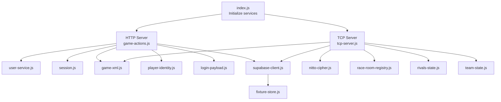
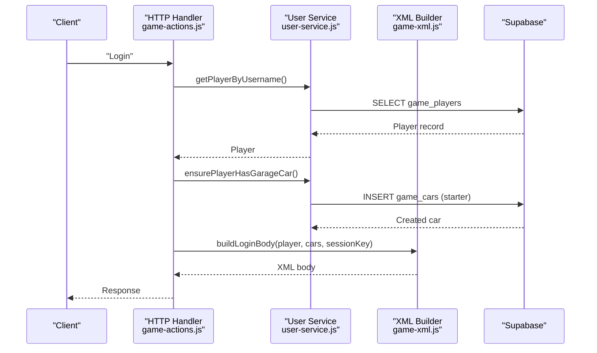
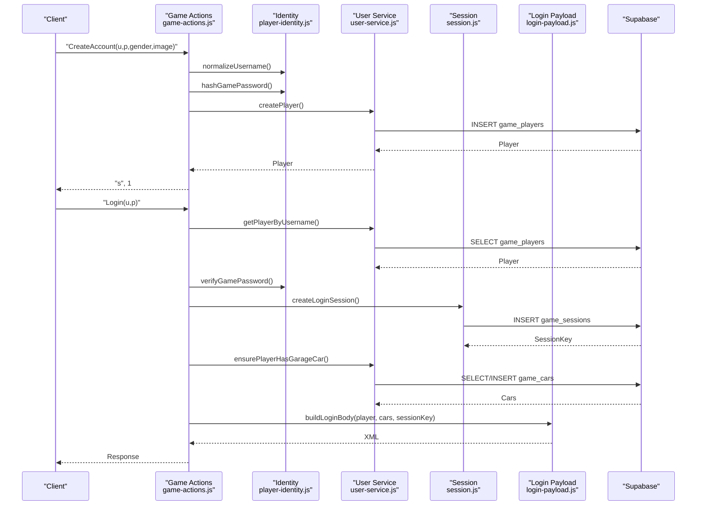
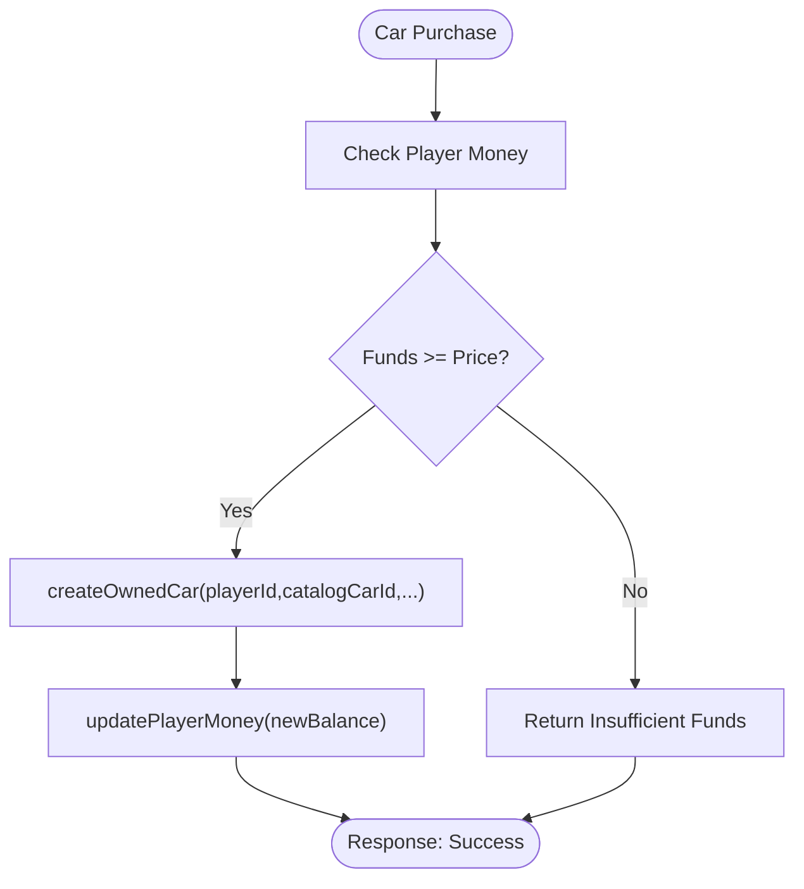
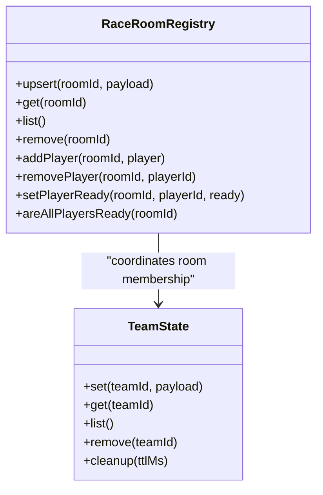
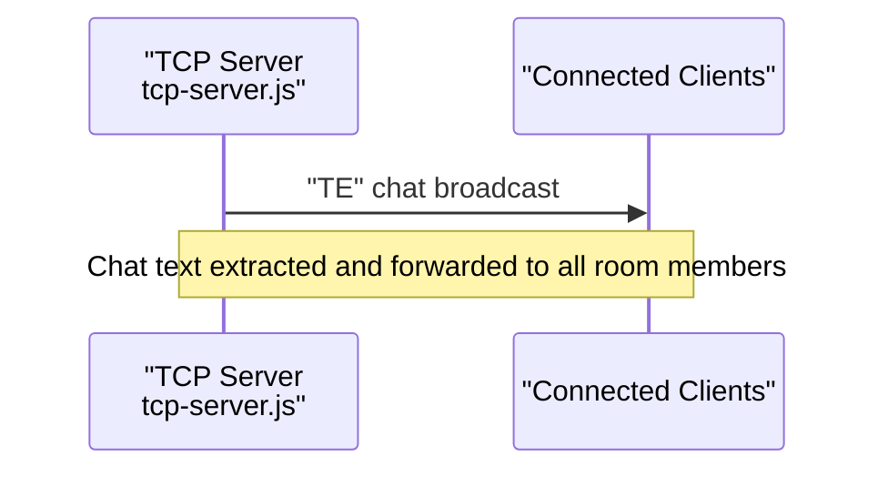
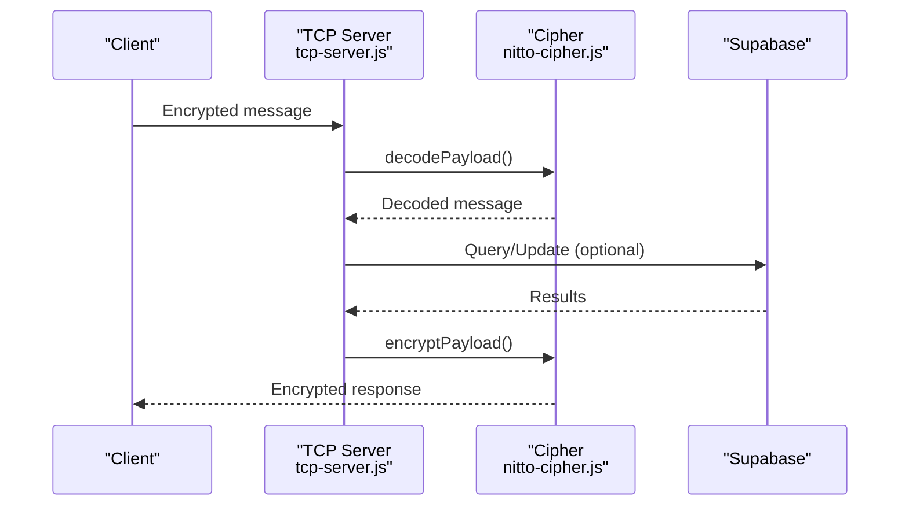
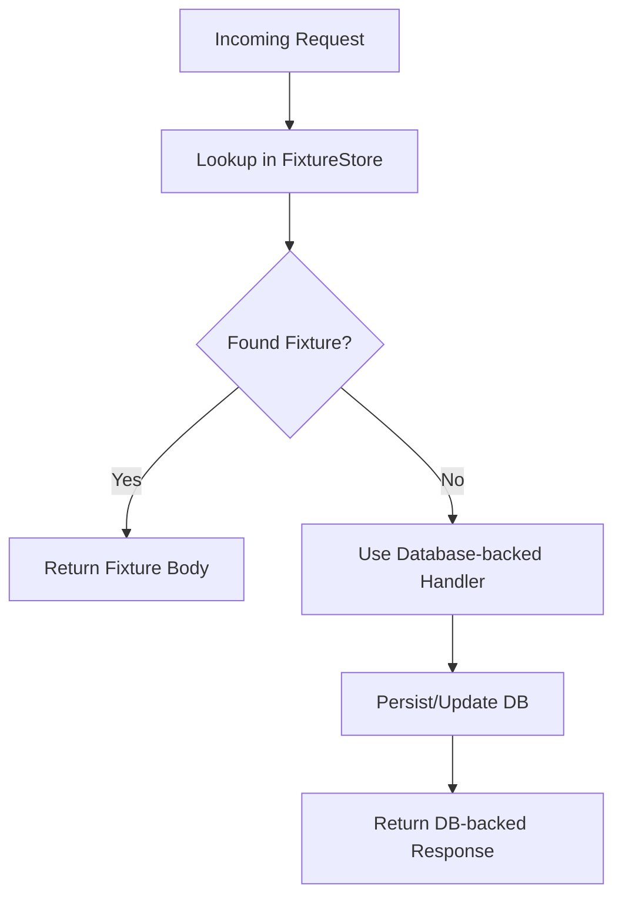
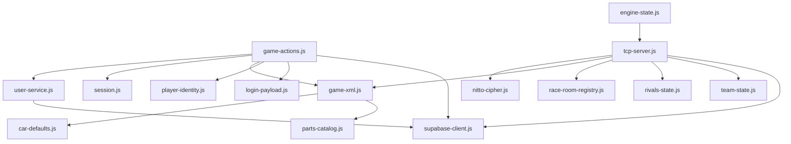

# Game Features Implementation

<cite>
**Referenced Files in This Document**
- [index.js](file://backend/src/index.js)
- [supabase-client.js](file://backend/src/supabase-client.js)
- [user-service.js](file://backend/src/user-service.js)
- [game-actions.js](file://backend/src/game-actions.js)
- [session.js](file://backend/src/session.js)
- [player-identity.js](file://backend/src/player-identity.js)
- [game-xml.js](file://backend/src/game-xml.js)
- [login-payload.js](file://backend/src/login-payload.js)
- [car-defaults.js](file://backend/src/car-defaults.js)
- [parts-catalog.js](file://backend/src/parts-catalog.js)
- [engine-state.js](file://backend/src/engine-state.js)
- [tcp-server.js](file://backend/src/tcp-server.js)
- [rivals-state.js](file://backend/src/rivals-state.js)
- [team-state.js](file://backend/src/team-state.js)
- [race-room-registry.js](file://backend/src/race-room-registry.js)
- [nitto-cipher.js](file://backend/src/nitto-cipher.js)
- [fixture-store.js](file://backend/src/fixture-store.js)
</cite>

## Table of Contents
1. [Introduction](#introduction)
2. [Project Structure](#project-structure)
3. [Core Components](#core-components)
4. [Architecture Overview](#architecture-overview)
5. [Detailed Component Analysis](#detailed-component-analysis)
6. [Dependency Analysis](#dependency-analysis)
7. [Performance Considerations](#performance-considerations)
8. [Troubleshooting Guide](#troubleshooting-guide)
9. [Conclusion](#conclusion)

## Introduction
This document explains the Nitto Legends game features implemented in the backend, focusing on player registration and authentication, car management (garage, purchases, customization), team creation and management, and social features such as rivalries and messaging. It also details the user service implementation for player data, car ownership tracking, and team membership management, along with the game actions framework that maps Nitto Legends features to database-backed operations. The document covers integration with the legacy protocol, a fixture fallback system for unimplemented features, and performance/scalability considerations.

## Project Structure
The backend is organized around a modular architecture:
- Entry point initializes services, HTTP/TCP servers, and periodic cleanup tasks.
- Supabase client provides database connectivity with graceful fallback when disabled.
- Game actions module orchestrates feature-specific workflows and XML rendering.
- User service encapsulates player, car, and team data operations.
- TCP server handles the legacy binary protocol, including lobby, races, and chat.
- Supporting modules manage sessions, identity hashing, XML building, catalogs, and engine state.

**Diagram sources**
- [index.js:14-64](file://backend/src/index.js#L14-L64)
- [tcp-server.js:12-39](file://backend/src/tcp-server.js#L12-L39)
- [game-actions.js:1-38](file://backend/src/game-actions.js#L1-L38)
- [user-service.js:1-30](file://backend/src/user-service.js#L1-L30)
- [session.js:11-21](file://backend/src/session.js#L11-L21)
- [game-xml.js:25-31](file://backend/src/game-xml.js#L25-L31)
- [player-identity.js:3-6](file://backend/src/player-identity.js#L3-L6)
- [login-payload.js:165-196](file://backend/src/login-payload.js#L165-L196)
- [supabase-client.js:1-26](file://backend/src/supabase-client.js#L1-L26)
- [nitto-cipher.js:100-138](file://backend/src/nitto-cipher.js#L100-L138)
- [race-room-registry.js:6-22](file://backend/src/race-room-registry.js#L6-L22)
- [rivals-state.js:6-10](file://backend/src/rivals-state.js#L6-L10)
- [team-state.js:6-10](file://backend/src/team-state.js#L6-L10)
- [fixture-store.js:26-32](file://backend/src/fixture-store.js#L26-L32)

**Section sources**
- [index.js:1-95](file://backend/src/index.js#L1-L95)
- [supabase-client.js:1-27](file://backend/src/supabase-client.js#L1-L27)

## Core Components
- User Service: Player CRUD, car lifecycle (purchase, ownership, default selection), money updates, and team queries.
- Game Actions: Feature handlers for login, profile retrieval, car purchases, part customization, showroom logic, test drive offers, and email retrieval.
- Session Management: Session creation, validation, and cleanup.
- Identity Utilities: Username normalization and password hashing/verification.
- XML Builders: Rendering of login bodies, user summaries, garage cars, and static catalogs.
- TCP Server: Legacy protocol handling, lobby, races, chat, and engine wear.
- Catalogs and Defaults: Car defaults, parts catalog balancing, and paint fallbacks.
- Engine State: Engine condition progression for cars.
- In-memory State: Rivals and team state caches with TTL-based cleanup.

**Section sources**
- [user-service.js:184-660](file://backend/src/user-service.js#L184-L660)
- [game-actions.js:227-846](file://backend/src/game-actions.js#L227-L846)
- [session.js:11-86](file://backend/src/session.js#L11-L86)
- [player-identity.js:3-27](file://backend/src/player-identity.js#L3-L27)
- [game-xml.js:33-265](file://backend/src/game-xml.js#L33-L265)
- [tcp-server.js:12-499](file://backend/src/tcp-server.js#L12-L499)
- [parts-catalog.js:16-82](file://backend/src/parts-catalog.js#L16-L82)
- [car-defaults.js:12-31](file://backend/src/car-defaults.js#L12-L31)
- [engine-state.js:26-62](file://backend/src/engine-state.js#L26-L62)
- [rivals-state.js:6-38](file://backend/src/rivals-state.js#L6-L38)
- [team-state.js:6-38](file://backend/src/team-state.js#L6-L38)

## Architecture Overview
The system integrates HTTP and TCP protocols:
- HTTP endpoint routes game actions to user-service and XML builders, with optional Supabase integration.
- TCP endpoint implements the legacy Nitto Legends protocol, managing lobby, races, and chat, with encryption/decryption support.
- Supabase provides persistence for players, cars, sessions, and mail; a fixture fallback allows operation without live DB.

**Diagram sources**
- [game-actions.js:227-272](file://backend/src/game-actions.js#L227-L272)
- [user-service.js:399-429](file://backend/src/user-service.js#L399-L429)
- [game-xml.js:165-196](file://backend/src/game-xml.js#L165-L196)

**Section sources**
- [index.js:51-64](file://backend/src/index.js#L51-L64)
- [tcp-server.js:148-498](file://backend/src/tcp-server.js#L148-L498)

## Detailed Component Analysis

### Player Registration and Authentication
- Registration: Validates credentials, hashes passwords, creates player with defaults, and optionally grants a starter car.
- Authentication: Verifies password against stored hash, creates session, and returns login XML with cars and session metadata.
- Session Validation: Ensures session key matches player and updates last seen timestamps.

**Diagram sources**
- [game-actions.js:274-338](file://backend/src/game-actions.js#L274-L338)
- [game-actions.js:227-272](file://backend/src/game-actions.js#L227-L272)
- [player-identity.js:8-23](file://backend/src/player-identity.js#L8-L23)
- [session.js:23-39](file://backend/src/session.js#L23-L39)
- [login-payload.js:165-196](file://backend/src/login-payload.js#L165-L196)
- [user-service.js:211-255](file://backend/src/user-service.js#L211-L255)
- [user-service.js:399-429](file://backend/src/user-service.js#L399-L429)

**Section sources**
- [game-actions.js:274-338](file://backend/src/game-actions.js#L274-L338)
- [game-actions.js:227-272](file://backend/src/game-actions.js#L227-L272)
- [session.js:11-86](file://backend/src/session.js#L11-L86)
- [player-identity.js:3-27](file://backend/src/player-identity.js#L3-L27)

### Car Management: Garage, Purchases, and Customization
- Garage Operations: Ensures a default car exists, lists owned cars, updates default car, deletes cars, and repairs legacy car data.
- Car Purchasing: Validates funds, creates owned car, sets default if first car, and updates money.
- Part Customization: Parses parts catalog, installs parts into car parts_xml, supports custom decals, and persists changes.
- Test Drive System: Offers test drive invitations, tracks active test drive cars, and converts to owned cars or removes expired cars.

**Diagram sources**
- [game-actions.js:800-846](file://backend/src/game-actions.js#L800-L846)
- [user-service.js:295-367](file://backend/src/user-service.js#L295-L367)
- [user-service.js:523-538](file://backend/src/user-service.js#L523-L538)

**Section sources**
- [user-service.js:399-490](file://backend/src/user-service.js#L399-L490)
- [game-actions.js:800-846](file://backend/src/game-actions.js#L800-L846)
- [game-actions.js:621-730](file://backend/src/game-actions.js#L621-L730)
- [game-actions.js:732-792](file://backend/src/game-actions.js#L732-L792)

### Team Creation and Management
- Team Queries: List teams by IDs and list members ordered by contribution score.
- Team Registry: Tracks room memberships and enforces single-room-at-a-time semantics.
- In-memory Team State: TTL-based cleanup for transient team data.

**Diagram sources**
- [race-room-registry.js:6-136](file://backend/src/race-room-registry.js#L6-L136)
- [team-state.js:1-40](file://backend/src/team-state.js#L1-L40)

**Section sources**
- [user-service.js:588-638](file://backend/src/user-service.js#L588-L638)
- [race-room-registry.js:39-93](file://backend/src/race-room-registry.js#L39-L93)
- [team-state.js:24-38](file://backend/src/team-state.js#L24-L38)

### Social Features: Rivalries and Messaging
- Rivalries: In-memory cache with TTL-based eviction for rival-related state.
- Messaging: TCP server supports chat messages in rooms, broadcasting to other users.

**Diagram sources**
- [tcp-server.js:375-391](file://backend/src/tcp-server.js#L375-L391)
- [rivals-state.js:24-38](file://backend/src/rivals-state.js#L24-L38)

**Section sources**
- [tcp-server.js:375-391](file://backend/src/tcp-server.js#L375-L391)
- [rivals-state.js:1-40](file://backend/src/rivals-state.js#L1-L40)

### Game Actions Framework and Legacy Protocol Integration
- HTTP Actions: Route requests to user-service and XML builders; handle session resolution and caller/target validation.
- TCP Protocol: Decrypt/encrypt payloads, handle lobby, races, and chat; maintain room state and race synchronization.
- Fixture Fallback: Load static responses when Supabase is unavailable.

**Diagram sources**
- [nitto-cipher.js:107-138](file://backend/src/nitto-cipher.js#L107-L138)
- [tcp-server.js:148-498](file://backend/src/tcp-server.js#L148-L498)

**Section sources**
- [game-actions.js:166-204](file://backend/src/game-actions.js#L166-L204)
- [nitto-cipher.js:100-139](file://backend/src/nitto-cipher.js#L100-L139)
- [fixture-store.js:26-85](file://backend/src/fixture-store.js#L26-L85)

### Data Flow Patterns and Integration Notes
- XML Rendering: Centralized in game-xml.js; login payload builder composes static and dynamic nodes.
- Car Defaults and Legacy Repair: car-defaults.js normalizes wheel XML; user-service repairs legacy cars and derives test drive state.
- Parts Catalog Balancing: parts-catalog.js rebalances part locations across dealers.

**Section sources**
- [game-xml.js:33-206](file://backend/src/game-xml.js#L33-L206)
- [login-payload.js:165-196](file://backend/src/login-payload.js#L165-L196)
- [car-defaults.js:12-31](file://backend/src/car-defaults.js#L12-L31)
- [user-service.js:115-182](file://backend/src/user-service.js#L115-L182)
- [parts-catalog.js:16-82](file://backend/src/parts-catalog.js#L16-L82)

### Fixture Fallback System and Transition Examples
- Fixture Store: Loads decoded HTTP responses keyed by query/action/URI; selects the longest matching body.
- Transition Strategy: When a feature is unimplemented, return a fixture body; later replace with database-backed handler.

**Diagram sources**
- [fixture-store.js:75-85](file://backend/src/fixture-store.js#L75-L85)

**Section sources**
- [fixture-store.js:26-85](file://backend/src/fixture-store.js#L26-L85)

## Dependency Analysis
The following diagram highlights key dependencies among modules:

**Diagram sources**
- [game-actions.js:1-38](file://backend/src/game-actions.js#L1-L38)
- [user-service.js:1-30](file://backend/src/user-service.js#L1-L30)
- [tcp-server.js:12-39](file://backend/src/tcp-server.js#L12-L39)
- [nitto-cipher.js:100-139](file://backend/src/nitto-cipher.js#L100-L139)
- [race-room-registry.js:6-22](file://backend/src/race-room-registry.js#L6-L22)
- [rivals-state.js:6-10](file://backend/src/rivals-state.js#L6-L10)
- [team-state.js:6-10](file://backend/src/team-state.js#L6-L10)
- [supabase-client.js:1-26](file://backend/src/supabase-client.js#L1-L26)
- [car-defaults.js:12-31](file://backend/src/car-defaults.js#L12-L31)
- [parts-catalog.js:16-82](file://backend/src/parts-catalog.js#L16-L82)
- [engine-state.js:26-62](file://backend/src/engine-state.js#L26-L62)

**Section sources**
- [index.js:14-64](file://backend/src/index.js#L14-L64)

## Performance Considerations
- Database Access Patterns
  - Prefer batch queries for listing cars/members/players to reduce round-trips.
  - Use selective column projections and appropriate indexes on primary keys.
- Session Management
  - Hourly cleanup of expired sessions prevents table bloat.
- XML Building
  - Reuse static catalogs and minimize repeated parsing; cache parsed parts catalog.
- TCP Protocol
  - Avoid redundant room snapshots; send incremental updates on joins/leaves.
  - Limit engine wear computations to participating cars in a race.
- Memory State
  - TTL-based cleanup for rivals and teams prevents memory leaks; tune intervals based on traffic.
- Supabase Availability
  - Graceful fallback to fixture responses reduces downtime; prioritize critical paths (login, garage).

[No sources needed since this section provides general guidance]

## Troubleshooting Guide
- Login Failures
  - Missing credentials or invalid password hash verification cause failure responses.
  - Check username normalization and password verification logic.
- Session Issues
  - Session key mismatch or missing session leads to bad-session errors; ensure session creation during login and validation on subsequent calls.
- Car Operations
  - Insufficient funds for purchases or invalid car ownership trigger failures; verify balances and ownership checks.
  - Legacy car repair ensures compatibility; inspect normalized values and patches.
- TCP Protocol
  - Decryption errors indicate malformed seed suffix; validate cipher usage and payload format.
  - Race cleanup requires both players to send RD; ensure engine wear is applied consistently.

**Section sources**
- [game-actions.js:236-271](file://backend/src/game-actions.js#L236-L271)
- [session.js:56-86](file://backend/src/session.js#L56-L86)
- [user-service.js:523-538](file://backend/src/user-service.js#L523-L538)
- [nitto-cipher.js:107-138](file://backend/src/nitto-cipher.js#L107-L138)
- [tcp-server.js:246-288](file://backend/src/tcp-server.js#L246-L288)

## Conclusion
The Nitto Legends backend provides a robust foundation for player registration/authentication, car management, teams, and social features. The game actions framework maps core gameplay features to database-backed operations with XML rendering and legacy protocol support. The fixture fallback system enables gradual migration from template responses to live data, while in-memory state and periodic cleanup maintain performance and scalability. Extending features involves adding handlers, updating user-service operations, and ensuring protocol compatibility.