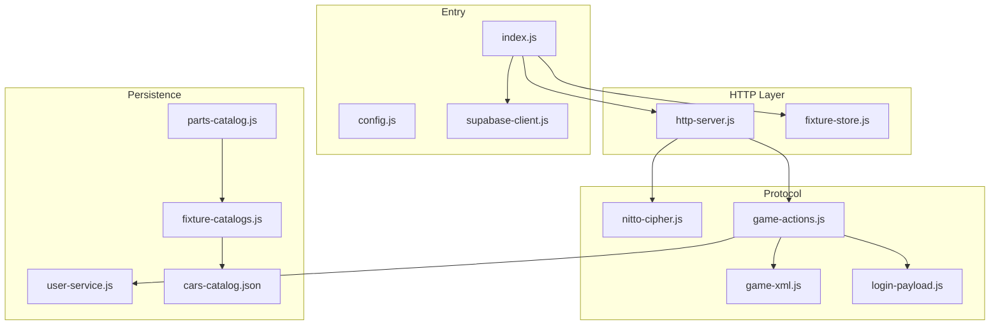
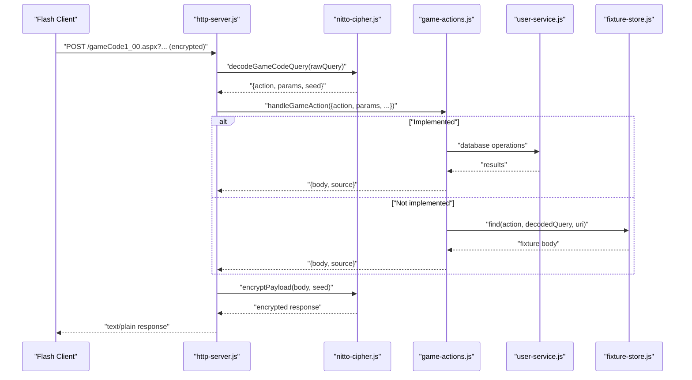
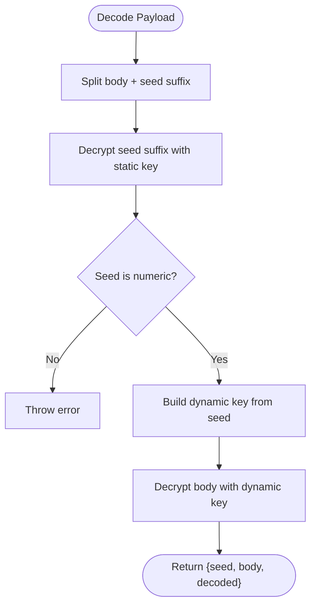
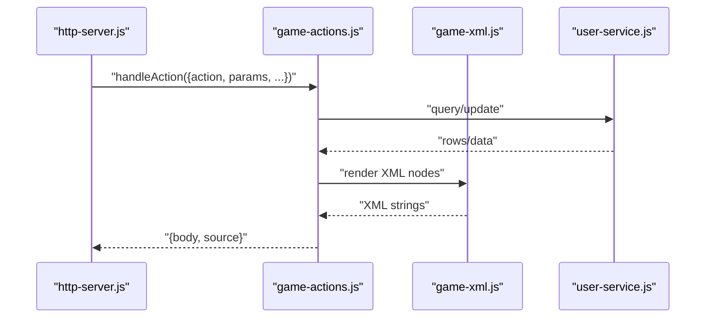
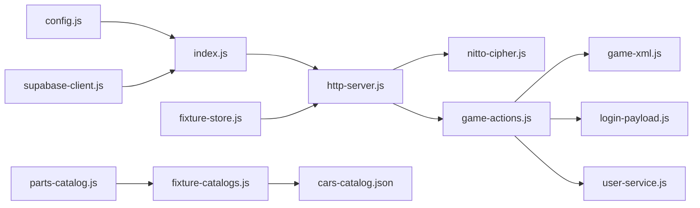

# Game Protocol Implementation

<cite>
**Referenced Files in This Document**
- [index.js](file://backend/src/index.js)
- [config.js](file://backend/src/config.js)
- [supabase-client.js](file://backend/src/supabase-client.js)
- [http-server.js](file://backend/src/http-server.js)
- [nitto-cipher.js](file://backend/src/nitto-cipher.js)
- [game-actions.js](file://backend/src/game-actions.js)
- [game-xml.js](file://backend/src/game-xml.js)
- [login-payload.js](file://backend/src/login-payload.js)
- [user-service.js](file://backend/src/user-service.js)
- [fixture-store.js](file://backend/src/fixture-store.js)
- [parts-catalog.js](file://backend/src/parts-catalog.js)
- [fixture-catalogs.js](file://backend/src/fixture-catalogs.js)
- [cars-catalog.json](file://backend/src/catalog-data/cars-catalog.json)
- [README.md](file://backend/README.md)
</cite>

## Table of Contents
1. [Introduction](#introduction)
2. [Project Structure](#project-structure)
3. [Core Components](#core-components)
4. [Architecture Overview](#architecture-overview)
5. [Detailed Component Analysis](#detailed-component-analysis)
6. [Dependency Analysis](#dependency-analysis)
7. [Performance Considerations](#performance-considerations)
8. [Troubleshooting Guide](#troubleshooting-guide)
9. [Conclusion](#conclusion)
10. [Appendices](#appendices)

## Introduction
This document describes the Nitto Legends game protocol implementation that maintains backward compatibility with the original 10.0.03 Flash client. It explains how the backend decodes legacy encrypted requests, executes action handlers, generates XML responses, and falls back to fixtures for unimplemented features. It also documents the Nitto cipher, XML formatting standards, database-backed responses, and operational guidance for maintaining protocol compliance.

## Project Structure
The backend is organized around a small set of modules that handle HTTP routing, decryption, action dispatch, XML rendering, and database access. A fixture store provides fallback responses for unimplemented actions. Configuration and Supabase client initialization are centralized.

**Diagram sources**
- [index.js:1-95](file://backend/src/index.js#L1-L95)
- [config.js:1-53](file://backend/src/config.js#L1-L53)
- [supabase-client.js:1-27](file://backend/src/supabase-client.js#L1-L27)
- [http-server.js:1-521](file://backend/src/http-server.js#L1-L521)
- [nitto-cipher.js:1-139](file://backend/src/nitto-cipher.js#L1-L139)
- [game-actions.js:1-800](file://backend/src/game-actions.js#L1-L800)
- [game-xml.js:1-266](file://backend/src/game-xml.js#L1-L266)
- [login-payload.js:1-197](file://backend/src/login-payload.js#L1-L197)
- [user-service.js:1-661](file://backend/src/user-service.js#L1-L661)
- [parts-catalog.js:1-82](file://backend/src/parts-catalog.js#L1-L82)
- [fixture-catalogs.js:1-31](file://backend/src/fixture-catalogs.js#L1-L31)
- [cars-catalog.json:1-712](file://backend/src/catalog-data/cars-catalog.json#L1-L712)

**Section sources**
- [index.js:1-95](file://backend/src/index.js#L1-L95)
- [README.md:1-76](file://backend/README.md#L1-L76)

## Core Components
- HTTP server: Routes requests to the legacy endpoint, decrypts payloads, dispatches actions, and encrypts responses.
- Nitto cipher: Implements the legacy encryption/decryption scheme used by the Flash client.
- Action handlers: Implement game logic for supported actions and coordinate with the database layer.
- XML renderer: Generates legacy-compatible XML for responses and login payloads.
- Fixture store: Loads decoded HTTP responses to serve as fallbacks for unimplemented actions.
- Supabase client: Provides database access with service role credentials.
- User service: Encapsulates database operations for players, cars, teams, and related entities.

**Section sources**
- [http-server.js:253-521](file://backend/src/http-server.js#L253-L521)
- [nitto-cipher.js:100-139](file://backend/src/nitto-cipher.js#L100-L139)
- [game-actions.js:1-800](file://backend/src/game-actions.js#L1-L800)
- [game-xml.js:1-266](file://backend/src/game-xml.js#L1-L266)
- [fixture-store.js:1-86](file://backend/src/fixture-store.js#L1-L86)
- [supabase-client.js:1-27](file://backend/src/supabase-client.js#L1-L27)
- [user-service.js:1-661](file://backend/src/user-service.js#L1-L661)

## Architecture Overview
The backend preserves the original request/response shape expected by the 10.0.03 Flash client. Requests arrive at the legacy endpoint, are decrypted, parsed, routed to an action handler, executed against the database, and returned as an encrypted response. Unimplemented actions fall back to pre-recorded fixtures.

**Diagram sources**
- [http-server.js:425-514](file://backend/src/http-server.js#L425-L514)
- [nitto-cipher.js:125-139](file://backend/src/nitto-cipher.js#L125-L139)
- [game-actions.js:472-481](file://backend/src/game-actions.js#L472-L481)
- [fixture-store.js:75-84](file://backend/src/fixture-store.js#L75-L84)

## Detailed Component Analysis

### Nitto Cipher
The Nitto cipher provides a legacy symmetric transformation used to encode/decode request payloads and responses. It uses a fixed static key and a dynamic key derived from a seed number embedded in the payload. The implementation supports:
- Dynamic key construction from a seed number.
- Character-wise XOR-based encryption/decryption over a custom alphabet.
- Escape sequences for newline and quote handling.
- Seed suffix decoding to recover the original seed.

**Diagram sources**
- [nitto-cipher.js:100-139](file://backend/src/nitto-cipher.js#L100-L139)

**Section sources**
- [nitto-cipher.js:100-139](file://backend/src/nitto-cipher.js#L100-L139)

### HTTP Server and Legacy Endpoint
The HTTP server handles the legacy endpoint and related compatibility routes:
- Validates and parses the legacy query string.
- Attempts decryption; if plain text is detected for specific actions, it routes accordingly.
- Dispatches to action handlers and encrypts the response using the original seed.
- Provides compatibility assets and fallback fixtures for static routes.

Key behaviors:
- Decryption and action parsing occur via the Nitto cipher.
- Action dispatch returns a structured result with a body and source label.
- Responses are encrypted and tagged with metadata headers.

**Section sources**
- [http-server.js:425-514](file://backend/src/http-server.js#L425-L514)
- [http-server.js:391-424](file://backend/src/http-server.js#L391-L424)

### Action Handler Framework
The action handler framework centralizes request processing:
- Resolves caller session and validates permissions.
- Executes database operations through the user service.
- Builds XML responses using the XML renderer.
- Returns a standardized result with a body and source label for logging/tracing.

Representative actions include login, account creation, retrieving users/cars, purchasing parts, and dyno upgrades. Many actions leverage the XML renderer to produce legacy-compatible structures.

**Diagram sources**
- [game-actions.js:227-272](file://backend/src/game-actions.js#L227-L272)
- [game-xml.js:25-31](file://backend/src/game-xml.js#L25-L31)
- [user-service.js:184-209](file://backend/src/user-service.js#L184-L209)

**Section sources**
- [game-actions.js:166-204](file://backend/src/game-actions.js#L166-L204)
- [game-actions.js:227-272](file://backend/src/game-actions.js#L227-L272)
- [game-actions.js:340-345](file://backend/src/game-actions.js#L340-L345)
- [game-actions.js:347-372](file://backend/src/game-actions.js#L347-L372)
- [game-actions.js:413-436](file://backend/src/game-actions.js#L413-L436)
- [game-actions.js:438-474](file://backend/src/game-actions.js#L438-L474)
- [game-actions.js:476-502](file://backend/src/game-actions.js#L476-L502)
- [game-actions.js:504-532](file://backend/src/game-actions.js#L504-L532)
- [game-actions.js:534-548](file://backend/src/game-actions.js#L534-L548)
- [game-actions.js:550-579](file://backend/src/game-actions.js#L550-L579)
- [game-actions.js:581-619](file://backend/src/game-actions.js#L581-L619)
- [game-actions.js:621-730](file://backend/src/game-actions.js#L621-L730)
- [game-actions.js:732-792](file://backend/src/game-actions.js#L732-L792)
- [game-actions.js:794-800](file://backend/src/game-actions.js#L794-L800)

### XML Rendering and Login Payloads
XML rendering produces legacy-compatible structures for users, cars, teams, and login payloads. It escapes special characters, builds attribute lists, and wraps data in the expected container nodes. Login payloads combine static nodes with per-player data and tail segments containing session identifiers.

Key capabilities:
- Escape XML entities.
- Render user summaries and collections.
- Render cars with wheels, parts, and paint fallbacks.
- Compose login bodies with static and dynamic nodes.

**Section sources**
- [game-xml.js:9-16](file://backend/src/game-xml.js#L9-L16)
- [game-xml.js:25-31](file://backend/src/game-xml.js#L25-L31)
- [game-xml.js:33-54](file://backend/src/game-xml.js#L33-L54)
- [game-xml.js:56-64](file://backend/src/game-xml.js#L56-L64)
- [game-xml.js:137-187](file://backend/src/game-xml.js#L137-L187)
- [game-xml.js:189-202](file://backend/src/game-xml.js#L189-L202)
- [game-xml.js:204-206](file://backend/src/game-xml.js#L204-L206)
- [login-payload.js:165-196](file://backend/src/login-payload.js#L165-L196)

### Fixture Fallback System
The fixture store loads decoded HTTP responses from JSON files keyed by decoded query, action name, or URI. It prioritizes longer bodies when multiple keys match, ensuring richer fixtures are preferred. The HTTP server falls back to fixtures for static routes when the primary handler does not apply.

**Section sources**
- [fixture-store.js:1-86](file://backend/src/fixture-store.js#L1-L86)
- [http-server.js:409-420](file://backend/src/http-server.js#L409-L420)

### Database Access and Car Catalogs
The user service encapsulates database operations for players, cars, teams, and related entities. It normalizes legacy data, repairs inconsistencies, and manages test drive state. Parts catalogs are rebalanced and sourced from fixtures, while car catalog entries are loaded from JSON.

**Section sources**
- [user-service.js:115-131](file://backend/src/user-service.js#L115-L131)
- [user-service.js:133-152](file://backend/src/user-service.js#L133-L152)
- [user-service.js:154-182](file://backend/src/user-service.js#L154-L182)
- [user-service.js:399-429](file://backend/src/user-service.js#L399-L429)
- [parts-catalog.js:16-82](file://backend/src/parts-catalog.js#L16-L82)
- [fixture-catalogs.js:14-30](file://backend/src/fixture-catalogs.js#L14-L30)
- [cars-catalog.json:1-712](file://backend/src/catalog-data/cars-catalog.json#L1-L712)

## Dependency Analysis
The system exhibits clear layering:
- Entry and configuration depend on environment and optional Supabase.
- HTTP server depends on cipher, action handlers, and fixture store.
- Action handlers depend on XML renderer, login payload builder, and user service.
- User service depends on Supabase client and database schema.
- Catalogs depend on fixture catalogs and JSON data.

**Diagram sources**
- [index.js:1-95](file://backend/src/index.js#L1-L95)
- [config.js:1-53](file://backend/src/config.js#L1-L53)
- [supabase-client.js:1-27](file://backend/src/supabase-client.js#L1-L27)
- [http-server.js:1-521](file://backend/src/http-server.js#L1-L521)
- [nitto-cipher.js:1-139](file://backend/src/nitto-cipher.js#L1-L139)
- [game-actions.js:1-800](file://backend/src/game-actions.js#L1-L800)
- [game-xml.js:1-266](file://backend/src/game-xml.js#L1-L266)
- [login-payload.js:1-197](file://backend/src/login-payload.js#L1-L197)
- [user-service.js:1-661](file://backend/src/user-service.js#L1-L661)
- [parts-catalog.js:1-82](file://backend/src/parts-catalog.js#L1-L82)
- [fixture-catalogs.js:1-31](file://backend/src/fixture-catalogs.js#L1-L31)
- [cars-catalog.json:1-712](file://backend/src/catalog-data/cars-catalog.json#L1-L712)
- [fixture-store.js:1-86](file://backend/src/fixture-store.js#L1-L86)

**Section sources**
- [index.js:14-64](file://backend/src/index.js#L14-L64)
- [http-server.js:253-521](file://backend/src/http-server.js#L253-L521)

## Performance Considerations
- Cipher operations are lightweight but should be avoided unnecessarily; reuse decrypted parameters where possible.
- XML rendering is string-heavy; minimize repeated renders by composing fragments efficiently.
- Database queries should be batched (e.g., listing cars by IDs) to reduce round-trips.
- Fixture loading is read-once and cached; ensure fixture files are reasonably sized and avoid excessive duplication.
- Logging includes request metadata; consider sampling or structured logging in high-throughput scenarios.

## Troubleshooting Guide
Common issues and diagnostics:
- Decryption failures: Verify the payload length and seed suffix; ensure the static key matches the client’s expectations.
- Session errors: Confirm session keys and player resolution; check for missing or expired sessions.
- Missing database columns: The user service includes compatibility handling for missing columns; ensure schema updates are applied.
- Fixture mismatches: Validate fixture keys (decoded query, action, URI) and body precedence rules.
- Supabase connectivity: Ensure credentials are present and the client is initialized; otherwise, the backend runs in fixture-only mode.

Operational tips:
- Enable request logging to inspect decoded queries and action routing.
- Monitor “X-Nitto-Source” and “X-Nitto-Action” headers for tracing.
- Use health endpoints to confirm service availability.

**Section sources**
- [http-server.js:432-468](file://backend/src/http-server.js#L432-L468)
- [user-service.js:64-67](file://backend/src/user-service.js#L64-L67)
- [user-service.js:244-254](file://backend/src/user-service.js#L244-L254)
- [README.md:64-69](file://backend/README.md#L64-L69)

## Conclusion
The Nitto Legends backend preserves the legacy protocol while modernizing data persistence and response generation. By combining a robust cipher, a modular action handler framework, XML rendering, and a fixture fallback system, it maintains compatibility with the 10.0.03 Flash client. The design allows incremental migration of features to database-backed responses while keeping the original behavior intact.

## Appendices

### Protocol Specifications and Message Formats
- Endpoint: /gameCode1_00.aspx
- Request: Encrypted query string; seed suffix included for decryption.
- Response: Encrypted text/plain body; includes metadata headers for tracing.
- Action parameter: Determined from the decoded query; supports multiple actions (login, getuser, getracerscars, etc.).

**Section sources**
- [http-server.js:425-514](file://backend/src/http-server.js#L425-L514)
- [nitto-cipher.js:125-139](file://backend/src/nitto-cipher.js#L125-L139)

### Security Considerations
- The Nitto cipher is a legacy scheme; treat it as a transport mechanism and not a security boundary.
- Keep service role credentials secret; the backend initializes the Supabase client only when credentials are present.
- Validate and sanitize inputs (e.g., filenames for uploads) to prevent path traversal.

**Section sources**
- [supabase-client.js:1-27](file://backend/src/supabase-client.js#L1-L27)
- [http-server.js:168-175](file://backend/src/http-server.js#L168-L175)
- [http-server.js:314-328](file://backend/src/http-server.js#L314-L328)

### Protocol Versioning and Compatibility Maintenance
- The HTTP server recognizes compatibility routes and static assets to maintain parity with the original client.
- Unimplemented actions fall back to fixtures, enabling continued gameplay during feature porting.
- Incremental migration: Prefer database-backed responses for implemented actions; keep fixtures for others.

**Section sources**
- [http-server.js:391-424](file://backend/src/http-server.js#L391-L424)
- [README.md:21-29](file://backend/README.md#L21-L29)

### Transition from Template-Based Fixtures to Database-Backed Responses
- Template-based fixtures: Static XML bodies loaded from decoded HTTP captures.
- Database-backed responses: Actions query and update Supabase tables, then render XML using the renderer.
- Hybrid approach: Implemented actions use database-backed responses; unimplemented actions fall back to fixtures.

**Section sources**
- [fixture-store.js:1-86](file://backend/src/fixture-store.js#L1-L86)
- [game-actions.js:227-272](file://backend/src/game-actions.js#L227-L272)
- [login-payload.js:165-196](file://backend/src/login-payload.js#L165-L196)