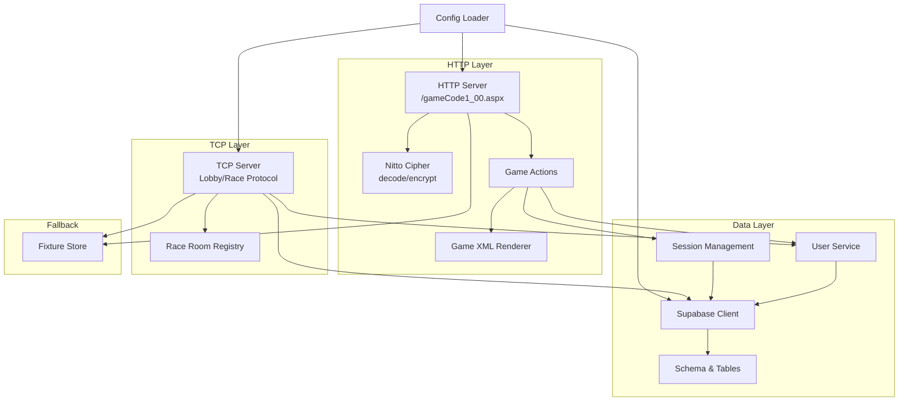
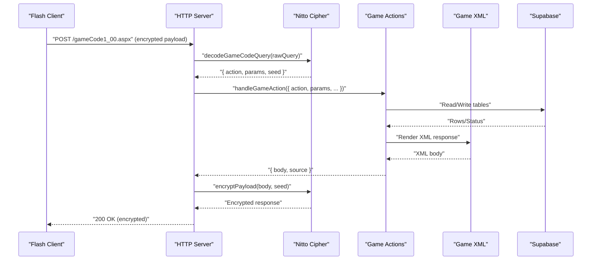
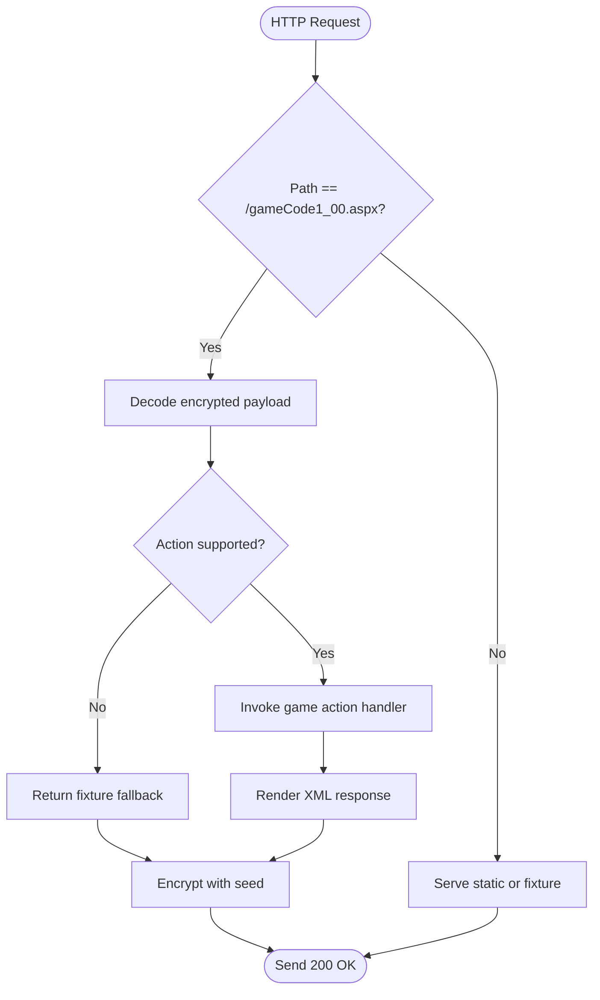
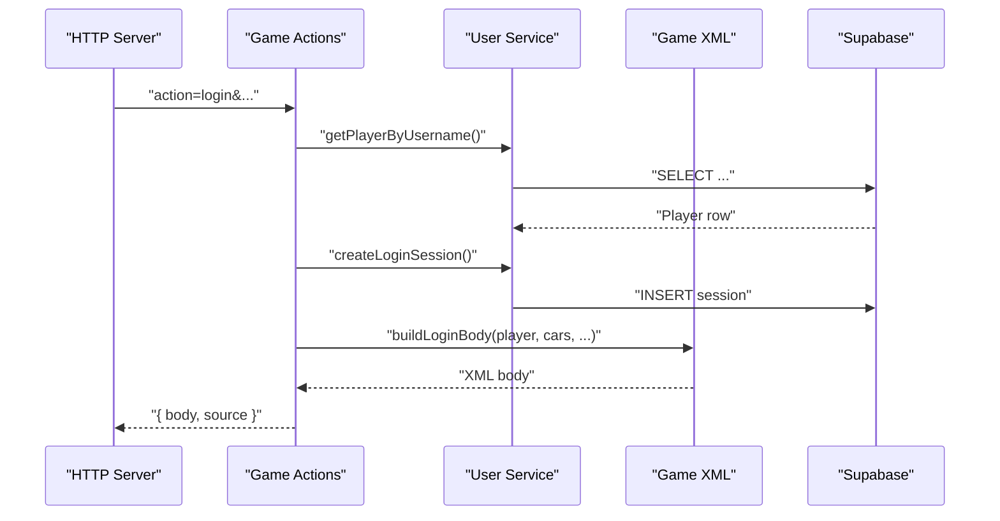
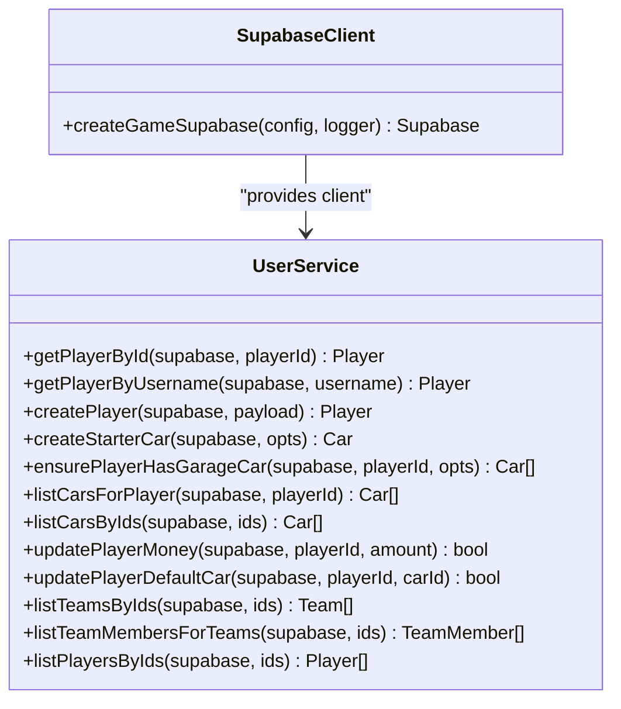
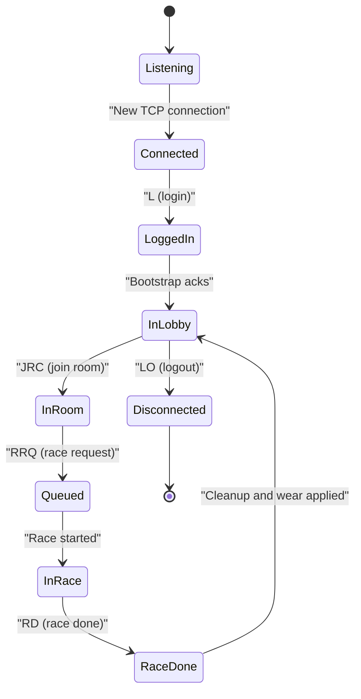
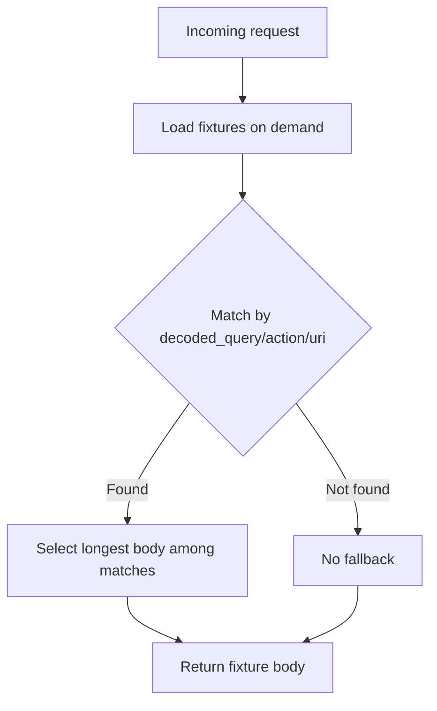
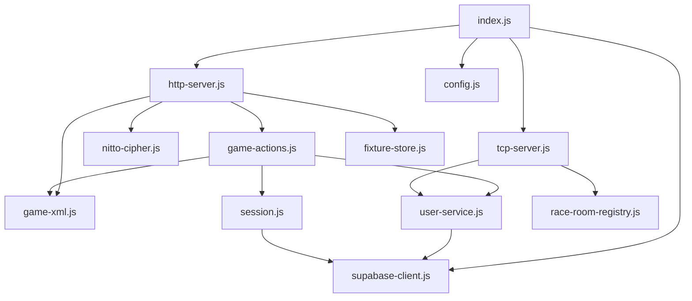

# Project Overview

<cite>
**Referenced Files in This Document**
- [backend/README.md](file://backend/README.md)
- [backend/package.json](file://backend/package.json)
- [backend/src/index.js](file://backend/src/index.js)
- [backend/src/config.js](file://backend/src/config.js)
- [backend/src/supabase-client.js](file://backend/src/supabase-client.js)
- [backend/src/http-server.js](file://backend/src/http-server.js)
- [backend/src/nitto-cipher.js](file://backend/src/nitto-cipher.js)
- [backend/src/game-actions.js](file://backend/src/game-actions.js)
- [backend/src/game-xml.js](file://backend/src/game-xml.js)
- [backend/src/user-service.js](file://backend/src/user-service.js)
- [backend/src/session.js](file://backend/src/session.js)
- [backend/src/fixture-store.js](file://backend/src/fixture-store.js)
- [backend/src/tcp-server.js](file://backend/src/tcp-server.js)
- [backend/supabase/schema.sql](file://backend/supabase/schema.sql)
</cite>

## Table of Contents
1. [Introduction](#introduction)
2. [Project Structure](#project-structure)
3. [Core Components](#core-components)
4. [Architecture Overview](#architecture-overview)
5. [Detailed Component Analysis](#detailed-component-analysis)
6. [Dependency Analysis](#dependency-analysis)
7. [Performance Considerations](#performance-considerations)
8. [Troubleshooting Guide](#troubleshooting-guide)
9. [Conclusion](#conclusion)

## Introduction
This document presents a comprehensive overview of the Nitto Legends Community Backend project. The project serves as a community-driven replacement for the original Nitto Legends game server, maintaining backward compatibility with the legacy 10.0.03 Flash client while leveraging modern Supabase infrastructure. It preserves the original gameCode1_00.aspx action flow and legacy protocol compliance, ensuring that the Flash client interacts exclusively with this backend. Real gameplay data is stored in Supabase tables, while unimplemented actions gracefully fall back to captured fixtures, enabling continued gameplay during ongoing feature porting.

Key benefits include:
- Preserved legacy protocol compliance for seamless Flash client compatibility
- Modern data persistence via Supabase for scalability and maintainability
- Action-by-action migration path with a robust fixture fallback system
- Modular services for HTTP, TCP, sessions, and user data management

Target audience:
- Flash game enthusiasts who wish to continue playing Nitto Legends online
- Developers building or maintaining community servers and related tools

Relationship to the original game:
- The backend emulates the original server’s behavior, including encrypted payloads and lobby/race protocols
- It replaces the original server’s data layer while keeping the client-facing interface unchanged

## Project Structure
The backend is organized around a modular architecture with clear separation of concerns:
- HTTP server handling gameCode1_00.aspx requests and static assets
- TCP server managing lobby and race communications
- Supabase client and user-service layer for data access
- Game actions module implementing supported actions and XML rendering
- Fixture store for fallback responses
- Configuration and cipher utilities for environment and encryption

**Diagram sources**
- [backend/src/http-server.js:253-521](file://backend/src/http-server.js#L253-L521)
- [backend/src/nitto-cipher.js:100-139](file://backend/src/nitto-cipher.js#L100-L139)
- [backend/src/game-actions.js:1-800](file://backend/src/game-actions.js#L1-L800)
- [backend/src/game-xml.js:1-266](file://backend/src/game-xml.js#L1-L266)
- [backend/src/user-service.js:1-661](file://backend/src/user-service.js#L1-L661)
- [backend/src/session.js:1-87](file://backend/src/session.js#L1-L87)
- [backend/src/tcp-server.js:1-800](file://backend/src/tcp-server.js#L1-L800)
- [backend/supabase/schema.sql:1-325](file://backend/supabase/schema.sql#L1-L325)
- [backend/src/fixture-store.js:1-86](file://backend/src/fixture-store.js#L1-L86)
- [backend/src/config.js:1-53](file://backend/src/config.js#L1-L53)

**Section sources**
- [backend/README.md:1-76](file://backend/README.md#L1-L76)
- [backend/src/index.js:1-95](file://backend/src/index.js#L1-L95)
- [backend/src/config.js:1-53](file://backend/src/config.js#L1-L53)

## Core Components
- HTTP server: Decodes legacy payloads, routes actions, encrypts responses, and serves static assets and fixtures
- TCP server: Implements lobby and race protocols, manages rooms and matches, forwards race sync messages
- Supabase client: Initializes secure access with service role key and handles database operations
- Game actions: Implements supported actions (login, user retrieval, garage/cars, parts, purchases) and delegates to user-service and XML renderer
- User service: Provides CRUD operations against Supabase tables for players, cars, teams, and mail
- Session management: Creates and validates sessions, purges expired sessions
- Fixture store: Loads and selects fallback responses from captured decoded HTTP responses
- Configuration: Centralized environment loading and path resolution

**Section sources**
- [backend/src/http-server.js:253-521](file://backend/src/http-server.js#L253-L521)
- [backend/src/tcp-server.js:1-800](file://backend/src/tcp-server.js#L1-L800)
- [backend/src/supabase-client.js:1-27](file://backend/src/supabase-client.js#L1-L27)
- [backend/src/game-actions.js:1-800](file://backend/src/game-actions.js#L1-L800)
- [backend/src/user-service.js:1-661](file://backend/src/user-service.js#L1-L661)
- [backend/src/session.js:1-87](file://backend/src/session.js#L1-L87)
- [backend/src/fixture-store.js:1-86](file://backend/src/fixture-store.js#L1-L86)
- [backend/src/config.js:1-53](file://backend/src/config.js#L1-L53)

## Architecture Overview
The backend maintains the legacy protocol compliance required by the 10.0.03 Flash client:
- HTTP requests arrive at /gameCode1_00.aspx with encrypted payloads
- The server decrypts the payload, extracts the action and parameters, and invokes the appropriate handler
- Handlers read/write Supabase tables for implemented actions
- Unimplemented actions return fixture fallback responses
- Responses are re-encrypted and returned to the client
- TCP connections handle lobby and race communications with the same protocol semantics

**Diagram sources**
- [backend/src/http-server.js:426-521](file://backend/src/http-server.js#L426-L521)
- [backend/src/nitto-cipher.js:125-139](file://backend/src/nitto-cipher.js#L125-L139)
- [backend/src/game-actions.js:227-272](file://backend/src/game-actions.js#L227-L272)
- [backend/src/game-xml.js:25-31](file://backend/src/game-xml.js#L25-L31)
- [backend/src/user-service.js:184-255](file://backend/src/user-service.js#L184-L255)

## Detailed Component Analysis

### HTTP Server and Legacy Protocol Compliance
The HTTP server is the primary entry point for the legacy Flash client:
- Accepts /gameCode1_00.aspx requests with encrypted payloads
- Decrypts payloads using the Nitto cipher and extracts action/parameters
- Routes to game actions or serves static routes and fixtures
- Encrypts responses with the same seed to maintain protocol compliance
- Supports special endpoints like Status.aspx, Upload.aspx, and tournament key generation

**Diagram sources**
- [backend/src/http-server.js:391-521](file://backend/src/http-server.js#L391-L521)
- [backend/src/nitto-cipher.js:100-139](file://backend/src/nitto-cipher.js#L100-L139)

**Section sources**
- [backend/src/http-server.js:253-521](file://backend/src/http-server.js#L253-L521)
- [backend/src/nitto-cipher.js:1-139](file://backend/src/nitto-cipher.js#L1-L139)

### Game Actions and Action Flow
The game actions module implements the legacy action flow:
- Supported actions include login, user retrieval, garage/cars, parts, purchases, and more
- Each action resolves caller session, validates permissions, accesses Supabase, and renders XML
- Unimplemented actions return fixture fallback responses
- The action flow preserves the original parameter names and response formats expected by the client

**Diagram sources**
- [backend/src/game-actions.js:227-272](file://backend/src/game-actions.js#L227-L272)
- [backend/src/user-service.js:197-255](file://backend/src/user-service.js#L197-L255)
- [backend/src/game-xml.js:25-31](file://backend/src/game-xml.js#L25-L31)

**Section sources**
- [backend/src/game-actions.js:227-338](file://backend/src/game-actions.js#L227-L338)
- [backend/src/user-service.js:184-255](file://backend/src/user-service.js#L184-L255)
- [backend/src/game-xml.js:25-31](file://backend/src/game-xml.js#L25-L31)

### Supabase Client and Data Access
The Supabase client encapsulates secure initialization and provides a unified interface for database operations:
- Loads credentials from environment and initializes the client
- Falls back to fixture-only mode if credentials are missing
- Used by user-service for all data access patterns

**Diagram sources**
- [backend/src/supabase-client.js:1-27](file://backend/src/supabase-client.js#L1-L27)
- [backend/src/user-service.js:1-661](file://backend/src/user-service.js#L1-L661)

**Section sources**
- [backend/src/supabase-client.js:1-27](file://backend/src/supabase-client.js#L1-L27)
- [backend/src/user-service.js:184-430](file://backend/src/user-service.js#L184-L430)

### TCP Server and Lobby/Race Protocol
The TCP server implements the lobby and race protocol used by the Flash client:
- Handles login, heartbeat, room joins, race requests, and race sync messages
- Manages rooms and player queues, forwards race position updates
- Applies engine wear after races and cleans up state
- Uses the same encrypted payload semantics for race channel messages

**Diagram sources**
- [backend/src/tcp-server.js:174-498](file://backend/src/tcp-server.js#L174-L498)

**Section sources**
- [backend/src/tcp-server.js:1-800](file://backend/src/tcp-server.js#L1-L800)

### Fixture Fallback System
The fixture fallback system ensures continuity when features are not yet implemented:
- Loads decoded HTTP responses from fixtures directory
- Derives action/URI keys and selects the most specific match
- Returns fixture bodies for static routes and unimplemented actions
- Enables the community to keep the game running while porting features

**Diagram sources**
- [backend/src/fixture-store.js:1-86](file://backend/src/fixture-store.js#L1-L86)

**Section sources**
- [backend/src/fixture-store.js:1-86](file://backend/src/fixture-store.js#L1-L86)
- [backend/README.md:29-29](file://backend/README.md#L29-L29)

### Configuration and Environment
Configuration loads environment variables and resolves paths for the backend and fixtures:
- Reads .env file and merges with process.env
- Exposes HTTP/TCP ports, Supabase credentials, and filesystem roots
- Ensures consistent paths for fixtures and assets

**Section sources**
- [backend/src/config.js:1-53](file://backend/src/config.js#L1-L53)
- [backend/package.json:1-15](file://backend/package.json#L1-L15)

## Dependency Analysis
The backend exhibits strong cohesion within functional areas and low coupling between modules:
- HTTP server depends on cipher, game actions, XML renderer, and fixture store
- Game actions depend on user-service and session management
- User-service depends on Supabase client and schema
- TCP server depends on user-service and race room registry
- Supabase client depends on environment configuration

**Diagram sources**
- [backend/src/index.js:1-95](file://backend/src/index.js#L1-L95)
- [backend/src/http-server.js:253-521](file://backend/src/http-server.js#L253-L521)
- [backend/src/tcp-server.js:1-800](file://backend/src/tcp-server.js#L1-L800)
- [backend/src/nitto-cipher.js:1-139](file://backend/src/nitto-cipher.js#L1-L139)
- [backend/src/game-actions.js:1-800](file://backend/src/game-actions.js#L1-L800)
- [backend/src/game-xml.js:1-266](file://backend/src/game-xml.js#L1-L266)
- [backend/src/user-service.js:1-661](file://backend/src/user-service.js#L1-L661)
- [backend/src/session.js:1-87](file://backend/src/session.js#L1-L87)
- [backend/src/fixture-store.js:1-86](file://backend/src/fixture-store.js#L1-L86)
- [backend/src/config.js:1-53](file://backend/src/config.js#L1-L53)
- [backend/src/supabase-client.js:1-27](file://backend/src/supabase-client.js#L1-L27)

**Section sources**
- [backend/src/index.js:1-95](file://backend/src/index.js#L1-L95)
- [backend/src/http-server.js:253-521](file://backend/src/http-server.js#L253-L521)
- [backend/src/tcp-server.js:1-800](file://backend/src/tcp-server.js#L1-L800)

## Performance Considerations
- Encryption/decryption overhead is minimal compared to database operations; optimize by avoiding unnecessary re-encoding when possible
- Use indexed database queries for frequent lookups (sessions, players, cars)
- Batch operations where feasible (e.g., listing cars by IDs)
- Monitor TCP connection churn and race cleanup intervals to prevent memory leaks
- Keep fixture store lazy-loaded to minimize startup costs

## Troubleshooting Guide
Common issues and resolutions:
- Missing Supabase credentials: The backend runs in fixture-only mode and logs a warning; configure .env to enable live data access
- Unsupported actions: Expect fixture fallback responses; implement the action in game-actions.js and user-service.js
- Session errors: Ensure sessions are created during login and validated on subsequent requests; expired sessions are purged periodically
- TCP protocol mismatches: Verify lobby and race messages conform to expected formats; check room definitions and race GUID handling

**Section sources**
- [backend/src/supabase-client.js:1-27](file://backend/src/supabase-client.js#L1-L27)
- [backend/src/http-server.js:426-521](file://backend/src/http-server.js#L426-L521)
- [backend/src/session.js:45-87](file://backend/src/session.js#L45-L87)
- [backend/src/tcp-server.js:174-498](file://backend/src/tcp-server.js#L174-L498)

## Conclusion
The Nitto Legends Community Backend preserves the legacy 10.0.03 Flash client experience while modernizing the underlying data layer. By maintaining legacy protocol compliance, implementing a robust action flow, and providing a fixture fallback system, the project enables continued gameplay and a sustainable migration path to full feature parity. Developers can extend the backend incrementally, adding new actions and refining the data model, all while keeping the client-facing interface unchanged.