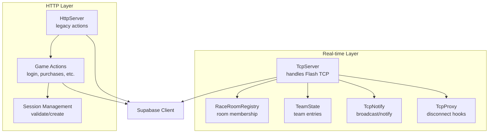
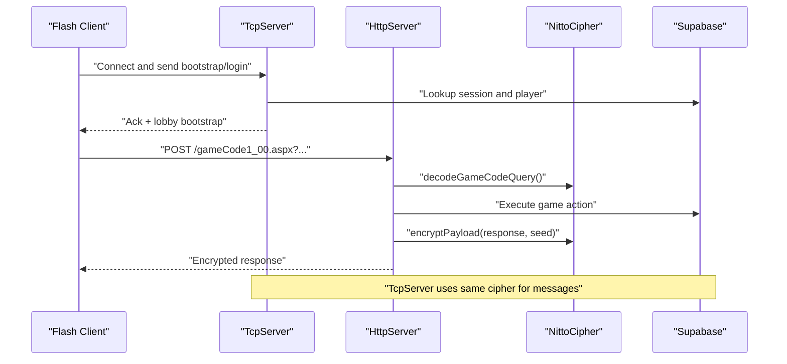
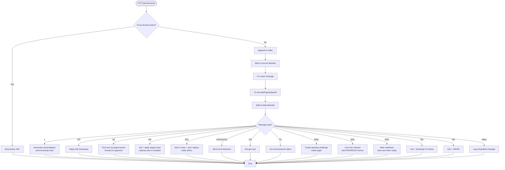
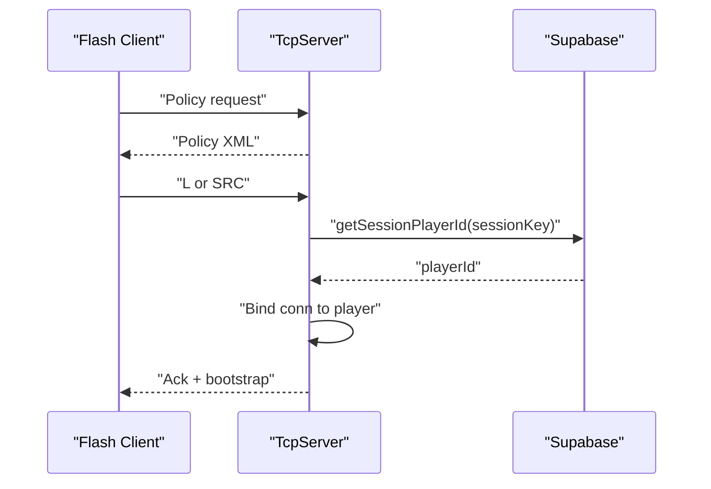
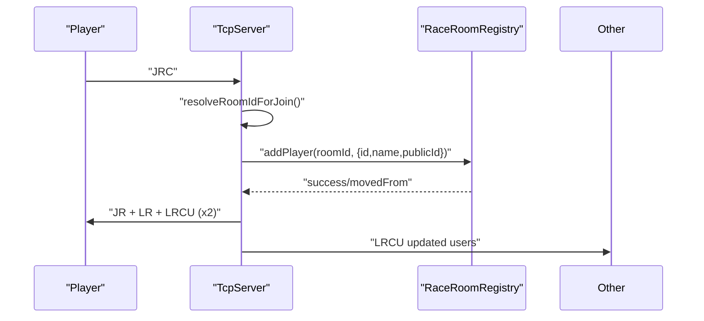
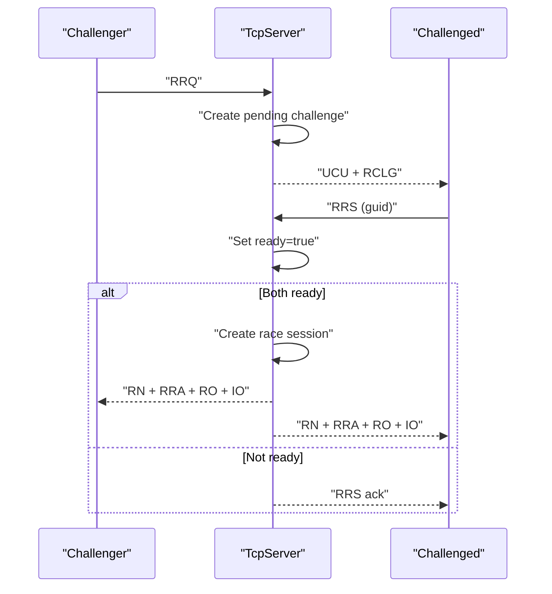
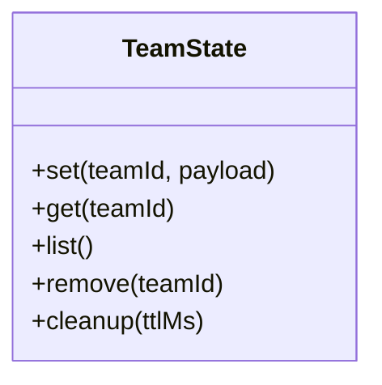
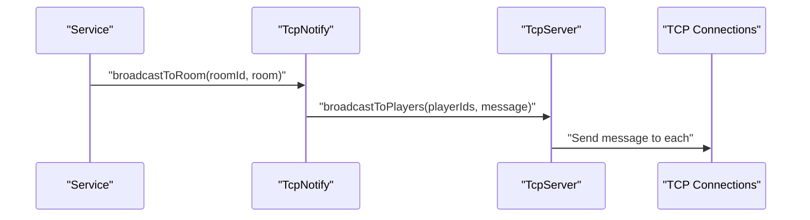
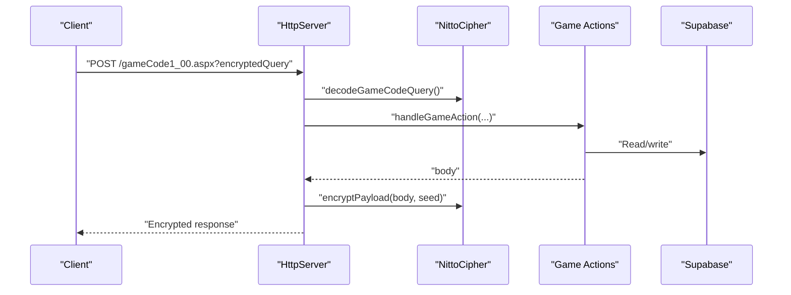
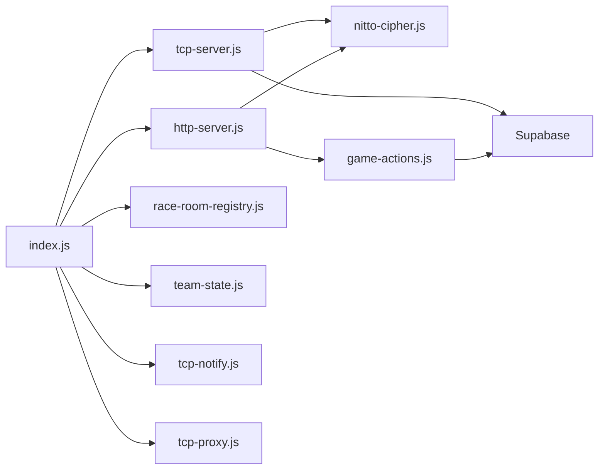

# Real-time Communication

<cite>
**Referenced Files in This Document**
- [tcp-server.js](file://backend/src/tcp-server.js)
- [race-room-registry.js](file://backend/src/race-room-registry.js)
- [team-state.js](file://backend/src/team-state.js)
- [tcp-notify.js](file://backend/src/tcp-notify.js)
- [tcp-proxy.js](file://backend/src/tcp-proxy.js)
- [nitto-cipher.js](file://backend/src/nitto-cipher.js)
- [engine-state.js](file://backend/src/engine-state.js)
- [public-id.js](file://backend/src/public-id.js)
- [http-server.js](file://backend/src/http-server.js)
- [session.js](file://backend/src/session.js)
- [index.js](file://backend/src/index.js)
- [README.md](file://backend/README.md)
</cite>

## Table of Contents
1. [Introduction](#introduction)
2. [Project Structure](#project-structure)
3. [Core Components](#core-components)
4. [Architecture Overview](#architecture-overview)
5. [Detailed Component Analysis](#detailed-component-analysis)
6. [Dependency Analysis](#dependency-analysis)
7. [Performance Considerations](#performance-considerations)
8. [Troubleshooting Guide](#troubleshooting-guide)
9. [Conclusion](#conclusion)
10. [Appendices](#appendices)

## Introduction
This document explains the real-time communication system enabling multiplayer gaming over TCP, integrated with HTTP-based game actions. It covers the TCP server implementation for Flash clients, lobby and room management, team state coordination, and real-time notifications. It also documents the TCP protocol specifics, connection lifecycle, message routing, state synchronization, race matchmaking, and the integration between TCP and HTTP services. Guidance on scalability, monitoring, and performance optimization is included.

## Project Structure
The backend exposes two primary entry points:
- A TCP server for real-time Flash client communication
- An HTTP server for legacy game actions and assets

The TCP server coordinates rooms, matches players for races, and forwards in-race telemetry. The HTTP server handles login, purchases, and other actions, encrypting responses with the same scheme used by the TCP protocol.

**Diagram sources**
- [index.js:25-64](file://backend/src/index.js#L25-L64)
- [tcp-server.js:12-39](file://backend/src/tcp-server.js#L12-L39)
- [race-room-registry.js:1-137](file://backend/src/race-room-registry.js#L1-L137)
- [team-state.js:1-40](file://backend/src/team-state.js#L1-L40)
- [tcp-notify.js:1-58](file://backend/src/tcp-notify.js#L1-L58)
- [tcp-proxy.js:1-11](file://backend/src/tcp-proxy.js#L1-L11)
- [http-server.js:253-521](file://backend/src/http-server.js#L253-L521)
- [session.js:11-86](file://backend/src/session.js#L11-L86)

**Section sources**
- [README.md:1-76](file://backend/README.md#L1-L76)
- [index.js:1-95](file://backend/src/index.js#L1-L95)

## Core Components
- TcpServer: Manages TCP sockets, parses legacy Flash packets, performs encryption/decryption, and orchestrates lobby, room, and race flows.
- RaceRoomRegistry: Enforces single-room membership, tracks ready status, and synchronizes room state.
- TeamState: Maintains ephemeral team entries with TTL-based cleanup.
- TcpNotify: Broadcasts room updates and targeted messages to TCP clients.
- TcpProxy: Provides lifecycle hooks for TCP disconnections and integrates with room/team services.
- HttpServer: Decrypts requests, dispatches game actions, and re-encrypts responses with the same cipher.
- Session: Validates and manages session keys used across TCP and HTTP.
- Engine-state: Applies engine wear after races to simulate realistic degradation.

**Section sources**
- [tcp-server.js:12-39](file://backend/src/tcp-server.js#L12-L39)
- [race-room-registry.js:1-137](file://backend/src/race-room-registry.js#L1-L137)
- [team-state.js:1-40](file://backend/src/team-state.js#L1-L40)
- [tcp-notify.js:1-58](file://backend/src/tcp-notify.js#L1-L58)
- [tcp-proxy.js:1-11](file://backend/src/tcp-proxy.js#L1-L11)
- [http-server.js:253-521](file://backend/src/http-server.js#L253-L521)
- [session.js:11-86](file://backend/src/session.js#L11-L86)
- [engine-state.js:1-63](file://backend/src/engine-state.js#L1-L63)

## Architecture Overview
The system maintains a strict separation between HTTP and TCP:
- HTTP handles long-lived actions and asset delivery, encrypting responses with the legacy cipher.
- TCP handles real-time lobby, room, and race telemetry with a dedicated protocol and encryption.

**Diagram sources**
- [http-server.js:426-514](file://backend/src/http-server.js#L426-L514)
- [nitto-cipher.js:107-138](file://backend/src/nitto-cipher.js#L107-L138)
- [tcp-server.js:148-498](file://backend/src/tcp-server.js#L148-L498)

## Detailed Component Analysis

### TCP Protocol and Message Handling
- Delimiters: Messages are separated by a record delimiter and fields by a field delimiter. The server buffers incoming data and splits on the record delimiter.
- Encryption: All TCP messages are encrypted with a seed-derived key; the seed is appended as a two-character suffix. Decryption and encryption routines are symmetric.
- Handshake: The server responds to Flash’s cross-domain policy request immediately and then sends a bootstrap sequence upon login.
- Message types:
  - L: Login; associates session key to player and sends acknowledgments.
  - HTI: Heartbeat; server replies with current timestamp.
  - S/I: In-race position sync; server forwards to opponents without acknowledgment.
  - RD: Race done; applies engine wear and cleans up race state.
  - JRC: Join room; adds player to room and notifies others.
  - LRCR2/LRC: Room list and refresh.
  - GR: Get race.
  - TC: Team/channel selection.
  - RRQ: Race request; creates a pending challenge and notifies the target.
  - SRC: Start race connection; links race channel to active race.
  - RRS: Race ready; marks readiness and starts race when both are ready.
  - RO: Race open; bootstraps initial IO frames.
  - RR: Race result; acknowledges and signals cleanup.

**Diagram sources**
- [tcp-server.js:119-498](file://backend/src/tcp-server.js#L119-L498)
- [nitto-cipher.js:100-123](file://backend/src/nitto-cipher.js#L100-L123)

**Section sources**
- [tcp-server.js:9-11, 119-498:9-11](file://backend/src/tcp-server.js#L9-L11)
- [nitto-cipher.js:100-123](file://backend/src/nitto-cipher.js#L100-L123)

### Connection Lifecycle and Security
- Cross-domain policy: First message is handled specially to satisfy Flash’s security model.
- Session binding: On L and SRC, the server resolves the player via session key against Supabase and binds the connection.
- Duplicate connection protection: Existing connections for the same player are closed to maintain single-play-at-a-time.
- Encryption: Every outgoing TCP message is encrypted with a random seed; incoming messages are decrypted before parsing.

**Diagram sources**
- [tcp-server.js:124-134, 175-213, 397-473:124-134](file://backend/src/tcp-server.js#L124-L134)
- [session.js:11-21](file://backend/src/session.js#L11-L21)

**Section sources**
- [tcp-server.js:77-117, 175-213, 397-473:77-117](file://backend/src/tcp-server.js#L77-L117)
- [session.js:11-21](file://backend/src/session.js#L11-L21)

### Lobby and Room Management
- Room catalog: Ensures default rooms exist and merges with registry-defined rooms.
- Room join: Player joins a room by ID, with deduplication by connId and playerId. Registry sync ensures single-room membership.
- Room snapshot: Sends queue and user lists to the joining player and updates others.
- Room refresh: Responds to LRC with current snapshot.

**Diagram sources**
- [tcp-server.js:305-353, 643-666:305-353](file://backend/src/tcp-server.js#L305-L353)
- [race-room-registry.js:40-75](file://backend/src/race-room-registry.js#L40-L75)

**Section sources**
- [tcp-server.js:305-353, 533-553, 643-666:305-353](file://backend/src/tcp-server.js#L305-L353)
- [race-room-registry.js:24-75](file://backend/src/race-room-registry.js#L24-L75)

### Race Matchmaking and Session Coordination
- RRQ: Initiates a challenge with target player, bracket time, and cars. Stores a pending challenge keyed by GUID.
- RRS: Accepts challenge; when both sides are ready, creates a race session with two players and announces race.
- RO: Race open; bootstraps initial IO frames.
- RD: Race done; applies engine wear and cleans up race state.

**Diagram sources**
- [tcp-server.js:686-766, 881-1029:686-766](file://backend/src/tcp-server.js#L686-L766)
- [nitto-cipher.js:100-123](file://backend/src/nitto-cipher.js#L100-L123)

**Section sources**
- [tcp-server.js:686-766, 881-1029:686-766](file://backend/src/tcp-server.js#L686-L766)
- [engine-state.js:50-62](file://backend/src/engine-state.js#L50-L62)

### Team State Management
- Ephemeral storage: TeamState holds team entries with timestamps and periodically prunes stale entries.
- Integration: TcpNotify can broadcast room updates; team-related flows can leverage similar patterns.

**Diagram sources**
- [team-state.js:1-40](file://backend/src/team-state.js#L1-L40)

**Section sources**
- [team-state.js:1-40](file://backend/src/team-state.js#L1-L40)

### Real-time Notification Delivery
- TcpNotify broadcasts room updates to all players in a room and can notify individual players.
- Escaping: XML and TCP message escaping prevents injection and malformed packets.

**Diagram sources**
- [tcp-notify.js:12-30](file://backend/src/tcp-notify.js#L12-L30)
- [tcp-server.js:1104-1118](file://backend/src/tcp-server.js#L1104-L1118)

**Section sources**
- [tcp-notify.js:12-30](file://backend/src/tcp-notify.js#L12-L30)

### HTTP Integration and Cross-Service Communication
- Legacy action flow: HttpServer decrypts requests using the same cipher, executes game actions, and re-encrypts responses with the original seed.
- Session integration: Both TCP and HTTP use session keys to validate callers and resolve player identity.
- Asset compatibility: Static routes and asset serving mirror legacy endpoints.

**Diagram sources**
- [http-server.js:426-514](file://backend/src/http-server.js#L426-L514)
- [nitto-cipher.js:107-138](file://backend/src/nitto-cipher.js#L107-L138)
- [session.js:11-21](file://backend/src/session.js#L11-L21)

**Section sources**
- [http-server.js:426-514](file://backend/src/http-server.js#L426-L514)
- [session.js:11-21](file://backend/src/session.js#L11-L21)

## Dependency Analysis
- TcpServer depends on:
  - NittoCipher for encryption/decryption
  - Supabase for session and player resolution
  - RaceRoomRegistry for authoritative room membership
  - TeamState for ephemeral team data
  - TcpNotify for broadcasting
  - TcpProxy for lifecycle hooks
- HttpServer depends on NittoCipher for request/response encryption and Game Actions for business logic.
- Index wires all services together and starts both servers.

**Diagram sources**
- [index.js:25-64](file://backend/src/index.js#L25-L64)
- [tcp-server.js:12-39](file://backend/src/tcp-server.js#L12-L39)
- [http-server.js:253-521](file://backend/src/http-server.js#L253-L521)

**Section sources**
- [index.js:25-64](file://backend/src/index.js#L25-L64)

## Performance Considerations
- Connection pooling and reuse: Ensure single connection per player to avoid contention.
- Batch notifications: Group room updates to reduce message overhead.
- TTL-based cleanup: Regular pruning of stale challenges, races, and room members prevents memory leaks.
- Engine wear batching: Apply wear once per race to minimize repeated writes.
- Compression: Consider gzip for large XML payloads if bandwidth is constrained.
- Backpressure: Monitor socket write queues and throttle bursts during high-load races.

[No sources needed since this section provides general guidance]

## Troubleshooting Guide
- Cross-domain policy errors: Verify the initial policy response is sent before any game data.
- Stale connections: Confirm duplicate connection closure and room membership normalization.
- Decryption failures: Validate seed suffix and alphabet constraints; ensure consistent cipher usage.
- Missing engine wear: Check race completion tracking and wear application logic.
- Session mismatches: Validate session ownership and update last seen timestamps.

**Section sources**
- [tcp-server.js:124-134, 175-213, 246-288, 1120-1175:124-134](file://backend/src/tcp-server.js#L124-L134)
- [nitto-cipher.js:107-123](file://backend/src/nitto-cipher.js#L107-L123)
- [session.js:56-86](file://backend/src/session.js#L56-L86)

## Conclusion
The real-time communication system combines a Flash-compatible TCP protocol with robust lobby and race orchestration, supported by authoritative room registries and ephemeral team state. HTTP actions complement TCP with encrypted legacy compatibility, ensuring seamless integration across services. With careful lifecycle management, encryption consistency, and periodic cleanup, the system scales reliably for multiplayer racing scenarios.

[No sources needed since this section summarizes without analyzing specific files]

## Appendices

### TCP Protocol Reference
- Delimiters: Record delimiter separates messages; field delimiter separates fields.
- Encryption: encryptPayload(message, seed) and decodePayload(payload) use a wheel cipher with seed-dependent keys.
- Messages:
  - L, HTI, S, I, RD, JRC, LRCR2, LRC, GR, TC, RRQ, SRC, RRS, RO, RR.

**Section sources**
- [tcp-server.js:9-11, 119-498:9-11](file://backend/src/tcp-server.js#L9-L11)
- [nitto-cipher.js:100-123](file://backend/src/nitto-cipher.js#L100-L123)

### Room Types and Defaults
- Default rooms include team, tournament, bracket KOTH, H2H KOTH, and newbie rooms with predefined attributes.

**Section sources**
- [race-room-catalog.js:1-34](file://backend/src/race-room-catalog.js#L1-L34)

### Public ID Resolution
- Public ID is derived from player internal ID for room and registry operations.

**Section sources**
- [public-id.js:1-4](file://backend/src/public-id.js#L1-L4)