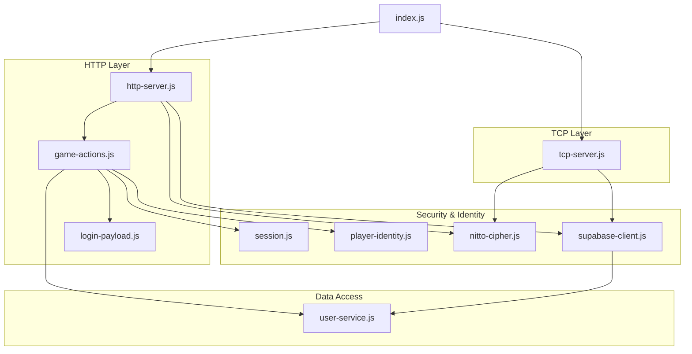
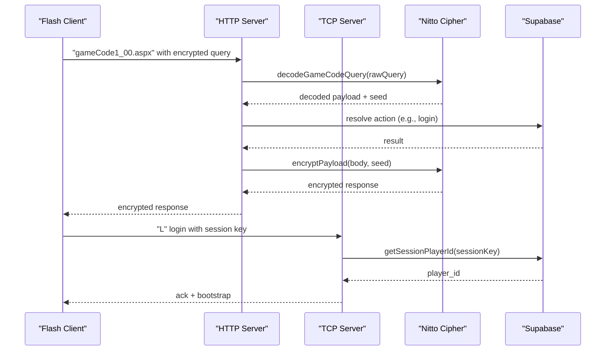
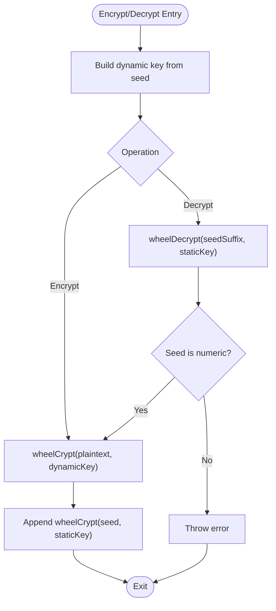
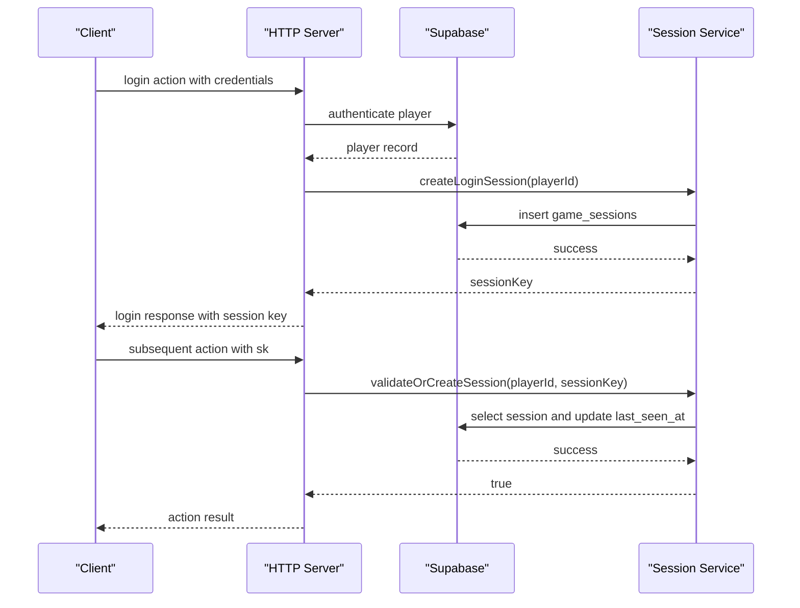
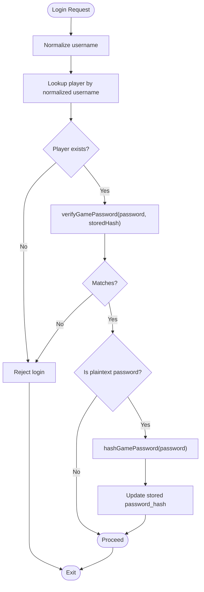
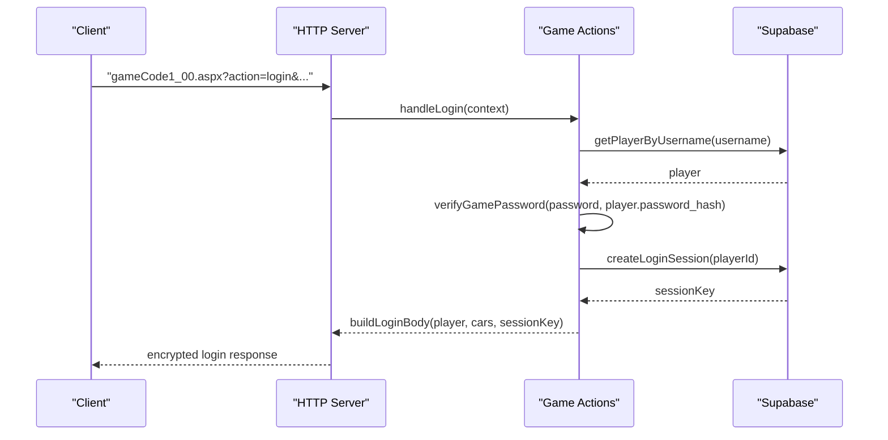
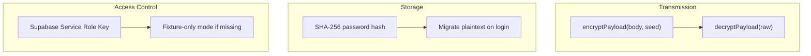
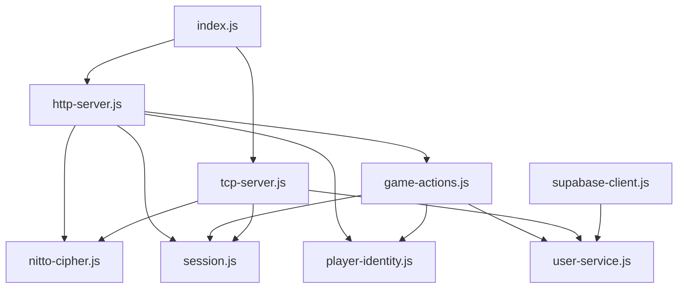

# Security Considerations

<cite>
**Referenced Files in This Document**
- [nitto-cipher.js](file://backend/src/nitto-cipher.js)
- [session.js](file://backend/src/session.js)
- [player-identity.js](file://backend/src/player-identity.js)
- [user-service.js](file://backend/src/user-service.js)
- [login-payload.js](file://backend/src/login-payload.js)
- [supabase-client.js](file://backend/src/supabase-client.js)
- [tcp-server.js](file://backend/src/tcp-server.js)
- [http-server.js](file://backend/src/http-server.js)
- [index.js](file://backend/src/index.js)
- [config.js](file://backend/src/config.js)
- [README.md](file://backend/README.md)
</cite>

## Table of Contents
1. [Introduction](#introduction)
2. [Project Structure](#project-structure)
3. [Core Components](#core-components)
4. [Architecture Overview](#architecture-overview)
5. [Detailed Component Analysis](#detailed-component-analysis)
6. [Dependency Analysis](#dependency-analysis)
7. [Performance Considerations](#performance-considerations)
8. [Troubleshooting Guide](#troubleshooting-guide)
9. [Conclusion](#conclusion)
10. [Appendices](#appendices)

## Introduction
This document provides comprehensive security documentation for the Nitto Legends Community Backend. It focuses on authentication, session management, data protection, and protocol security. It explains the Nitto cipher implementation for secure communication, session validation mechanisms, and player identity verification. It documents authentication flows, session token management, and protections against unauthorized access. It also covers data protection strategies, secure database access patterns, prevention of common vulnerabilities, protocol security considerations, message integrity verification, replay attack prevention, and secure communication channels. Finally, it outlines best practices, threat mitigation strategies, compliance considerations, and guidelines for secure development and auditing.

## Project Structure
The backend is organized around a small set of focused modules:
- HTTP server handling legacy game actions and static assets
- TCP server handling real-time lobby/race communications
- Session management and player identity utilities
- Supabase client initialization and configuration
- Encryption/decryption utilities for legacy payload encoding
- User service layer for database operations

**Diagram sources**
- [index.js:25-64](file://backend/src/index.js#L25-L64)
- [http-server.js:5,253](file://backend/src/http-server.js#L5,L253)
- [tcp-server.js:3,12](file://backend/src/tcp-server.js#L3,L12)
- [nitto-cipher.js:100-139](file://backend/src/nitto-cipher.js#L100-L139)
- [session.js:11-86](file://backend/src/session.js#L11-L86)
- [player-identity.js:3,8,35:3-37](file://backend/src/player-identity.js#L3-L37)
- [user-service.js:184-195](file://backend/src/user-service.js#L184-L195)
- [supabase-client.js:1,26:1-26](file://backend/src/supabase-client.js#L1-L26)

**Section sources**
- [README.md:64-68](file://backend/README.md#L64-L68)
- [index.js:14-95](file://backend/src/index.js#L14-L95)

## Core Components
- Nitto cipher: Implements a custom symmetric cipher for request/response payload encryption/decryption, including seed-based dynamic keys and payload parsing.
- Session management: Manages session records, validates session ownership, and purges expired sessions.
- Player identity: Normalizes usernames, hashes and verifies passwords, and supports legacy plaintext migration.
- Supabase client: Initializes a Supabase client with safe auth settings and handles missing credentials gracefully.
- HTTP server: Decrypts requests, resolves actions, encrypts responses, and serves static assets and compatibility routes.
- TCP server: Handles binary TCP messages, applies Nitto cipher decoding, authenticates via session keys, and manages lobby/race flows.

**Section sources**
- [nitto-cipher.js:100-139](file://backend/src/nitto-cipher.js#L100-L139)
- [session.js:11-86](file://backend/src/session.js#L11-L86)
- [player-identity.js:3,8,35:3-37](file://backend/src/player-identity.js#L3-L37)
- [supabase-client.js:1,26:1-26](file://backend/src/supabase-client.js#L1-L26)
- [http-server.js:426-521](file://backend/src/http-server.js#L426-L521)
- [tcp-server.js:12,148-498:12-498](file://backend/src/tcp-server.js#L12-L498)

## Architecture Overview
The backend enforces a strict separation of concerns:
- The Flash client communicates exclusively with the backend over HTTP and TCP.
- The backend decodes legacy payloads, validates sessions, and accesses Supabase through a service role key.
- Real-time TCP messages are decrypted/encrypted using the Nitto cipher and authenticated via session keys.
- Static assets and compatibility routes are served locally or via fixtures.

**Diagram sources**
- [http-server.js:426-521](file://backend/src/http-server.js#L426-L521)
- [nitto-cipher.js:125-139](file://backend/src/nitto-cipher.js#L125-L139)
- [session.js:11-21](file://backend/src/session.js#L11-L21)
- [tcp-server.js:174-213](file://backend/src/tcp-server.js#L174-L213)

## Detailed Component Analysis

### Nitto Cipher Implementation
The Nitto cipher provides symmetric encryption for legacy payload transport:
- Alphabet mapping and sentinel handling define a fixed character set and escape sequences.
- Dynamic key generation uses a seed number and constants to derive a per-message key.
- Encryption/decryption operate over character indexes with XOR and modular arithmetic.
- Payload parsing extracts a seed suffix appended to the encrypted body and validates it.
- HTTP and TCP servers use the cipher to decrypt incoming requests and encrypt outgoing responses.

Security characteristics:
- Symmetric cipher with a static key component and seed-derived dynamic key.
- Seed suffix embedded in ciphertext enables decryption without external state.
- Escape sequences handle special characters and newline normalization.
- The cipher is deterministic and reversible; it does not provide authentication or integrity guarantees on its own.

Operational flow:
- Encryption: build dynamic key from seed → wheelCrypt(plaintext, dynamicKey) → append wheelCrypt(seed, staticKey).
- Decryption: extract seed suffix → wheelDecrypt(seedSuffix, staticKey) → validate seed → wheelDecrypt(body, dynamicKey).

**Diagram sources**
- [nitto-cipher.js:100-139](file://backend/src/nitto-cipher.js#L100-L139)

**Section sources**
- [nitto-cipher.js:100-139](file://backend/src/nitto-cipher.js#L100-L139)

### Session Management and Validation
Session management ensures secure access to protected actions:
- Session creation generates a UUID and inserts a record with player_id and timestamps.
- Session retrieval queries the database by session_key and returns player_id.
- Session validation checks ownership and updates last_seen_at; rejects unknown or mismatched sessions.
- Periodic cleanup removes expired sessions based on TTL.

**Diagram sources**
- [http-server.js:221-251](file://backend/src/http-server.js#L221-L251)
- [session.js:23-39](file://backend/src/session.js#L23-L39)
- [session.js:56-86](file://backend/src/session.js#L56-L86)

**Section sources**
- [session.js:11-86](file://backend/src/session.js#L11-L86)
- [index.js:77-84](file://backend/src/index.js#L77-L84)

### Player Identity Verification
Identity verification protects against credential misuse:
- Username normalization ensures case-insensitive matching.
- Password hashing uses SHA-256; legacy plaintext passwords are detected and migrated on successful login.
- Password verification compares computed hash with stored value, with fallback for legacy plaintext.

**Diagram sources**
- [player-identity.js:3,12,30](file://backend/src/player-identity.js#L3,L12,L30)
- [game-actions.js:227-286](file://backend/src/game-actions.js#L227-L286)

**Section sources**
- [player-identity.js:3,8,12,30,35:3-37](file://backend/src/player-identity.js#L3-L37)
- [game-actions.js:227-286](file://backend/src/game-actions.js#L227-L286)

### Authentication Flows
The backend supports two primary authentication paths:
- HTTP login flow: Decodes encrypted query, authenticates credentials, creates a session, and returns a login payload with session tokens.
- TCP login flow: Accepts a login message containing a session key, validates it against the database, and associates the connection to the player.

**Diagram sources**
- [http-server.js:426-521](file://backend/src/http-server.js#L426-L521)
- [game-actions.js:227-286](file://backend/src/game-actions.js#L227-L286)
- [login-payload.js:165-196](file://backend/src/login-payload.js#L165-L196)

**Section sources**
- [http-server.js:426-521](file://backend/src/http-server.js#L426-L521)
- [game-actions.js:227-286](file://backend/src/game-actions.js#L227-L286)
- [login-payload.js:165-196](file://backend/src/login-payload.js#L165-L196)

### Protocol Security Considerations
Protocol-level security relies on the Nitto cipher and session validation:
- Message integrity: The Nitto cipher does not provide built-in integrity or authenticity; integrity must be ensured by application-layer controls (e.g., session ownership checks).
- Replay attack prevention: The session key is bound to a single player; mismatches invalidate the session. Periodic session purging reduces long-term exposure.
- Secure channels: The HTTP server encrypts responses using the same seed from the request, ensuring confidentiality for the lifetime of the session.

Recommendations:
- Enforce strict session ownership for all actions.
- Implement rate limiting and IP tracking to mitigate brute-force attempts.
- Rotate session keys periodically and enforce re-authentication after prolonged idle periods.
- Consider adding nonce-based replay protection or HMAC for stronger integrity guarantees.

**Section sources**
- [nitto-cipher.js:100-139](file://backend/src/nitto-cipher.js#L100-L139)
- [session.js:56-86](file://backend/src/session.js#L56-L86)
- [http-server.js:507-514](file://backend/src/http-server.js#L507-L514)

### Data Protection Strategies
Data protection encompasses storage, transmission, and access controls:
- Transmission: HTTP responses are encrypted using the Nitto cipher with the request’s seed; TCP messages are similarly processed.
- Storage: Passwords are hashed with SHA-256; legacy plaintext is migrated on successful login.
- Access: Supabase client is initialized with a service role key; missing credentials cause the backend to run in a fixture-only mode, preventing direct database access by the client.

**Diagram sources**
- [http-server.js:507-514](file://backend/src/http-server.js#L507-L514)
- [nitto-cipher.js:100-139](file://backend/src/nitto-cipher.js#L100-L139)
- [player-identity.js:8,12,30](file://backend/src/player-identity.js#L8,L12,L30)
- [supabase-client.js:1,26:1-26](file://backend/src/supabase-client.js#L1-L26)

**Section sources**
- [player-identity.js:8,12,30:8-30](file://backend/src/player-identity.js#L8-L30)
- [supabase-client.js:1,26:1-26](file://backend/src/supabase-client.js#L1-L26)
- [http-server.js:507-514](file://backend/src/http-server.js#L507-L514)

### Separation of Concerns Between Frontend and Backend
The backend enforces a strict separation:
- The Flash client communicates only with the backend; it does not connect directly to Supabase.
- The backend holds the Supabase service role key and performs all database operations.
- This design preserves the original encrypted request format, keeps secrets private, and allows incremental feature porting.

**Section sources**
- [README.md:64-68](file://backend/README.md#L64-L68)

## Dependency Analysis
The backend exhibits low coupling and clear boundaries:
- HTTP and TCP servers depend on the Nitto cipher for payload processing.
- Game actions depend on session and identity utilities and the user service for database operations.
- Supabase client initialization is centralized and guarded against missing credentials.

**Diagram sources**
- [http-server.js:5,253](file://backend/src/http-server.js#L5,L253)
- [tcp-server.js:3,12](file://backend/src/tcp-server.js#L3,L12)
- [index.js:25-64](file://backend/src/index.js#L25-L64)
- [nitto-cipher.js:100-139](file://backend/src/nitto-cipher.js#L100-L139)
- [session.js:11-86](file://backend/src/session.js#L11-L86)
- [player-identity.js:3,8,35:3-37](file://backend/src/player-identity.js#L3-L37)
- [user-service.js:184-195](file://backend/src/user-service.js#L184-L195)
- [supabase-client.js:1,26:1-26](file://backend/src/supabase-client.js#L1-L26)

**Section sources**
- [index.js:25-64](file://backend/src/index.js#L25-L64)

## Performance Considerations
- Session purging runs hourly to maintain database hygiene.
- In-process state cleanup occurs every 15 minutes for rivals and teams.
- TCP server maintains connection maps and room registries; consider memory pressure under high concurrency.
- Encryption/decryption overhead is minimal compared to database operations.

[No sources needed since this section provides general guidance]

## Troubleshooting Guide
Common issues and mitigations:
- Missing Supabase credentials: The backend logs a warning and operates in fixture-only mode. Ensure environment variables are configured.
- Invalid session key: Session validation returns false; clients should re-authenticate.
- Decoding errors: The Nitto cipher throws on malformed payloads; verify seed suffix and character set.
- Upload validation: Filename sanitization prevents path traversal; invalid filenames trigger errors.

**Section sources**
- [supabase-client.js:3,12](file://backend/src/supabase-client.js#L3,L12)
- [session.js:56-86](file://backend/src/session.js#L56-L86)
- [nitto-cipher.js:108-123](file://backend/src/nitto-cipher.js#L108-L123)
- [http-server.js:169,172,314-318](file://backend/src/http-server.js#L169,L172,L314-L318)

## Conclusion
The Nitto Legends Community Backend implements a layered security model centered on:
- Encrypted transport using the Nitto cipher
- Strict session validation and periodic cleanup
- Robust player identity verification with password migration
- A clear separation of concerns enforcing backend-only database access

These measures protect the system against common threats while preserving compatibility with legacy protocols. Continued hardening should focus on integrity and replay protections, operational monitoring, and adherence to secure development practices.

[No sources needed since this section summarizes without analyzing specific files]

## Appendices

### Security Best Practices
- Enforce HTTPS termination at the edge (e.g., Nginx) to protect in-transit data.
- Implement rate limiting and IP-based throttling for login and registration endpoints.
- Rotate session keys and enforce re-authentication after extended idle periods.
- Add nonce-based replay protection or HMAC for stronger integrity guarantees.
- Regularly audit database permissions and service role key usage.
- Monitor for anomalies in session creation, login failures, and upload patterns.

[No sources needed since this section provides general guidance]

### Compliance Considerations
- Data minimization: Collect only necessary player data.
- Data retention: Implement automated purging of inactive sessions and logs.
- Access logging: Record authentication events and session lifecycle changes for auditability.
- Secure defaults: Disable interactive auth in the Supabase client and restrict network exposure.

[No sources needed since this section provides general guidance]